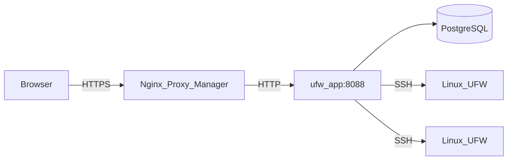

# Architektur

Diese Seite beschreibt, wie UFW Remote Manager aufgebaut ist, wie Daten fließen und wo Geheimnisse liegen.

*Diagramm: Browser → Reverse Proxy → App → Postgres; App → Zielserver über SSH.*

## Komponenten

| Komponente | Rolle |
|------------|-------|
| **ufw-app** | Next.js-Anwendung (UI + API + Server Actions) |
| **ufw-postgres** | PostgreSQL — Benutzer, verschlüsselte Zugangsdaten, Regeln, Snapshots, Audit |
| **ufw-migrate** | Einmal-Container — führt `prisma migrate deploy` bei jedem Deploy aus |
| **Nginx Proxy Manager** | Externe HTTPS-Terminierung (nicht Teil dieses Stacks) |
| **Ziel-Linux-Server** | UFW-verwaltete Hosts, die über SSH erreicht werden |

## Anfragefluss (Produktion)

1. Der Administrator öffnet `APP_URL` im Browser (HTTPS über NPM).
2. Better Auth validiert das Session-Cookie.
3. Server Actions und API-Routen orchestrieren SSH und Datenbankarbeit.
4. **Initial Sync** läuft automatisch im Hintergrund, wenn **noch kein UFW-Snapshot in Postgres existiert** (`needsSync`) — z. B. direkt nach dem Anlegen eines Servers oder vor dem ersten Refresh.

Server-Seiten bleiben schnell; SSH-Arbeit erfolgt nur bei explizitem Refresh oder wenn noch kein Cache vorhanden ist.

## Concurrency-Modell

- **Pro-Server-SSH-Warteschlange** (`p-queue`, Concurrency 1) — Operationen auf demselben Host werden serialisiert
- **Einzelne App-Replika** in Produktion — Rate Limits im Speicher
- Nicht auf mehrere Replikas skalieren ohne gemeinsamen Rate-Limit-Speicher (z. B. Redis)

## Datenspeicherung

| Daten | Ort | Verschlüsselt? |
|-------|-----|----------------|
| SSH-Passwörter / private Keys | Postgres (`identity`-Tabelle) | Ja — AES-256-GCM mit `APP_ENCRYPTION_KEY` |
| UFW-Regeln, Entwürfe, Snapshots | Postgres | Nur Metadaten; Regelinhalt ist nicht geheim |
| Sessions | Postgres (Better Auth) | Session-Tokens; geschützt durch `BETTER_AUTH_SECRET` |
| Audit-Ereignisse | Postgres | Wer hat wann was getan |
| `.env`-Geheimnisse | Nur Host-Dateisystem | Niemals in Git |

## Sicherheitsgrenzen

- Postgres wird in Produktion **nicht** auf den Host veröffentlicht (`docker-compose.prod.yml`)
- App-Port ist im Docker-Netzwerk erreichbar (NPM + intern), nicht auf `0.0.0.0` in Prod
- SSH-Zielvalidierung blockiert private/Metadata-IPs standardmäßig; optional `SSH_ALLOWED_CIDRS`
- Produktionsantworten enthalten CSP, HSTS und Security-Header (`next.config.ts`)

## Verwandte Dokumentation

- [Sicherheitsmodell](./administration/security-model.md)
- [Entwurf-und-Apply-Workflow](./concepts/draft-apply-workflow.md)
- [Umgebungsvariablen](./administration/environment-variables.md)
