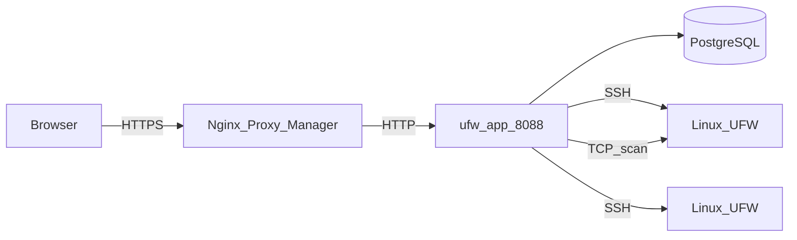
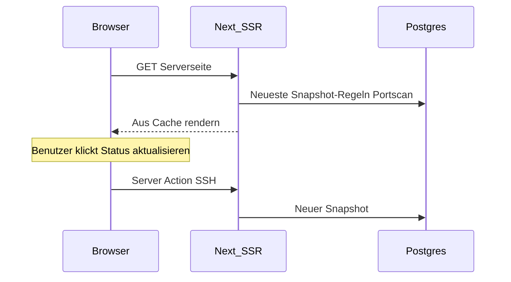

# Architektur

Diese Seite beschreibt den Aufbau von UFW Remote Manager, den Datenfluss und wo Secrets liegen. Version **v0.9.6**.

*Diagramm: Browser → Reverse-Proxy → App → Postgres; App → Zielserver über SSH; optionaler Portscan vom App-Container zu Ziel-Hosts.*

## Komponenten

| Komponente | Rolle |
|------------|-------|
| **ufw-app** | Next.js-Anwendung (UI, Server Actions, API-Routen) |
| **ufw-postgres** | PostgreSQL — Benutzer, verschlüsselte Zugangsdaten, Regeln, Snapshots, Scans, Audit |
| **ufw-migrate** | Einmal-Container — `prisma migrate deploy` bei jedem Deploy |
| **Nginx Proxy Manager** | Externe HTTPS-Terminierung (nicht Teil dieses Stacks) |
| **Ziel-Linux-Server** | UFW-verwaltete Hosts, erreichbar über SSH |

## Request-Flow (Produktion)

1. Administrator öffnet `APP_URL` im Browser (HTTPS über NPM).
2. Better Auth validiert das Session-Cookie.
3. Server Actions orchestrieren SSH- und Datenbankarbeit.
4. UFW-Befehle laufen auf Remote-Hosts erst nach expliziter Apply-Bestätigung.
5. Portscan (wenn aktiviert) führt Naabu/Nmap vom App-Container aus — nicht über SSH.

## Server-Detail-Lademodell (Cache-first)

Das Öffnen eines Server-Dashboards öffnet **kein** SSH beim initialen Seitenload:

| Schritt | Quelle | SSH? |
|---------|--------|------|
| UFW-Status-Badge | Neuester `serverSnapshot` | Nein |
| Regeltabelle (erste Seite) | Entwurf + Snapshot + Regeldatensätze | Nein |
| Portscan-Panel | Neuester Scan beliebigen Status (v0.9.2) | Nein |
| **Status aktualisieren** | Live-Erkennung + Snapshot-Update | Ja |
| **Anwenden bestätigen** | UFW-Befehle + Post-Apply-Sync | Ja |
| **Initial-Sync** (kein Snapshot) | Hintergrund-Sync-Vorgang | Ja |

## Nebenläufigkeitsmodell

Siehe [Vorgänge und Nebenläufigkeit](./concepts/operations-and-concurrency.md) für Details. Zusammenfassung:

| Mechanismus | Verhalten |
|-------------|-----------|
| **Pro-Server-Warteschlange** | SSH + Post-SSH-DB-Schreibvorgänge serialisiert (`p-queue`, Concurrency 1) |
| **Portscan** | Außerhalb der SSH-Warteschlange — blockiert UFW-Vorgänge nicht |
| **Ratenlimits** | In-Memory; 30 s Cooldown pro Server für Refresh/Sync/Scan |
| **Einzelne Replik** | Produktion setzt eine App-Instanz voraus |

Apply und Refresh halten die Warteschlange durch Snapshot-Persistenz und Regeldatensatz-Sync — nicht nur durch die SSH-Sitzung.

## Datenmodell (PostgreSQL)

| Entität | Zweck |
|---------|-------|
| **user** | Ein Administratorkonto (Better Auth) |
| **identity** | Verschlüsselte SSH-Zugangsdaten |
| **server** | Host, Port, Verknüpfung zur Identität, Host-Key-Fingerabdruck |
| **serverSnapshot** | UFW-Status und geparste Regeln zu einem Zeitpunkt |
| **ruleRecord** | Lokale Metadaten (Gruppe, Name, Notizen) per Fingerabdruck |
| **draftSession** / **draftRule** | Bearbeitbare Arbeitskopie pro Benutzer pro Server |
| **applySession** / **applySessionItem** | Vorschau- und Apply-Pipeline-Zustand |
| **operationLog** | Fortschritt langlaufender Aufgaben |
| **auditEvent** | Sicherheitsrelevante Aktionen |
| **portScan** / **portScanFinding** | Externe Scan-Läufe und Ergebnisse |

Snapshots werden aufbewahrt (letzte 10 pro Server); alte Snapshots werden bei neuer Erfassung bereinigt.

## Laufzeitkonfiguration

Die öffentliche URL wird zur **Laufzeit** gesetzt, nicht ins Docker-Image gebacken:

- `APP_URL` in `.env` → `BETTER_AUTH_URL` im Container
- Ein GHCR-Image funktioniert für jede Domain — siehe [GHCR + Compose](./deployment/ghcr-compose.md)

**Wichtig:** `APP_URL` ist die **öffentliche HTTPS-URL**, die der Browser nutzt. NPM leitet an `http://ufw-app:8088` im Docker-Netzwerk weiter — internes HTTP ist beabsichtigt.

## Datenspeicherung und Verschlüsselung

| Daten | Speicherort | Verschlüsselt? |
|-------|-------------|----------------|
| SSH-Passwörter / private Schlüssel | Postgres (`identity`) | Ja — AES-256-GCM (`APP_ENCRYPTION_KEY`) |
| UFW-Regeln, Entwürfe, Snapshots | Postgres | Regelinhalt nicht geheim; Zugangsdaten schon |
| Sessions | Postgres (Better Auth) | Geschützt durch `BETTER_AUTH_SECRET` |
| Audit-Ereignisse | Postgres | Wer hat wann was getan |
| `.env`-Secrets | Host-Dateisystem | Dürfen nie in Git sein |

## Sicherheitsgrenzen

- Postgres wird in Produktion **nicht** auf den Host veröffentlicht (`docker-compose.prod.yml`)
- App-Port im Docker-Netzwerk erreichbar (NPM + intern), nicht auf `0.0.0.0` in Prod
- SSH-Zielvalidierung blockiert standardmäßig private/Metadaten-IPs; optional `SSH_ALLOWED_CIDRS`
- Produktionsantworten enthalten CSP, HSTS und Security-Header (`next.config.ts`)

## Verwandte Dokumentation

- [Vorgänge und Nebenläufigkeit](./concepts/operations-and-concurrency.md)
- [Sicherheitsmodell](./administration/security-model.md)
- [Umgebungsvariablen](./administration/environment-variables.md)
