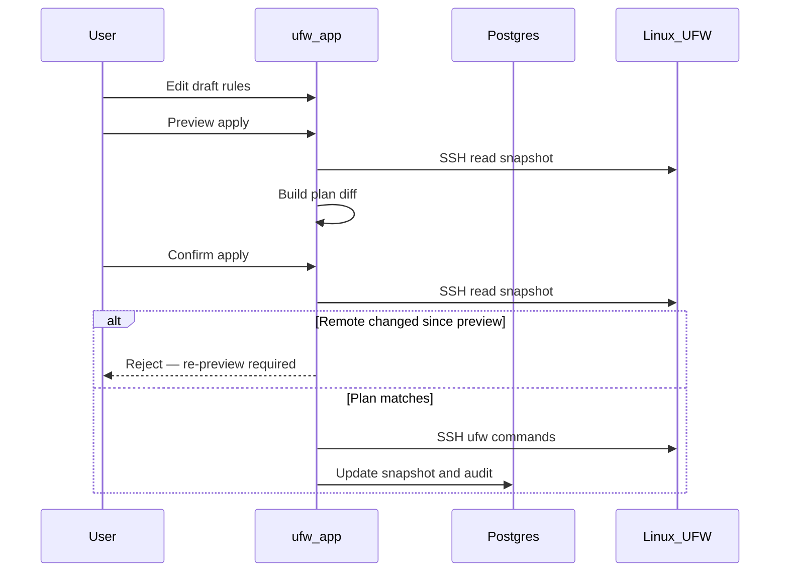

# Entwurf-und-Anwenden-Workflow

UFW Remote Manager überträgt Firewall-Änderungen niemals stillschweigend. Jede Mutation folgt **Bearbeiten → Vorschau → Bestätigen → Anwenden**.

## Schritte

### 1. Entwurf bearbeiten

Regeln in der Tabelle ändern: hinzufügen, bearbeiten, löschen, neu ordnen, importieren. Änderungen leben im **lokalen Entwurf**, bis sie angewendet werden.

### 2. Anwenden-Vorschau

**Apply preview** klicken. Die App:

1. Lädt den aktuellen UFW-Zustand vom Server (SSH-Snapshot)
2. Berechnet einen **Plan** — Befehle, die UFW an Ihren Entwurf anpassen würden
3. Zeigt hinzugefügte, entfernte und neu geordnete Regeln

Prüfen Sie die Vorschau sorgfältig. Achten Sie auf Regeln, die Sie aussperren könnten (z. B. SSH blockieren).

### 3. Bestätigen

Im Dialog bestätigen. Erst dann werden UFW-Befehle über SSH ausgeführt.

### 4. Anwenden-Ausführung

Befehle laufen sequenziell auf dem Server (Warteschlange pro Server, Nebenläufigkeit 1). Der Fortschritt erscheint im **Vorgangsbanner** mit schrittweisem Status.

### 5. Sync nach Anwenden

Nach Erfolg aktualisiert die App den Snapshot und synchronisiert Entwurfs-Ursprungszustände, damit Zeilenfarben die neue Realität widerspiegeln.

## Sequenzdiagramm

## Teilweises Anwenden und Drift

Remote-UFW kann sich zwischen Vorschau und Bestätigung ändern, oder Anwenden kann unterwegs fehlschlagen. Die App behandelt drei verschiedene Fälle:

| Szenario | Sitzungsstatus | Vorgehen |
|----------|----------------|----------|
| Remote-UFW **zwischen Vorschau und Bestätigung geändert** | Anwenden abgelehnt (`needsRePreview`) | Erneut **Apply preview** ausführen — kein Force Resync |
| UFW-Befehle auf dem Server **unterbrochen** | `PARTIAL` (`needsResync`) | **Force resync from server**, dann prüfen vor weiterer Bearbeitung |
| UFW-Befehle erfolgreich, aber **Post-Apply-Sync fehlgeschlagen** | `PARTIAL` (`needsResync`) | **Force resync from server** — Remote-UFW wurde bereits geändert |

**Ignorieren Sie Teilweise-Anwenden-Warnungen niemals** — blindes Fortfahren kann doppelte Regeln oder Reihenfolgefehler verursachen.

## SSH-Zugang-Sicherung

Der Anwenden-Planer enthält Schutzmaßnahmen für SSH-Zugangsregeln, wo konfiguriert — siehe Tests in `src/lib/ufw/commands.allow-ssh.test.ts`. Prüfen Sie die Vorschau dennoch manuell für Produktionsserver.

## Verwandte Dokumentation

- [UFW-Regeln und Zustände](./ufw-rules-and-states.md)
- [Regeln bearbeiten und anwenden](../user-guide/edit-and-apply-rules.md)
- [Vorgangsverlauf](../user-guide/operations-history.md)
