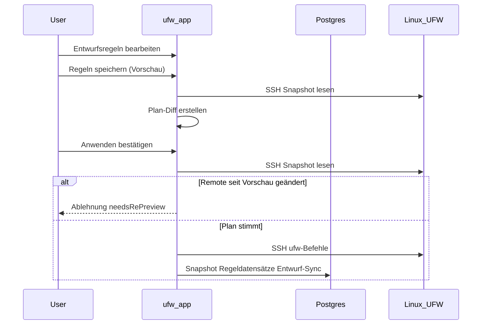

# Entwurf-und-Anwenden-Workflow

UFW Remote Manager überträgt Firewall-Änderungen nie stillschweigend. Jede Mutation folgt **Bearbeiten → Vorschau → Bestätigen → Anwenden**.

## Schritte

### 1. Entwurf bearbeiten

Regeln in der Tabelle ändern: hinzufügen, bearbeiten, löschen, neu ordnen, importieren. Änderungen leben im **lokalen Entwurf**, bis sie angewendet werden.

### 2. Apply-Vorschau

**Regeln speichern** klicken (Speichern-mit-Bestätigung-Ablauf). Die App:

1. Lädt aktuellen UFW-Zustand vom Server (SSH)
2. Berechnet einen **Plan** — UFW-Befehle, um Remote an Ihren Entwurf anzugleichen
3. Zeigt hinzugefügte, entfernte, aktualisierte und neu geordnete Regeln

Sorgfältig prüfen. Achten Sie auf Regeln, die Sie aussperren könnten (z. B. SSH blockieren).

### 3. Bestätigen

Im Dialog bestätigen. Erst dann werden UFW-Befehle über SSH ausgeführt.

Wenn sich Remote-UFW seit der Vorschau geändert hat, wird Apply **abgelehnt** — Vorschau erneut ausführen.

### 4. Apply-Ausführung

Befehle laufen sequenziell auf dem Server innerhalb der **Pro-Server-Warteschlange**. Fortschritt erscheint im **Vorgangsbanner** mit schrittweisem Status.

### 5. Post-Apply-Sync

Nach erfolgreicher UFW-Ausführung, noch innerhalb der Warteschlange:

1. Neuen Snapshot aus Live-Erkennung persistieren
2. `ruleRecord`-Zeilen aus Erkennung synchronisieren (nicht veralteter Cache)
3. Entwurfs-Origin-Zustände aktualisieren, damit Zeilenfarben der Realität entsprechen

Seit v0.9.2 werden Post-Apply-Regeldatensätze aus **Live-Erkennungsdaten** erstellt — gelöschte Remote-Regeln tauchen nicht wieder in der Datenbank auf.

## Sequenzdiagramm

## Teilweises Anwenden und Drift

| Szenario | Sitzungsstatus | Vorgehen |
|----------|----------------|----------|
| Remote-UFW **zwischen Vorschau und Bestätigung** geändert | Abgelehnt (`needsRePreview`) | **Regeln speichern** (Vorschau) erneut — keine erzwungene Synchronisation |
| UFW-Befehle auf Server **unterbrochen** | `PARTIAL` (`needsResync`) | **Erzwungene Synchronisation vom Server**, dann prüfen |
| UFW erfolgreich, aber **Post-Apply-Sync fehlgeschlagen** | `PARTIAL` (`needsResync`) | **Erzwungene Synchronisation vom Server** — Remote-UFW bereits geändert |

**Teilweises Anwenden nie ignorieren** — blindes Fortfahren kann doppelte Regeln oder Reihenfolgefehler verursachen.

## Nur-DB-Apply

Wenn die Vorschau nur Metadaten-Änderungen zeigt (kein UFW-Befehls-Diff), aktualisiert Bestätigen lokale Datensätze ohne Remote-UFW-Befehle.

## SSH-Allow-Sicherung

Der Apply-Planer enthält Sicherungen rund um SSH-Zugangsregeln, wo konfiguriert. Vorschau auf Produktionsservern dennoch manuell prüfen.

## Verwandte Dokumentation

- [UFW-Regeln und Zustände](./ufw-rules-and-states.md)
- [Regeln bearbeiten und anwenden](../user-guide/edit-and-apply-rules.md)
- [Vorgänge und Nebenläufigkeit](./operations-and-concurrency.md)
