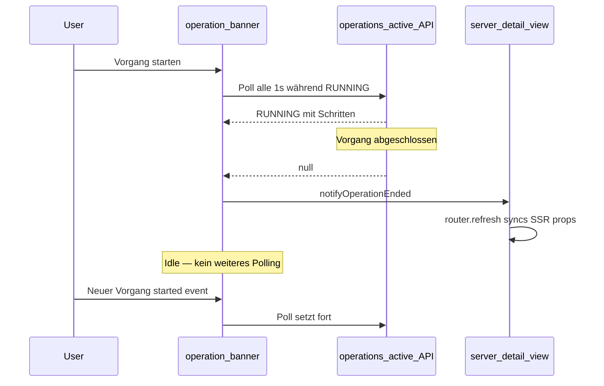
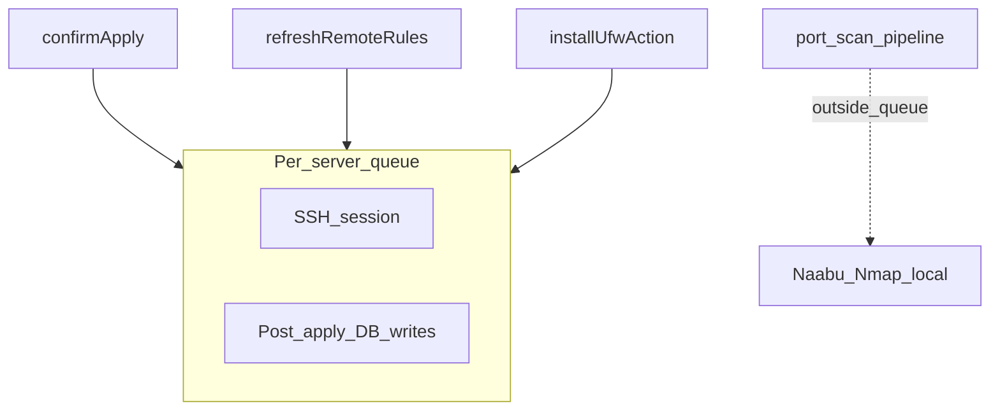

# Vorgänge und Nebenläufigkeit

UFW Remote Manager führt langlaufende Aufgaben (Apply, Sync, Refresh, Install, Portscan) asynchron aus. Die UI verfolgt den Fortschritt über **Vorgangsprotokolle**, das **Vorgangsbanner** und clientseitiges Polling. Diese Seite erklärt, wie diese Teile zusammenpassen und wie die App Race Conditions auf demselben Server vermeidet.

## Vorgangsbanner

Während Arbeit läuft, erscheint oben in der App ein Banner (und auf der Server-Detailseite, wenn auf einen Server begrenzt).

| Element | Beschreibung |
|---------|--------------|
| **Typ** | Übersetztes Label, z. B. Regeln anwenden, Status aktualisieren, Portscan |
| **Status** | `RUNNING`, `PENDING`, `SUCCESS`, `FAILED` oder `PARTIAL` |
| **Schritte** | Aufklappbare Liste mit Schrittstatus und Fehlermeldungen |
| **Fortschritt** | Optionaler current/total-Zähler für mehrstufige Vorgänge |

Bei **SUCCESS** schließt sich das Banner nach etwa 10 Sekunden automatisch. Sie können es früher manuell schließen. Fehlgeschlagene und teilweise Vorgänge bleiben sichtbar bis zum Schließen.

Das Banner lädt aktive Vorgänge von `/api/operations/active`. Dieser Endpunkt liefert nur Vorgänge im Zustand `RUNNING` oder `PENDING` — keine terminalen.

## Client-Polling-Lebenszyklus

### Aktives Polling

Während ein Vorgang `RUNNING` oder `PENDING` ist, pollt das Banner etwa alle **1 Sekunde** (mit Backoff für portscan-spezifische Hooks nach längeren Läufen).

### Idle-Verhalten (seit v0.9.2)

Wenn kein aktiver Vorgang existiert, **stoppt das Banner das Polling**. Dies vermeidet hunderte idle API-Anfragen pro Stunde pro Browser-Tab.

Polling **startet neu**, wenn:

- Ein neuer Vorgang startet (`OPERATION_STARTED` Browser-Event), oder
- Die Seite lädt und beim ersten Fetch einen aktiven Vorgang findet.

### Vorgang-beendet-Event

Wenn Polling einen Übergang von `RUNNING`/`PENDING` zu `null` erkennt oder einen terminalen Status (`SUCCESS`, `FAILED`, `PARTIAL`) empfängt, dispatcht die App `OPERATION_ENDED`.

Die Server-Detailansicht hört auf dieses Event. Während ein Vorgang aktiv ist, blockiert sie das Sync von SSR-Props (Regeln, Portzähler) von einem veralteten Seiten-Refresh. Wenn der Vorgang endet, ruft sie `router.refresh()` auf, damit die UI den neuesten Datenbankzustand widerspiegelt.

Wenn das Banner verschwindet, die Regeltabelle nach Sync oder Apply aber veraltet aussieht, Seite einmal aktualisieren — dies sollte nach v0.9.2 unter normalen Bedingungen nicht mehr vorkommen.

## Pro-Server-SSH-Warteschlange

Remote-Arbeit auf einem Server wird über eine **Pro-Server-Warteschlange** serialisiert (`p-queue`, Concurrency 1):

### Was in der Warteschlange läuft

| Vorgang | SSH | Post-SSH-Datenbank-Schreibvorgänge |
|---------|-----|-------------------------------------|
| **Regeln anwenden** | UFW-Befehle + finale Erkennungs-Leseoperation | Snapshot persistieren, Regeldatensätze, Entwurfs-Origin-Zustände — **innerhalb desselben Warteschlangen-Halts** |
| **Refresh / Regeln synchronisieren** | UFW-Status lesen (wenn keine Erkennung übergeben) | Snapshot persistieren, Entwurf neu seeden — **innerhalb der Warteschlange** |
| **UFW installieren** | install + enable + Erkennung | Remote-Regeln aktualisieren — **innerhalb der Warteschlange** |

Dies verhindert, dass zwei gleichzeitige Flows (z. B. Apply und Refresh) Snapshots oder Regeldatensätze in widersprüchlicher Reihenfolge schreiben.

### Was außerhalb der Warteschlange läuft

**Portscan** (Naabu + Nmap) läuft **lokal im App-Container** und hält die **SSH-Warteschlange nicht**. Ein langer Scan (~30+ Minuten) blockiert daher UFW-Refresh oder Apply auf demselben Server nicht.

Portscan-Overlap wird separat verhindert: Nur ein `PENDING`- oder `RUNNING`-Scan pro Server ist erlaubt. Ein weiterer Scanstart liefert einen *Scan läuft bereits*-Fehler.

## Ratenlimits

Wiederholte Aktionen auf demselben Server nutzen eine **30-Sekunden-Cooldown** (fest im Anwendungscode, nicht über Umgebungsvariablen konfigurierbar):

| Aktion | Cooldown-Key |
|--------|--------------|
| Status aktualisieren / Regeln synchronisieren | `ufw-refresh:{serverId}` |
| Portscan starten | `port-scan:{serverId}` |

Weitere Limits:

| Aktion | Limit |
|--------|-------|
| Setup (erster Admin) | 5 Versuche pro Minute pro Client-IP |
| Konfigurationsexport | 5 pro Minute pro Benutzer |
| Konfigurationsimport-Vorschau | 10 pro Minute pro Benutzer |
| UFW-Installation | 3 pro Minute pro Server |

Ratenlimit-Buckets sind **In-Memory**. Die App ist für **eine Replik** in Produktion ausgelegt. Mehrere App-Instanzen ohne geteiltes Ratenlimit-Storage erlauben das Umgehen von Limits.

Hinter Nginx Proxy Manager `TRUST_PROXY=1` setzen, damit Setup-Ratenlimits die echte Client-IP aus `X-Forwarded-For` nutzen.

## Veraltete-Vorgänge-Bereinigung

Wenn sich der Browser mitten im Vorgang trennt, aktualisiert sich das UI-Banner möglicherweise nicht. Ein Hintergrund-Sweeper markiert sehr alte `RUNNING`-Vorgänge als fehlgeschlagen (typischerweise innerhalb von 30–60 Minuten). Seite aktualisieren, um ein hängendes Banner zu löschen; **Vorgangsverlauf** für den finalen Status prüfen.

## Error Boundaries

Clientseitige Error Boundaries verhindern, dass ein einzelner Seitenabsturz die gesamte Shell bricht:

| Bereich | Datei | Wiederherstellung |
|---------|-------|-------------------|
| App-Shell | `src/app/(app)/error.tsx` | **Erneut versuchen** setzt Error Boundary zurück |
| Server-Detail | `src/app/(app)/servers/[serverAddress]/error.tsx` | **Erneut versuchen** oder **Zurück zu Servern** |

Diese fangen Rendering-Fehler in Kindkomponenten ab. Sie ersetzen keine operativen Fehlermeldungen von fehlgeschlagenem SSH oder Apply — diese erscheinen im Vorgangsbanner und Vorgangsverlauf.

## Verwandte Dokumentation

- [Vorgangsverlauf](../user-guide/operations-history.md)
- [Entwurf-und-Anwenden-Workflow](./draft-apply-workflow.md)
- [Architektur](../architecture.md)
- [Portscan (Benutzerhandbuch)](../user-guide/port-scan.md)
