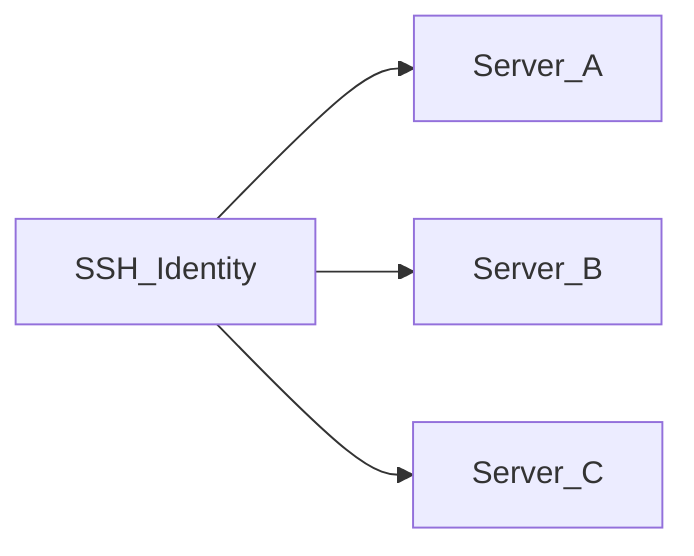

# SSH-Identitäten

Eine **SSH-Identität** ist ein wiederverwendbarer Satz Zugangsdaten (Benutzername + Passwort oder privater Schlüssel), **verschlüsselt** in der Anwendungsdatenbank gespeichert. Server referenzieren Identitäten, anstatt Geheimnisse inline einzubetten.

## Warum Identitäten existieren

| Ohne Identitäten | Mit Identitäten |
|------------------|-----------------|
| Doppelte Zugangsdaten auf jedem Server | Eine Identität von vielen Servern gemeinsam genutzt |
| Schlüsselrotation bedeutet Bearbeitung jedes Servers | Identität einmal aktualisieren; alle verknüpften Server nutzen neue Zugangsdaten |
| Schwerer zu auditieren | Klare Zuordnung: Identität → Server |

## Authentifizierungsmethoden

- **Passwort** — Benutzername und Passwort ruhend verschlüsselt
- **Privater Schlüssel** — Benutzername und PEM-Privatschlüssel ruhend verschlüsselt

Geheimnisse werden mit **AES-256-GCM** unter Verwendung von `APP_ENCRYPTION_KEY` aus `.env` verschlüsselt. Bei Verlust dieses Schlüssels können verschlüsselte Zugangsdaten nicht wiederhergestellt werden.

## Identität anlegen

1. **SSH-Identitäten** in der Seitenleiste öffnen (`/identities`)
2. **Identität hinzufügen** klicken
3. Name, Benutzername, Authentifizierungsmethode und Geheimnis eingeben
4. Speichern — Zugangsdaten werden vor der Speicherung verschlüsselt

## Bearbeiten und Löschen

- **Bearbeiten** — Passwort-/Schlüsselfelder können leer bleiben, um bestehende Geheimnisse unverändert zu lassen
- **Löschen** — blockiert, solange ein Server die Identität noch nutzt; zuerst neu zuweisen oder diese Server löschen

## Beziehung zu Servern

Jeder Serverdatensatz speichert eine Referenz auf eine Identität. Das Ändern der Identität auf einem Server erfordert vor dem Speichern einen erfolgreichen **SSH-Test**.

## Sicherheitshinweise

- Identitätsgeheimnisse erscheinen nach dem Speichern nicht mehr in der Oberfläche (nur Platzhalter beim Bearbeiten)
- Konfigurations-**Export** enthält Geheimnisse im Klartext — siehe [Konfiguration importieren und exportieren](./import-export-config.md)
- `.env` mit `APP_ENCRYPTION_KEY` sichern — siehe [Backup und Wiederherstellung](../operations/backup-restore.md)

## Verwandte Dokumentation

- [Server und SSH](./servers-and-ssh.md)
- [Server verwalten](../user-guide/manage-servers.md)
