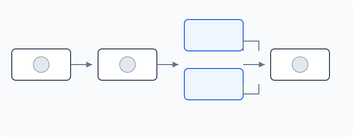
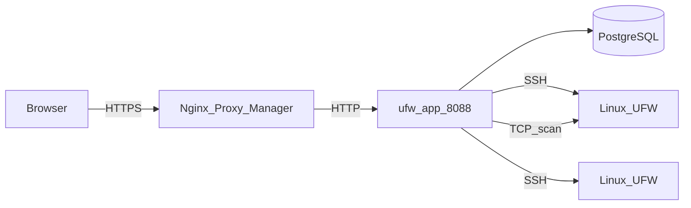
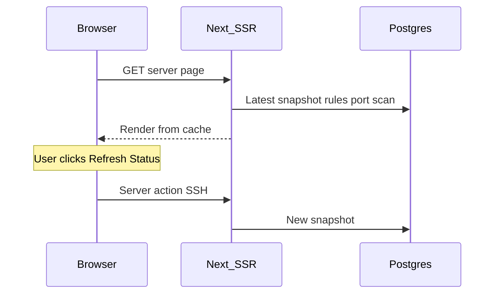

# Architecture

This page describes how UFW Remote Manager is built, how data flows, and where secrets live. Version **v0.9.5**.

*Diagram: Browser → reverse proxy → app → Postgres; app → target servers over SSH; optional port scan from app container to target hosts.*

## Components

| Component | Role |
|-----------|------|
| **ufw-app** | Next.js application (UI, server actions, API routes) |
| **ufw-postgres** | PostgreSQL — users, encrypted credentials, rules, snapshots, scans, audit |
| **ufw-migrate** | One-shot container — `prisma migrate deploy` on each deploy |
| **Nginx Proxy Manager** | External HTTPS termination (not part of this stack) |
| **Target Linux servers** | UFW-managed hosts reached over SSH |

## Request flow (production)

1. Administrator opens `APP_URL` in a browser (HTTPS via NPM).
2. Better Auth validates the session cookie.
3. Server actions orchestrate SSH and database work.
4. UFW commands run on remote hosts only after explicit apply confirmation.
5. Port scan (when enabled) runs Naabu/Nmap from the app container — not over SSH.

## Server detail load model (cache-first)

Opening a server dashboard does **not** open SSH on initial page load:

| Step | Source | SSH? |
|------|--------|------|
| UFW status badge | Latest `serverSnapshot` | No |
| Rules table (first page) | Draft + snapshot + rule records | No |
| Port scan panel | Latest scan any status (v0.9.2) | No |
| **Refresh Status** | Live detection + snapshot update | Yes |
| **Apply confirm** | UFW commands + post-apply sync | Yes |
| **Initial sync** (no snapshot) | Background sync operation | Yes |

## Concurrency model

See [Operations and concurrency](./concepts/operations-and-concurrency.md) for full detail. Summary:

| Mechanism | Behaviour |
|-----------|-----------|
| **Per-server queue** | SSH + post-SSH DB writes serialized (`p-queue`, concurrency 1) |
| **Port scan** | Outside SSH queue — does not block UFW operations |
| **Rate limits** | In-memory; 30s cooldown per server for refresh/sync/scan |
| **Single replica** | Production assumes one app instance |

Apply and refresh hold the queue through snapshot persist and rule-record sync — not only through the SSH session.

## Data model (PostgreSQL)

| Entity | Purpose |
|--------|---------|
| **user** | Single admin account (Better Auth) |
| **identity** | Encrypted SSH credentials |
| **server** | Host, port, link to identity, host key fingerprint |
| **serverSnapshot** | Point-in-time UFW status + parsed rules |
| **ruleRecord** | Local metadata (group, name, notes) keyed by fingerprint |
| **draftSession** / **draftRule** | Editable working copy per user per server |
| **applySession** / **applySessionItem** | Preview and apply pipeline state |
| **operationLog** | Long-running task progress |
| **auditEvent** | Security-relevant actions |
| **portScan** / **portScanFinding** | External scan runs and results |

Snapshots are retained (last 10 per server); old snapshots are pruned on new capture.

## Runtime configuration

Public URL is set at **runtime**, not baked into the Docker image:

- `APP_URL` in `.env` → `BETTER_AUTH_URL` in the container
- One GHCR image works for any domain — see [GHCR + Compose](./deployment/ghcr-compose.md)

**Important:** `APP_URL` is the **public HTTPS URL** the browser uses. NPM forwards to `http://ufw-app:8088` on the Docker network — internal HTTP is intentional.

## Data storage and encryption

| Data | Location | Encrypted? |
|------|----------|------------|
| SSH passwords / private keys | Postgres (`identity`) | Yes — AES-256-GCM (`APP_ENCRYPTION_KEY`) |
| UFW rules, drafts, snapshots | Postgres | Rule content not secret; credentials are |
| Sessions | Postgres (Better Auth) | Protected by `BETTER_AUTH_SECRET` |
| Audit events | Postgres | Who did what and when |
| `.env` secrets | Host filesystem | Must never be in git |

## Security boundaries

- Postgres is **not** published to the host in production (`docker-compose.prod.yml`)
- App port reachable on Docker network (NPM + internal), not on `0.0.0.0` in prod
- SSH target validation blocks private/metadata IPs by default; optional `SSH_ALLOWED_CIDRS`
- Production responses include CSP, HSTS, and security headers (`next.config.ts`)

## Related docs

- [Operations and concurrency](./concepts/operations-and-concurrency.md)
- [Security model](./administration/security-model.md)
- [Environment variables](./administration/environment-variables.md)
