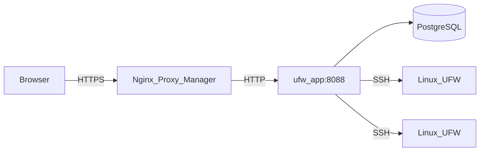

# Architecture

This page describes how UFW Remote Manager is built, how data flows, and where secrets live.

*Diagram: Browser → reverse proxy → app → Postgres; app → target servers over SSH.*

## Components

| Component | Role |
|-----------|------|
| **ufw-app** | Next.js application (UI + API + server actions) |
| **ufw-postgres** | PostgreSQL — users, encrypted credentials, rules, snapshots, audit |
| **ufw-migrate** | One-shot container — runs `prisma migrate deploy` on each deploy |
| **Nginx Proxy Manager** | External HTTPS termination (not part of this stack) |
| **Target Linux servers** | UFW-managed hosts reached over SSH |

## Request flow (production)

1. The administrator opens `APP_URL` in a browser (HTTPS via NPM).
2. Better Auth validates the session cookie.
3. Server actions and API routes orchestrate SSH and database work.
4. UFW commands run on remote hosts only after explicit apply confirmation.

## Runtime configuration

Public URL is set at **runtime**, not baked into the Docker image:

- `APP_URL` in `.env` → `BETTER_AUTH_URL` in the container
- One GHCR image works for any domain — see [GHCR + Compose](./deployment/ghcr-compose.md)

Implementation: `getPublicAppUrl()` in `src/lib/app-url.ts`.

**Important:** `APP_URL` is the **public HTTPS URL** the browser uses (via NPM). NPM forwards to `http://ufw-app:8088` on the Docker network — internal HTTP is intentional. See [Nginx Proxy Manager](./deployment/nginx-proxy-manager.md).

## Server detail load model

Opening a server dashboard is **cache-first** — no SSH on initial page load:

1. **SSR** reads the latest UFW **snapshot** from Postgres (`detectionFromSnapshot`) and renders status and rules from the database.
2. Rules, port-scan results, and Docker inventory load **in parallel** from Postgres (`Promise.all`) — still no SSH.
3. **Refresh** (dashboard or rules toolbar) triggers a live SSH read and updates the snapshot.
4. **Initial sync** runs automatically in the background when **no UFW snapshot exists yet in Postgres** (`needsSync`) — for example right after creating a server or before the first refresh.

This keeps server pages fast while SSH work happens only when you explicitly refresh or when the app has no cached state yet.

## Concurrency model

- **Per-server SSH queue** (`p-queue`, concurrency 1) — operations on the same host are serialized
- **Single app replica** in production — rate limits are in-memory
- Do not scale to multiple app replicas without adding shared rate-limit storage (e.g. Redis)

## Data storage

| Data | Location | Encrypted? |
|------|----------|------------|
| SSH passwords / private keys | Postgres (`identity` table) | Yes — AES-256-GCM with `APP_ENCRYPTION_KEY` |
| UFW rules, drafts, snapshots | Postgres | Metadata only; rule content is not secret |
| Sessions | Postgres (Better Auth) | Session tokens; protected by `BETTER_AUTH_SECRET` |
| Audit events | Postgres | Who did what and when |
| `.env` secrets | Host filesystem only | Must never be in git |

## Security boundaries

- Postgres is **not** published to the host in production (`docker-compose.prod.yml`)
- App port is reachable on the Docker network (NPM + internal), not on `0.0.0.0` in prod
- SSH target validation blocks private/metadata IPs by default; optional `SSH_ALLOWED_CIDRS`
- Production responses include CSP, HSTS, and security headers (`next.config.ts`)

## Related docs

- [Security model](./administration/security-model.md)
- [Draft and apply workflow](./concepts/draft-apply-workflow.md)
- [Environment variables](./administration/environment-variables.md)
