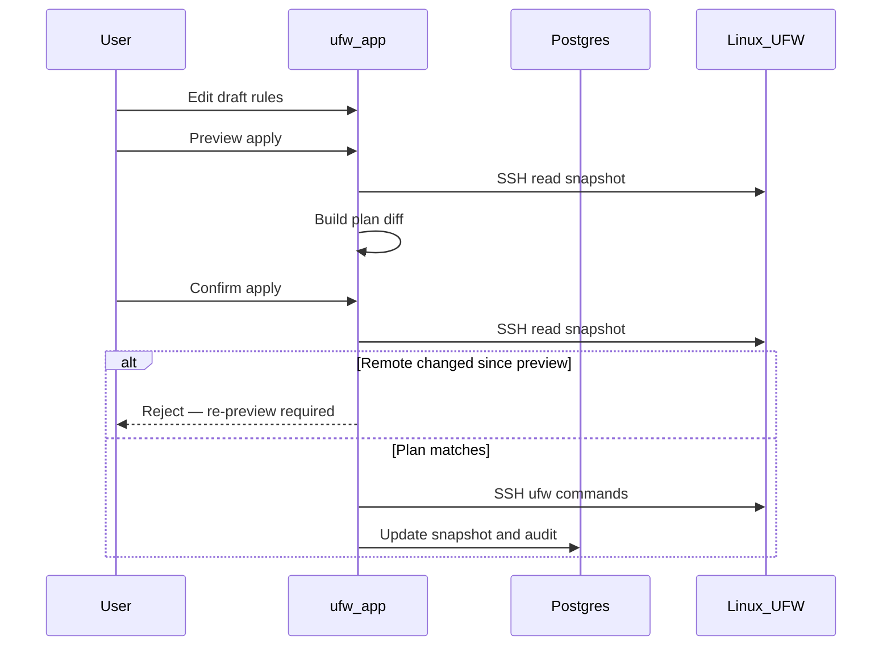

# Draft and apply workflow

UFW Remote Manager never pushes firewall changes silently. Every mutation follows **edit → preview → confirm → apply**.

## Steps

### 1. Edit draft

Change rules in the table: add, edit, delete, reorder, import. Changes live in the **local draft** until applied.

### 2. Preview apply

Click **Apply preview**. The app:

1. Loads current UFW state from the server (SSH snapshot)
2. Computes a **plan** — commands that would bring UFW in line with your draft
3. Shows added, removed, and reordered rules

Review the preview carefully. Pay attention to rules that could lock you out (e.g. blocking SSH).

### 3. Confirm

Confirm in the dialog. Only then are UFW commands executed over SSH.

### 4. Apply execution

Commands run sequentially on the server (per-server queue, concurrency 1). Progress appears in the **operation banner** with step-by-step status.

### 5. Post-apply sync

After success, the app updates the snapshot and syncs draft origin states so row colors reflect the new reality.

## Sequence diagram

## Partial apply and drift

Remote UFW can change between preview and confirm, or apply can fail partway through. The app handles three distinct cases:

| Scenario | Session status | What to do |
|----------|----------------|------------|
| Remote UFW changed **between preview and confirm** | Apply rejected (`needsRePreview`) | Run **Apply preview** again — do not force resync |
| UFW commands **interrupted** on the server | `PARTIAL` (`needsResync`) | **Force resync from server**, then review before editing |
| UFW commands succeeded but **post-apply sync failed** | `PARTIAL` (`needsResync`) | **Force resync from server** — remote UFW already changed |

**Never ignore partial apply warnings** — continuing blindly can cause duplicate rules or ordering errors.

## Allow SSH safeguard

The apply planner includes safeguards around SSH access rules where configured — see tests in `src/lib/ufw/commands.allow-ssh.test.ts`. Still verify preview manually for production servers.

## Related docs

- [UFW rules and states](./ufw-rules-and-states.md)
- [Edit and apply rules](../user-guide/edit-and-apply-rules.md)
- [Operations history](../user-guide/operations-history.md)
