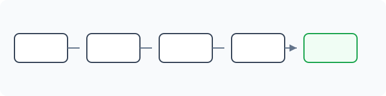
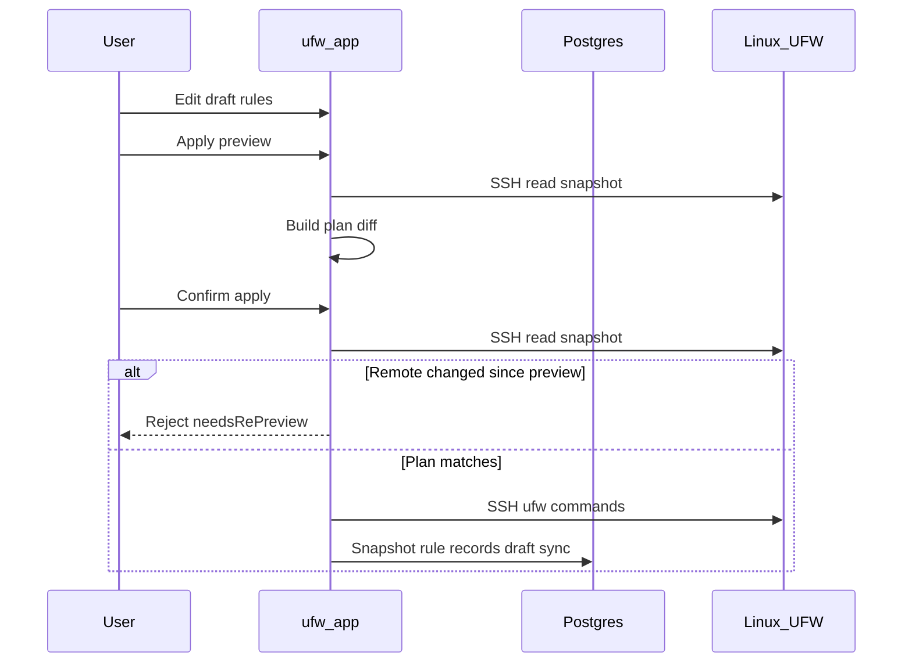

# Draft and apply workflow

UFW Remote Manager never pushes firewall changes silently. Every mutation follows **edit → preview → confirm → apply**.

## Steps

### 1. Edit draft

Change rules in the table: add, edit, delete, reorder, import. Changes live in the **local draft** until applied.

### 2. Preview apply

Click **Apply preview** (Save rules flow). The app:

1. Loads current UFW state from the server (SSH)
2. Computes a **plan** — UFW commands to align remote with your draft
3. Shows added, removed, updated, and reordered rules

Review carefully. Pay attention to rules that could lock you out (e.g. blocking SSH).

### 3. Confirm

Confirm in the dialog. Only then are UFW commands executed over SSH.

If remote UFW changed since preview, apply is **rejected** — run preview again.

### 4. Apply execution

Commands run sequentially on the server inside the **per-server queue**. Progress appears in the **operation banner** with step-by-step status.

### 5. Post-apply sync

After successful UFW execution, still inside the queue:

1. Persist a new snapshot from live detection
2. Sync `ruleRecord` rows from detection (not stale cache)
3. Update draft origin states so row colors match reality

Since v0.9.2, post-apply rule records are built from **live detection data**, preventing deleted remote rules from reappearing in the database.

## Sequence diagram

## Partial apply and drift

| Scenario | Session status | What to do |
|----------|----------------|------------|
| Remote UFW changed **between preview and confirm** | Rejected (`needsRePreview`) | Run **Apply preview** again — do not force resync |
| UFW commands **interrupted** on server | `PARTIAL` (`needsResync`) | **Force resync from server**, then review |
| UFW succeeded but **post-apply sync failed** | `PARTIAL` (`needsResync`) | **Force resync from server** — remote UFW already changed |

**Never ignore partial apply warnings** — continuing blindly can cause duplicate rules or ordering errors.

## DB-only apply

If preview shows metadata-only changes (no UFW command diff), confirm updates local records without remote UFW commands.

## Allow SSH safeguard

The apply planner includes safeguards around SSH access rules where configured. Still verify preview manually on production servers.

## Related docs

- [UFW rules and states](./ufw-rules-and-states.md)
- [Edit and apply rules](../user-guide/edit-and-apply-rules.md)
- [Operations and concurrency](./operations-and-concurrency.md)
