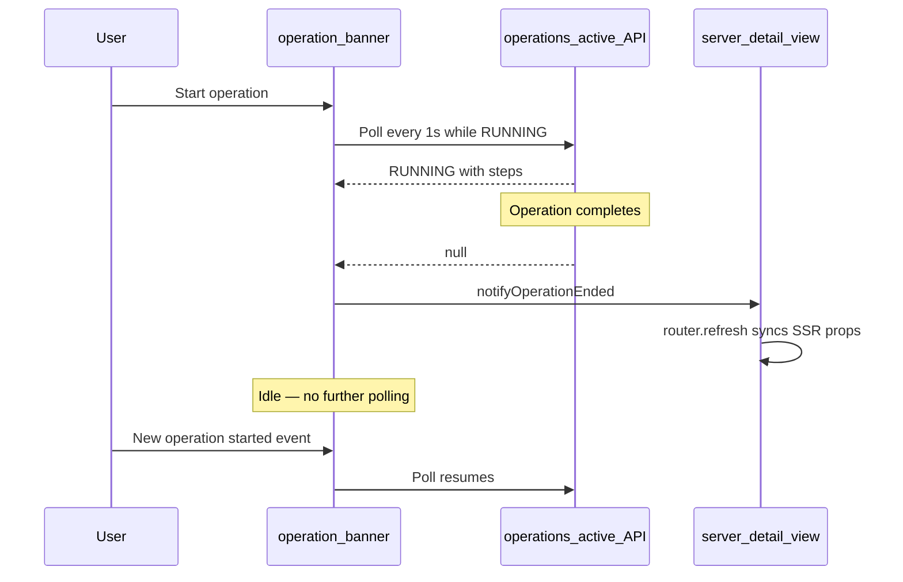
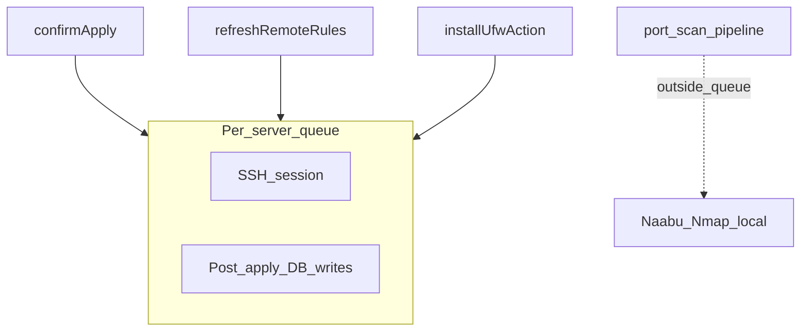

# Operations and concurrency

UFW Remote Manager runs long tasks (apply, sync, refresh, install, port scan) asynchronously. The UI tracks progress through **operation logs**, the **operation banner**, and client-side polling. This page explains how those pieces fit together and how the app avoids race conditions on the same server.

## Operation banner

While work runs, a banner appears at the top of the app (and on the server detail page when scoped to one server).

| Element | Description |
|---------|-------------|
| **Type** | Translated label, e.g. apply rules, refresh status, port scan |
| **Status** | `RUNNING`, `PENDING`, `SUCCESS`, `FAILED`, or `PARTIAL` |
| **Steps** | Expandable list with per-step status and error messages |
| **Progress** | Optional current/total counter for multi-step operations |

On **SUCCESS**, the banner auto-dismisses after about 10 seconds. You can dismiss it manually sooner. Failed and partial operations stay visible until dismissed.

The banner loads operations from `/api/operations/active`. That endpoint returns operations in `RUNNING` or `PENDING` state, and recently finished `SUCCESS`, `FAILED`, or `PARTIAL` operations for about **10 seconds** after completion.

## Client polling lifecycle

### Active polling

While an operation is `RUNNING` or `PENDING`, the banner polls about every **1 second** (with backoff for port-scan-specific hooks after longer runs).

### Idle behaviour (since v0.9.2)

When no active operation exists, the banner **stops polling**. This avoids hundreds of idle API requests per hour per browser tab.

Polling **restarts** when:

- A new operation starts (`OPERATION_STARTED` browser event), or
- The page loads and finds an active operation on the first fetch.

### Operation ended event

When polling detects a transition from `RUNNING`/`PENDING` to `null`, or receives a terminal status (`SUCCESS`, `FAILED`, `PARTIAL`), the app dispatches `OPERATION_ENDED`.

The server detail view listens for this event. While an operation is active, it blocks syncing SSR props (rules, port counts) from a stale page refresh. When the operation ends, it calls `router.refresh()` so the UI reflects the latest database state.

If the banner disappears but the rules table looks stale after a sync or apply, refresh the page once — this should no longer happen after v0.9.2 under normal conditions.

## Per-server SSH queue

Remote work on a given server is serialized through a **per-server queue** (`p-queue`, concurrency 1):

### What runs inside the queue

| Operation | SSH | Post-SSH database writes |
|-----------|-----|--------------------------|
| **Apply rules** | UFW commands + final detection read | Snapshot persist, rule records, draft origin states — **inside the same queue hold** |
| **Refresh / sync rules** | UFW status read (when no detection passed in) | Snapshot persist, draft re-seed — **inside the queue** |
| **Install UFW** | install + enable + detection | Refresh remote rules — **inside the queue** |

This prevents two concurrent flows (for example apply and refresh) from writing snapshots or rule records in conflicting order.

### What runs outside the queue

**Port scan** (Naabu + Nmap) runs **locally in the app container** and does **not** hold the SSH queue. A long scan (~30+ minutes) therefore does not block UFW refresh or apply on the same server.

Port scan overlap is prevented separately: only one `PENDING` or `RUNNING` scan per server is allowed. Starting another scan returns a *scan already running* error.

## Rate limits

Repeat actions on the same server use a **30 second cooldown** (fixed in application code, not configurable via environment variables):

| Action | Cooldown key |
|--------|----------------|
| Refresh status / sync rules | `ufw-refresh:{serverId}` |
| Start port scan | `port-scan:{serverId}` |

Additional limits:

| Action | Limit |
|--------|-------|
| Setup (first admin) | 5 attempts per minute per client IP |
| Config export | 5 per minute per user |
| Config import preview | 10 per minute per user |
| UFW install | 3 per minute per server |

Rate-limit buckets are **in-memory**. The app is designed for a **single replica** in production. Running multiple app instances without shared rate-limit storage allows limits to be bypassed.

When behind Nginx Proxy Manager, set `TRUST_PROXY=1` so setup rate limits use the real client IP from `X-Forwarded-For`.

## Stale operation sweep

If a browser disconnects mid-operation, the UI banner may not update. A background sweeper marks very old `RUNNING` operations as failed (typically within 30–60 minutes). Refresh the page to clear a stuck banner; check **Operations history** for the final status.

## Error boundaries

Client-side error boundaries prevent a single page crash from breaking the entire shell:

| Scope | File | Recovery |
|-------|------|----------|
| App shell | `src/app/(app)/error.tsx` | **Try again** resets the error boundary |
| Server detail | `src/app/(app)/servers/[serverAddress]/error.tsx` | **Try again** or **Back to servers** |

These catch rendering errors in child components. They do not replace operational error messages from failed SSH or apply actions — those appear in the operation banner and operations history.

## Related docs

- [Operations history](../user-guide/operations-history.md)
- [Draft and apply workflow](./draft-apply-workflow.md)
- [Architecture](../architecture.md)
- [Port scan (user guide)](../user-guide/port-scan.md)
