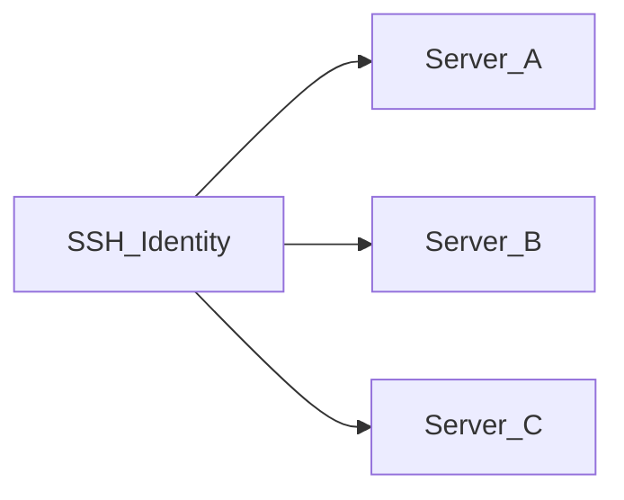

# SSH identities

An **SSH identity** is a reusable set of credentials (username + password or private key) stored **encrypted** in the application database. Servers reference identities instead of embedding secrets inline.

## Why identities exist

| Without identities | With identities |
|--------------------|-----------------|
| Duplicate credentials on every server | One identity shared by many servers |
| Rotating a key means editing every server | Update identity once; all linked servers use new credentials |
| Harder to audit | Clear mapping: identity → servers |

## Auth methods

- **Password** — username and password encrypted at rest
- **Private key** — username and PEM private key encrypted at rest

Secrets are encrypted with **AES-256-GCM** using `APP_ENCRYPTION_KEY` from `.env`. If you lose this key, encrypted credentials cannot be recovered.

## Creating an identity

1. Open **SSH Identities** in the sidebar (`/identities`)
2. Click **Add Identity**
3. Enter name, username, auth method, and secret
4. Save — credentials are encrypted before storage

## Editing and deleting

- **Edit** — you may leave password/key fields empty to keep existing secrets unchanged
- **Delete** — blocked if any server still uses the identity; reassign or delete those servers first

## Relationship to servers

Each server record stores a reference to one identity. Changing the identity on a server requires a successful **SSH test** before save.

## Security notes

- Identity secrets never appear in the UI after save (only placeholders on edit)
- Config **export** includes plaintext secrets — see [Import and export config](./import-export-config.md)
- Back up `.env` with `APP_ENCRYPTION_KEY` — see [Backup and restore](../operations/backup-restore.md)

## Related docs

- [Servers and SSH](./servers-and-ssh.md)
- [Manage servers](../user-guide/manage-servers.md)
