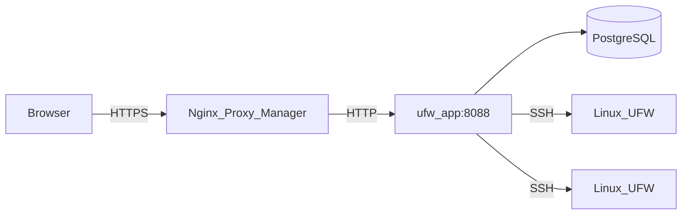

# Arquitectura

Esta página describe cómo está construido UFW Remote Manager, cómo fluyen los datos y dónde residen los secretos.

*Diagrama: Navegador → proxy inverso → aplicación → Postgres; aplicación → servidores destino por SSH.*

## Componentes

| Componente | Función |
|------------|---------|
| **ufw-app** | Aplicación Next.js (UI + API + server actions) |
| **ufw-postgres** | PostgreSQL — usuarios, credenciales cifradas, reglas, snapshots, auditoría |
| **ufw-migrate** | Contenedor one-shot — ejecuta `prisma migrate deploy` en cada despliegue |
| **Nginx Proxy Manager** | Terminación HTTPS externa (no forma parte de esta stack) |
| **Servidores Linux destino** | Hosts gestionados por UFW, accesibles por SSH |

## Flujo de solicitudes (producción)

1. El administrador abre `APP_URL` en un navegador (HTTPS vía NPM).
2. Better Auth valida la cookie de sesión.
3. Las server actions y rutas API orquestan el trabajo SSH y de base de datos.
4. La **sincronización inicial** se ejecuta automáticamente en segundo plano cuando **aún no existe un snapshot UFW en Postgres** (`needsSync`) — por ejemplo justo después de crear un servidor o antes del primer actualización.

Esto mantiene las páginas de servidor rápidas mientras el trabajo SSH ocurre solo cuando actualiza explícitamente o cuando la aplicación aún no tiene estado en caché.

## Modelo de concurrencia

- **Cola SSH por servidor** (`p-queue`, concurrencia 1) — las operaciones en el mismo host se serializan
- **Una sola réplica** de la aplicación en producción — los límites de tasa están en memoria
- No escale a varias réplicas sin almacenamiento compartido de límites (p. ej. Redis)

## Almacenamiento de datos

| Datos | Ubicación | ¿Cifrado? |
|-------|-----------|-----------|
| Contraseñas SSH / claves privadas | Postgres (tabla `identity`) | Sí — AES-256-GCM con `APP_ENCRYPTION_KEY` |
| Reglas UFW, borradores, snapshots | Postgres | Solo metadatos; el contenido de reglas no es secreto |
| Sesiones | Postgres (Better Auth) | Tokens de sesión; protegidos por `BETTER_AUTH_SECRET` |
| Eventos de auditoría | Postgres | Quién hizo qué y cuándo |
| Secretos `.env` | Solo sistema de archivos del host | Nunca deben estar en git |

## Límites de seguridad

- Postgres **no** se publica en el host en producción (`docker-compose.prod.yml`)
- El puerto de la aplicación es accesible en la red Docker (NPM + interna), no en `0.0.0.0` en prod
- La validación de destinos SSH bloquea IP privadas/metadatos por defecto; opcional `SSH_ALLOWED_CIDRS`
- Las respuestas en producción incluyen CSP, HSTS y cabeceras de seguridad (`next.config.ts`)

## Documentación relacionada

- [Modelo de seguridad](./administration/security-model.md)
- [Flujo de borrador y aplicación](./concepts/draft-apply-workflow.md)
- [Variables de entorno](./administration/environment-variables.md)
