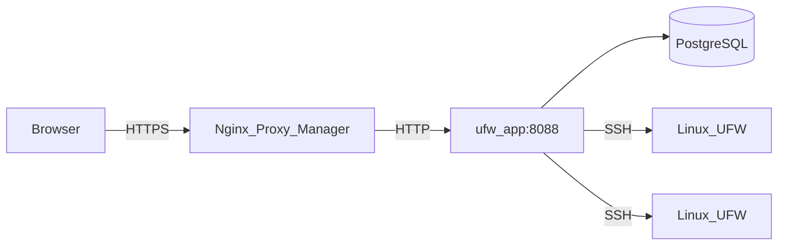

# Arquitectura

Esta página describe cómo está construido UFW Remote Manager, cómo fluyen los datos y dónde residen los secretos.

*Diagrama: Navegador → proxy inverso → aplicación → Postgres; aplicación → servidores de destino por SSH.*

## Componentes

| Componente | Función |
|-----------|------|
| **ufw-app** | Aplicación Next.js (interfaz + API + server actions) |
| **ufw-postgres** | PostgreSQL — usuarios, credenciales cifradas, reglas, snapshots, auditoría |
| **ufw-migrate** | Contenedor de una sola ejecución — ejecuta `prisma migrate deploy` en cada despliegue |
| **Nginx Proxy Manager** | Terminación HTTPS externa (no forma parte de este stack) |
| **Servidores Linux de destino** | Hosts gestionados por UFW alcanzados por SSH |

## Flujo de solicitudes (producción)

1. El administrador abre `APP_URL` en un navegador (HTTPS vía NPM).
2. Better Auth valida la cookie de sesión.
3. Las server actions y las rutas de API orquestan el trabajo SSH y de base de datos.
4. Los comandos UFW se ejecutan en hosts remotos solo tras la confirmación explícita de aplicación.

## Configuración en tiempo de ejecución

La URL pública se configura en **tiempo de ejecución**, no se incluye en la imagen Docker:

- `APP_URL` en `.env` → `BETTER_AUTH_URL` en el contenedor
- Una imagen GHCR sirve para cualquier dominio — consulte [GHCR + Compose](./deployment/ghcr-compose.md)

Implementación: `getPublicAppUrl()` en `src/lib/app-url.ts`.

## Modelo de concurrencia

- **Cola SSH por servidor** (`p-queue`, concurrencia 1) — las operaciones en el mismo host se serializan
- **Una sola réplica de la aplicación** en producción — los límites de tasa están en memoria
- No escale a varias réplicas de la aplicación sin añadir almacenamiento compartido de límites de tasa (p. ej. Redis)

## Almacenamiento de datos

| Dato | Ubicación | ¿Cifrado? |
|------|----------|------------|
| Contraseñas SSH / claves privadas | Postgres (tabla `identity`) | Sí — AES-256-GCM con `APP_ENCRYPTION_KEY` |
| Reglas UFW, borradores, snapshots | Postgres | Solo metadatos; el contenido de las reglas no es secreto |
| Sesiones | Postgres (Better Auth) | Tokens de sesión; protegidos por `BETTER_AUTH_SECRET` |
| Eventos de auditoría | Postgres | Quién hizo qué y cuándo |
| Secretos de `.env` | Solo en el sistema de archivos del host | Nunca deben estar en git |

## Límites de seguridad

- Postgres **no** se publica en el host en producción (`docker-compose.prod.yml`)
- El puerto de la aplicación es accesible en la red Docker (NPM + interna), no en `0.0.0.0` en prod
- La validación de destinos SSH bloquea IPs privadas/de metadatos por defecto; opcional `SSH_ALLOWED_CIDRS`
- Las respuestas en producción incluyen CSP, HSTS y cabeceras de seguridad (`next.config.ts`)

## Documentación relacionada

- [Modelo de seguridad](./administration/security-model.md)
- [Flujo de borrador y aplicación](./concepts/draft-apply-workflow.md)
- [Variables de entorno](./administration/environment-variables.md)
