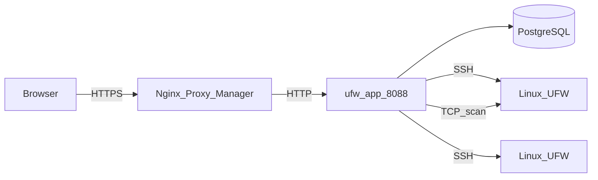
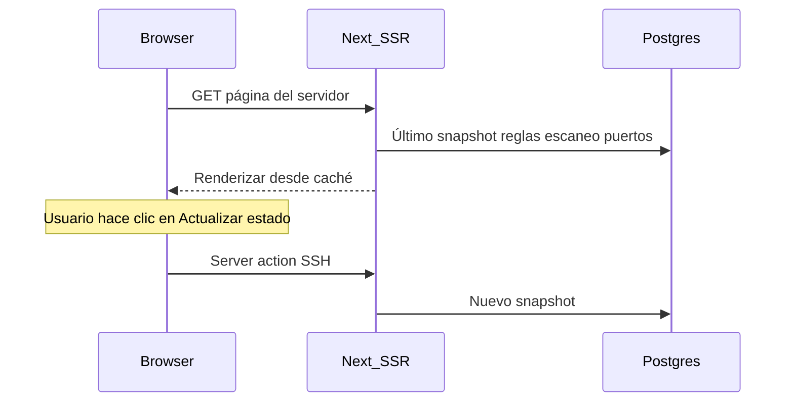

# Arquitectura

Esta página describe cómo está construido UFW Remote Manager, cómo fluyen los datos y dónde residen los secretos. Versión **v0.9.2**.

*Diagrama: Navegador → proxy inverso → app → Postgres; app → servidores destino por SSH; escaneo de puertos opcional desde el contenedor de la app hacia hosts destino.*

## Componentes

| Componente | Función |
|-----------|------|
| **ufw-app** | Aplicación Next.js (interfaz, server actions, rutas API) |
| **ufw-postgres** | PostgreSQL — usuarios, credenciales cifradas, reglas, snapshots, escaneos, auditoría |
| **ufw-migrate** | Contenedor de una sola ejecución — `prisma migrate deploy` en cada despliegue |
| **Nginx Proxy Manager** | Terminación HTTPS externa (no forma parte de este stack) |
| **Servidores Linux destino** | Hosts gestionados por UFW alcanzados por SSH |

## Flujo de peticiones (producción)

1. El administrador abre `APP_URL` en un navegador (HTTPS vía NPM).
2. Better Auth valida la cookie de sesión.
3. Las server actions orquestan el trabajo SSH y de base de datos.
4. Los comandos UFW se ejecutan en hosts remotos solo tras confirmación explícita de aplicación.
5. El escaneo de puertos (cuando está activado) ejecuta Naabu/Nmap desde el contenedor de la app — no por SSH.

## Modelo de carga del detalle de servidor (cache-first)

Abrir el panel de un servidor **no** abre SSH en la carga inicial de la página:

| Paso | Origen | ¿SSH? |
|------|--------|-------|
| Insignia de estado UFW | Último `serverSnapshot` | No |
| Tabla de reglas (primera página) | Borrador + snapshot + registros de reglas | No |
| Panel de escaneo de puertos | Último escaneo de cualquier estado (v0.9.2) | No |
| **Actualizar estado** | Detección en vivo + actualización de snapshot | Sí |
| **Confirmar aplicación** | Comandos UFW + sincronización post-aplicación | Sí |
| **Sincronización inicial** (sin snapshot) | Operación de sincronización en segundo plano | Sí |

## Modelo de concurrencia

Consulte [Operaciones y concurrencia](./concepts/operations-and-concurrency.md) para el detalle completo. Resumen:

| Mecanismo | Comportamiento |
|-----------|----------------|
| **Cola por servidor** | SSH + escrituras DB post-SSH serializadas (`p-queue`, concurrencia 1) |
| **Escaneo de puertos** | Fuera de la cola SSH — no bloquea operaciones UFW |
| **Límites de tasa** | En memoria; enfriamiento de 30 s por servidor para actualizar/sincronizar/escanear |
| **Réplica única** | Producción asume una instancia de la app |

Aplicar y actualizar mantienen la cola durante la persistencia del snapshot y la sincronización de registros de reglas — no solo durante la sesión SSH.

## Modelo de datos (PostgreSQL)

| Entidad | Propósito |
|--------|-----------|
| **user** | Cuenta de administrador única (Better Auth) |
| **identity** | Credenciales SSH cifradas |
| **server** | Host, puerto, enlace a identidad, huella de clave host |
| **serverSnapshot** | Estado UFW y reglas parseadas en un instante |
| **ruleRecord** | Metadatos locales (grupo, nombre, notas) indexados por huella |
| **draftSession** / **draftRule** | Copia de trabajo editable por usuario y servidor |
| **applySession** / **applySessionItem** | Estado del pipeline de vista previa y aplicación |
| **operationLog** | Progreso de tareas de larga duración |
| **auditEvent** | Acciones relevantes para seguridad |
| **portScan** / **portScanFinding** | Ejecuciones y resultados de escaneo externo |

Los snapshots se conservan (últimos 10 por servidor); los antiguos se eliminan al capturar uno nuevo.

## Configuración en tiempo de ejecución

La URL pública se configura en **tiempo de ejecución**, no se incluye en la imagen Docker:

- `APP_URL` en `.env` → `BETTER_AUTH_URL` en el contenedor
- Una imagen GHCR funciona para cualquier dominio — consulte [GHCR + Compose](./deployment/ghcr-compose.md)

**Importante:** `APP_URL` es la **URL HTTPS pública** que usa el navegador. NPM reenvía a `http://ufw-app:8088` en la red Docker — el HTTP interno es intencional.

## Almacenamiento de datos y cifrado

| Dato | Ubicación | ¿Cifrado? |
|------|-----------|-----------|
| Contraseñas / claves privadas SSH | Postgres (`identity`) | Sí — AES-256-GCM (`APP_ENCRYPTION_KEY`) |
| Reglas UFW, borradores, snapshots | Postgres | El contenido de reglas no es secreto; las credenciales sí |
| Sesiones | Postgres (Better Auth) | Protegidas por `BETTER_AUTH_SECRET` |
| Eventos de auditoría | Postgres | Quién hizo qué y cuándo |
| Secretos de `.env` | Sistema de archivos del host | Nunca deben estar en git |

## Límites de seguridad

- Postgres **no** se publica al host en producción (`docker-compose.prod.yml`)
- Puerto de la app accesible en la red Docker (NPM + interna), no en `0.0.0.0` en prod
- La validación de destino SSH bloquea IPs privadas/metadatos por defecto; opcional `SSH_ALLOWED_CIDRS`
- Las respuestas de producción incluyen CSP, HSTS y cabeceras de seguridad (`next.config.ts`)

## Documentos relacionados

- [Operaciones y concurrencia](./concepts/operations-and-concurrency.md)
- [Modelo de seguridad](./administration/security-model.md)
- [Variables de entorno](./administration/environment-variables.md)
