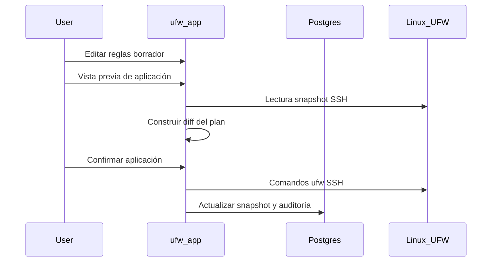

# Flujo de borrador y aplicación

UFW Remote Manager nunca envía cambios de firewall en silencio. Toda mutación sigue **editar → vista previa → confirmar → aplicar**.

## Pasos

### 1. Editar borrador

Modifique reglas en la tabla: añadir, editar, eliminar, reordenar, importar. Los cambios viven en el **borrador local** hasta aplicarse.

### 2. Vista previa de aplicación

Haga clic en **Guardar reglas** (vista previa). La aplicación:

1. Carga el estado UFW actual del servidor (snapshot SSH)
2. Calcula un **plan** — comandos que alinearían UFW con su borrador
3. Muestra reglas añadidas, eliminadas y reordenadas

Revise la vista previa con cuidado. Preste atención a reglas que podrían bloquearle el acceso (p. ej. bloquear SSH).

### 3. Confirmar

Confirme en el diálogo. Solo entonces se ejecutan los comandos UFW por SSH.

### 4. Ejecución de la aplicación

Los comandos se ejecutan secuencialmente en el servidor (cola por servidor, concurrencia 1). El progreso aparece en el **banner de operaciones** con estado paso a paso.

### 5. Sincronización posterior a la aplicación

Tras el éxito, la aplicación actualiza el snapshot y sincroniza los estados de origen del borrador para que los colores de fila reflejen la nueva realidad.

## Diagrama de secuencia

## Aplicación parcial y deriva

Si la aplicación falla a mitad de camino, UFW remoto puede diferir tanto del borrador como del snapshot. La interfaz le avisa y ofrece **Resincronización forzada desde el servidor** para realinear el estado local con las reglas remotas reales antes de seguir editando.

**Nunca ignore avisos de aplicación parcial** — continuar a ciegas puede causar reglas duplicadas o errores de orden.

## Salvaguarda de acceso SSH

El planificador de aplicación incluye salvaguardas en torno a reglas de acceso SSH cuando están configuradas — consulte las pruebas en `src/lib/ufw/commands.allow-ssh.test.ts`. Aun así, verifique la vista previa manualmente en servidores de producción.

## Documentación relacionada

- [Reglas UFW y estados](./ufw-rules-and-states.md)
- [Editar y aplicar reglas](../user-guide/edit-and-apply-rules.md)
- [Historial de operaciones](../user-guide/operations-history.md)
