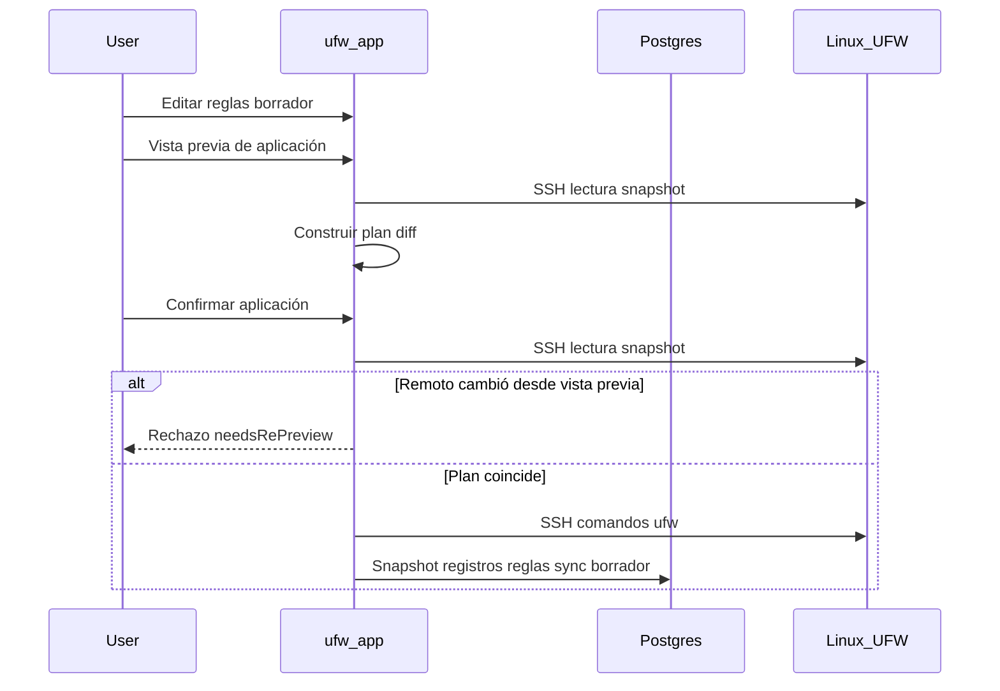

# Flujo de borrador y aplicación

UFW Remote Manager nunca aplica cambios de firewall en silencio. Toda mutación sigue **editar → vista previa → confirmar → aplicar**.

## Pasos

### 1. Editar borrador

Cambie reglas en la tabla: añadir, editar, eliminar, reordenar, importar. Los cambios viven en el **borrador local** hasta aplicarse.

### 2. Vista previa de aplicación

Haga clic en **Vista previa de aplicación** (flujo Guardar reglas). La app:

1. Carga el estado UFW actual del servidor (SSH)
2. Calcula un **plan** — comandos UFW para alinear remoto con su borrador
3. Muestra reglas añadidas, eliminadas, actualizadas y reordenadas

Revise con cuidado. Preste atención a reglas que podrían bloquearle (p. ej. bloquear SSH).

### 3. Confirmar

Confirme en el diálogo. Solo entonces se ejecutan comandos UFW por SSH.

Si UFW remoto cambió desde la vista previa, la aplicación se **rechaza** — ejecute la vista previa de nuevo.

### 4. Ejecución de aplicación

Los comandos se ejecutan secuencialmente en el servidor dentro de la **cola por servidor**. El progreso aparece en el **banner de operaciones** con estado paso a paso.

### 5. Sincronización post-aplicación

Tras ejecución UFW exitosa, aún dentro de la cola:

1. Persistir un nuevo snapshot desde detección en vivo
2. Sincronizar filas `ruleRecord` desde detección (no caché obsoleta)
3. Actualizar estados de origen del borrador para que los colores coincidan con la realidad

Desde v0.9.2, los registros de reglas post-aplicación se construyen desde **datos de detección en vivo**, evitando que reglas remotas eliminadas reaparezcan en la base de datos.

## Diagrama de secuencia

## Aplicación parcial y deriva

| Escenario | Estado de sesión | Qué hacer |
|-----------|------------------|-----------|
| UFW remoto cambió **entre vista previa y confirmación** | Rechazado (`needsRePreview`) | Ejecute **Vista previa de aplicación** de nuevo — no fuerce resincronización |
| Comandos UFW **interrumpidos** en servidor | `PARTIAL` (`needsResync`) | **Resincronización forzada desde el servidor**, luego revise |
| UFW tuvo éxito pero **falló sync post-aplicación** | `PARTIAL` (`needsResync`) | **Resincronización forzada desde el servidor** — UFW remoto ya cambió |

**Nunca ignore advertencias de aplicación parcial** — continuar a ciegas puede causar reglas duplicadas o errores de orden.

## Aplicación solo en BD

Si la vista previa muestra cambios solo de metadatos (sin diff de comandos UFW), confirmar actualiza registros locales sin comandos UFW remotos.

## Salvaguarda Allow SSH

El planificador de aplicación incluye salvaguardas alrededor de reglas de acceso SSH cuando está configurado. Aun así, verifique la vista previa manualmente en servidores de producción.

## Documentos relacionados

- [Reglas UFW y estados](./ufw-rules-and-states.md)
- [Editar y aplicar reglas](../user-guide/edit-and-apply-rules.md)
- [Operaciones y concurrencia](./operations-and-concurrency.md)
