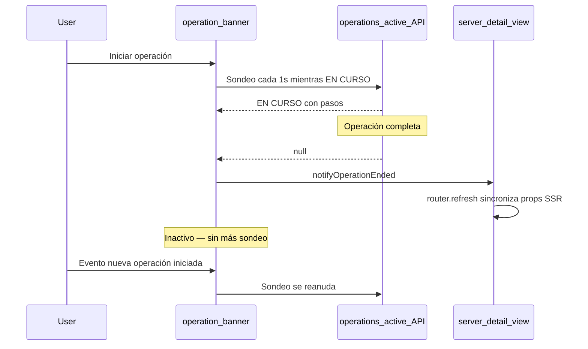
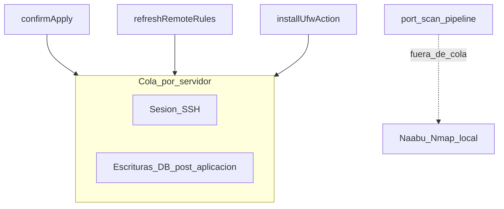

# Operaciones y concurrencia

UFW Remote Manager ejecuta tareas largas (aplicar, sincronizar, actualizar, instalar, escaneo de puertos) de forma asíncrona. La interfaz rastrea el progreso mediante **registros de operaciones**, el **banner de operaciones** y sondeo del lado del cliente. Esta página explica cómo encajan esas piezas y cómo la app evita condiciones de carrera en el mismo servidor.

## Banner de operaciones

Mientras el trabajo está en curso, aparece un banner en la parte superior de la app (y en la página de detalle del servidor cuando está acotado a un servidor).

| Elemento | Descripción |
|---------|-------------|
| **Tipo** | Etiqueta traducida, p. ej. aplicar reglas, actualizar estado, escaneo de puertos |
| **Estado** | `RUNNING`, `PENDING`, `SUCCESS`, `FAILED` o `PARTIAL` |
| **Pasos** | Lista expandible con estado por paso y mensajes de error |
| **Progreso** | Contador opcional actual/total para operaciones de varios pasos |

En **ÉXITO**, el banner se cierra automáticamente tras unos 10 segundos. Puede cerrarlo manualmente antes. Las operaciones fallidas y parciales permanecen visibles hasta cerrarlas.

El banner carga operaciones activas desde `/api/operations/active`. Ese endpoint devuelve solo operaciones en estado `RUNNING` o `PENDING` — no las terminales.

## Ciclo de vida del sondeo del cliente

### Sondeo activo

Mientras una operación está `RUNNING` o `PENDING`, el banner sondea aproximadamente cada **1 segundo** (con backoff para hooks específicos de escaneo de puertos tras ejecuciones largas).

### Comportamiento inactivo (desde v0.9.2)

Cuando no existe operación activa, el banner **deja de sondear**. Esto evita cientos de peticiones API inactivas por hora por pestaña del navegador.

El sondeo **se reinicia** cuando:

- Inicia una nueva operación (evento del navegador `OPERATION_STARTED`), o
- La página carga y encuentra una operación activa en la primera petición.

### Evento de fin de operación

Cuando el sondeo detecta una transición de `RUNNING`/`PENDING` a `null`, o recibe un estado terminal (`SUCCESS`, `FAILED`, `PARTIAL`), la app despacha `OPERATION_ENDED`.

La vista de detalle del servidor escucha este evento. Mientras una operación está activa, bloquea sincronizar props SSR (reglas, recuentos de puertos) desde una actualización de página obsoleta. Cuando termina la operación, llama `router.refresh()` para que la interfaz refleje el último estado de la base de datos.

Si el banner desaparece pero la tabla de reglas parece obsoleta tras sincronizar o aplicar, actualice la página una vez — esto ya no debería ocurrir tras v0.9.2 en condiciones normales.

## Cola SSH por servidor

El trabajo remoto en un servidor dado se serializa mediante una **cola por servidor** (`p-queue`, concurrencia 1):

### Qué corre dentro de la cola

| Operación | SSH | Escrituras DB post-SSH |
|-----------|-----|------------------------|
| **Aplicar reglas** | Comandos UFW + lectura final de detección | Persistir snapshot, registros de reglas, estados de origen del borrador — **dentro del mismo bloqueo de cola** |
| **Actualizar / sincronizar reglas** | Lectura de estado UFW (cuando no se pasa detección) | Persistir snapshot, re-sembrar borrador — **dentro de la cola** |
| **Instalar UFW** | install + enable + detección | Actualizar reglas remotas — **dentro de la cola** |

Esto evita que dos flujos concurrentes (por ejemplo aplicar y actualizar) escriban snapshots o registros de reglas en orden conflictivo.

### Qué corre fuera de la cola

**Escaneo de puertos** (Naabu + Nmap) corre **localmente en el contenedor de la app** y **no** mantiene la cola SSH. Un escaneo largo (~30+ minutos) por tanto no bloquea actualización UFW o aplicación en el mismo servidor.

El solapamiento de escaneo de puertos se previene por separado: solo se permite un escaneo `PENDING` o `RUNNING` por servidor. Iniciar otro devuelve error *escaneo ya en curso*.

## Límites de tasa

Las acciones repetidas en el mismo servidor usan un **enfriamiento de 30 segundos** (fijo en código de aplicación, no configurable por variables de entorno):

| Acción | Clave de enfriamiento |
|--------|----------------------|
| Actualizar estado / sincronizar reglas | `ufw-refresh:{serverId}` |
| Iniciar escaneo de puertos | `port-scan:{serverId}` |

Límites adicionales:

| Acción | Límite |
|--------|--------|
| Setup (primer admin) | 5 intentos por minuto por IP cliente |
| Exportar configuración | 5 por minuto por usuario |
| Vista previa importación configuración | 10 por minuto por usuario |
| Instalar UFW | 3 por minuto por servidor |

Los buckets de límite de tasa están **en memoria**. La app está diseñada para **una réplica única** en producción. Ejecutar varias instancias sin almacenamiento compartido de límites permite eludirlos.

Detrás de Nginx Proxy Manager, configure `TRUST_PROXY=1` para que los límites de setup usen la IP real del cliente desde `X-Forwarded-For`.

## Barrido de operaciones obsoletas

Si el navegador se desconecta a mitad de operación, el banner puede no actualizarse. Un barrido en segundo plano marca operaciones `RUNNING` muy antiguas como fallidas (típicamente en 30–60 minutos). Actualice la página para limpiar un banner atascado; consulte **Historial de operaciones** para el estado final.

## Límites de error

Los límites de error del lado del cliente evitan que un fallo de una sola página rompa todo el shell:

| Ámbito | Archivo | Recuperación |
|--------|---------|--------------|
| Shell de la app | `src/app/(app)/error.tsx` | **Reintentar** restablece el límite de error |
| Detalle de servidor | `src/app/(app)/servers/[serverAddress]/error.tsx` | **Reintentar** o **Volver a servidores** |

Estos capturan errores de renderizado en componentes hijos. No reemplazan mensajes de error operacionales de SSH o aplicación fallida — esos aparecen en el banner de operaciones e historial de operaciones.

## Documentos relacionados

- [Historial de operaciones](../user-guide/operations-history.md)
- [Flujo de borrador y aplicación](./draft-apply-workflow.md)
- [Arquitectura](../architecture.md)
- [Escaneo de puertos (guía de usuario)](../user-guide/port-scan.md)
