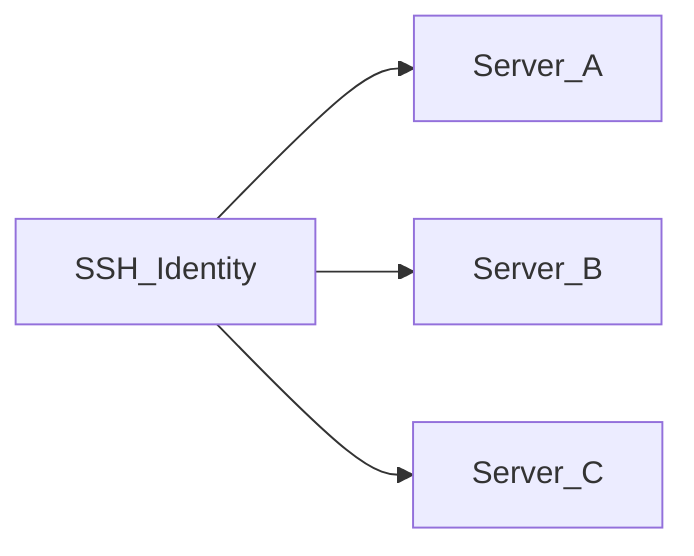

# Identidades SSH

Una **identidad SSH** es un conjunto reutilizable de credenciales (nombre de usuario + contraseña o clave privada) almacenado **cifrado** en la base de datos de la aplicación. Los servidores referencian identidades en lugar de incrustar secretos directamente.

## Por qué existen las identidades

| Sin identidades | Con identidades |
|--------------------|-----------------|
| Credenciales duplicadas en cada servidor | Una identidad compartida por muchos servidores |
| Rotar una clave implica editar cada servidor | Actualice la identidad una vez; todos los servidores vinculados usan las nuevas credenciales |
| Más difícil de auditar | Mapeo claro: identidad → servidores |

## Métodos de autenticación

- **Contraseña** — nombre de usuario y contraseña cifrados en reposo
- **Clave privada** — nombre de usuario y clave privada PEM cifrados en reposo

Los secretos se cifran con **AES-256-GCM** usando `APP_ENCRYPTION_KEY` de `.env`. Si pierde esta clave, las credenciales cifradas no se pueden recuperar.

## Crear una identidad

1. Abra **Identidades SSH** en la barra lateral (`/identities`)
2. Haga clic en **Añadir identidad**
3. Introduzca nombre, nombre de usuario, método de autenticación y secreto
4. Guarde — las credenciales se cifran antes del almacenamiento

## Editar y eliminar

- **Editar** — puede dejar los campos de contraseña/clave vacíos para conservar los secretos existentes
- **Eliminar** — bloqueado si algún servidor sigue usando la identidad; reasigne o elimine esos servidores primero

## Relación con los servidores

Cada registro de servidor almacena una referencia a una identidad. Cambiar la identidad de un servidor requiere una **prueba SSH** exitosa antes de guardar.

## Notas de seguridad

- Los secretos de identidad nunca aparecen en la interfaz tras guardar (solo marcadores de posición al editar)
- La **exportación** de configuración incluye secretos en texto plano — consulte [Importar y exportar configuración](./import-export-config.md)
- Haga copia de seguridad de `.env` con `APP_ENCRYPTION_KEY` — consulte [Copia de seguridad y restauración](../operations/backup-restore.md)

## Documentación relacionada

- [Servidores y SSH](./servers-and-ssh.md)
- [Administrar servidores](../user-guide/manage-servers.md)
