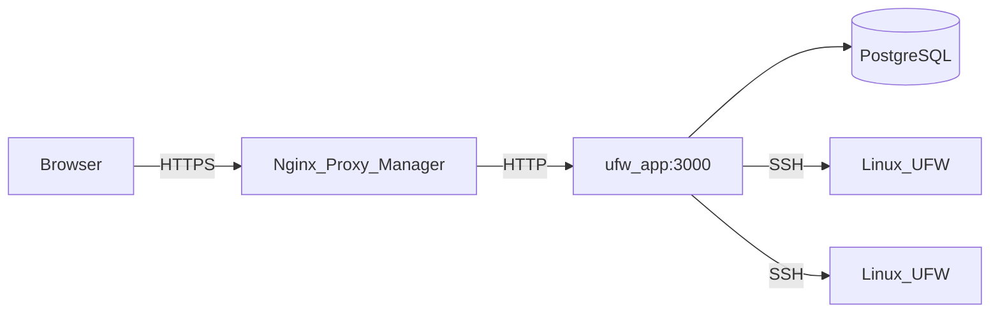

# Architecture

Cette page décrit comment UFW Remote Manager est construit, comment les données circulent et où résident les secrets.

*Schéma : Navigateur → proxy inverse → application → Postgres ; application → serveurs cibles via SSH.*

## Composants

| Composant | Rôle |
|-----------|------|
| **ufw-app** | Application Next.js (interface + API + server actions) |
| **ufw-postgres** | PostgreSQL — utilisateurs, identifiants chiffrés, règles, snapshots, audit |
| **ufw-migrate** | Conteneur one-shot — exécute `prisma migrate deploy` à chaque déploiement |
| **Nginx Proxy Manager** | Terminaison HTTPS externe (hors de cette stack) |
| **Serveurs Linux cibles** | Hôtes gérés par UFW, accessibles via SSH |

## Flux des requêtes (production)

1. L'administrateur ouvre `APP_URL` dans un navigateur (HTTPS via NPM).
2. Better Auth valide le cookie de session.
3. Les server actions et routes API orchestrent le travail SSH et base de données.
4. Les commandes UFW s'exécutent sur les hôtes distants uniquement après confirmation explicite d'application.

## Configuration d'exécution

L'URL publique est définie à **l'exécution**, pas intégrée dans l'image Docker :

- `APP_URL` dans `.env` → `BETTER_AUTH_URL` dans le conteneur
- Une image GHCR fonctionne pour n'importe quel domaine — voir [GHCR + Compose](./deployment/ghcr-compose.md)

Implémentation : `getPublicAppUrl()` dans `src/lib/app-url.ts`.

## Modèle de concurrence

- **File d'attente SSH par serveur** (`p-queue`, concurrence 1) — les opérations sur le même hôte sont sérialisées
- **Une seule réplique** de l'application en production — les limites de débit sont en mémoire
- Ne pas scaler à plusieurs répliques sans stockage partagé des limites (ex. Redis)

## Stockage des données

| Données | Emplacement | Chiffré ? |
|---------|-------------|-----------|
| Mots de passe SSH / clés privées | Postgres (table `identity`) | Oui — AES-256-GCM avec `APP_ENCRYPTION_KEY` |
| Règles UFW, brouillons, snapshots | Postgres | Métadonnées uniquement ; le contenu des règles n'est pas secret |
| Sessions | Postgres (Better Auth) | Jetons de session ; protégés par `BETTER_AUTH_SECRET` |
| Événements d'audit | Postgres | Qui a fait quoi et quand |
| Secrets `.env` | Système de fichiers de l'hôte uniquement | Ne doivent jamais être dans git |

## Limites de sécurité

- Postgres n'est **pas** publié sur l'hôte en production (`docker-compose.prod.yml`)
- Le port de l'application est accessible sur le réseau Docker (NPM + interne), pas sur `0.0.0.0` en prod
- La validation des cibles SSH bloque les IP privées/métadonnées par défaut ; option `SSH_ALLOWED_CIDRS`
- Les réponses en production incluent CSP, HSTS et en-têtes de sécurité (`next.config.ts`)

## Documentation associée

- [Modèle de sécurité](./administration/security-model.md)
- [Workflow brouillon et application](./concepts/draft-apply-workflow.md)
- [Variables d'environnement](./administration/environment-variables.md)
