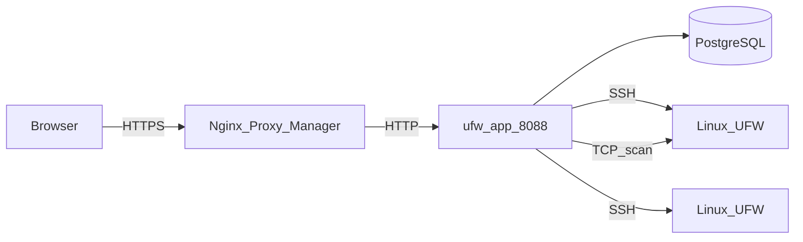
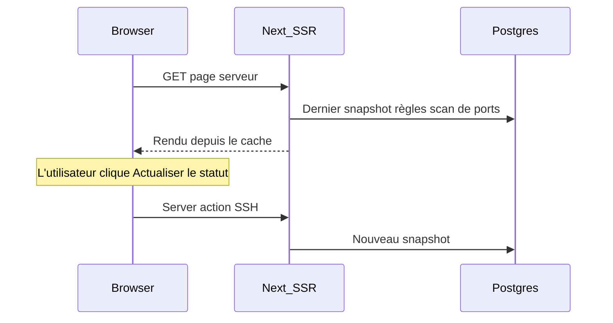

# Architecture

Cette page décrit comment UFW Remote Manager est construit, comment les données circulent et où résident les secrets. Version **v0.9.6**.

*Schéma : Navigateur → reverse proxy → app → Postgres ; app → serveurs cibles via SSH ; scan de ports optionnel depuis le conteneur app vers les hôtes cibles.*

## Composants

| Composant | Rôle |
|-----------|------|
| **ufw-app** | Application Next.js (interface, server actions, routes API) |
| **ufw-postgres** | PostgreSQL — utilisateurs, identifiants chiffrés, règles, snapshots, scans, audit |
| **ufw-migrate** | Conteneur one-shot — `prisma migrate deploy` à chaque déploiement |
| **Nginx Proxy Manager** | Terminaison HTTPS externe (hors de cette stack) |
| **Serveurs Linux cibles** | Hôtes gérés par UFW accessibles via SSH |

## Flux de requêtes (production)

1. L'administrateur ouvre `APP_URL` dans un navigateur (HTTPS via NPM).
2. Better Auth valide le cookie de session.
3. Les server actions orchestrent le travail SSH et base de données.
4. Les commandes UFW s'exécutent sur les hôtes distants uniquement après confirmation explicite d'application.
5. Le scan de ports (si activé) exécute Naabu/Nmap depuis le conteneur app — pas via SSH.

## Modèle de chargement de la page serveur (cache-first)

L'ouverture d'un tableau de bord serveur **n'ouvre pas** SSH au chargement initial de la page :

| Étape | Source | SSH ? |
|-------|--------|-------|
| Badge statut UFW | Dernier `serverSnapshot` | Non |
| Tableau de règles (première page) | Brouillon + snapshot + enregistrements de règles | Non |
| Panneau scan de ports | Dernier scan de tout statut (v0.9.2) | Non |
| **Actualiser le statut** | Détection en direct + mise à jour du snapshot | Oui |
| **Confirmer l'application** | Commandes UFW + sync post-application | Oui |
| **Sync initiale** (sans snapshot) | Opération de sync en arrière-plan | Oui |

## Modèle de concurrence

Voir [Opérations et concurrence](./concepts/operations-and-concurrency.md) pour le détail complet. Résumé :

| Mécanisme | Comportement |
|-----------|--------------|
| **File d'attente par serveur** | SSH + écritures BD post-SSH sérialisées (`p-queue`, concurrence 1) |
| **Scan de ports** | Hors file SSH — ne bloque pas les opérations UFW |
| **Limites de débit** | En mémoire ; cooldown de 30 s par serveur pour actualisation/sync/scan |
| **Réplique unique** | La production suppose une instance d'application |

L'application et l'actualisation retiennent la file jusqu'à la persistance du snapshot et la sync des enregistrements de règles — pas seulement pendant la session SSH.

## Modèle de données (PostgreSQL)

| Entité | Rôle |
|--------|------|
| **user** | Compte administrateur unique (Better Auth) |
| **identity** | Identifiants SSH chiffrés |
| **server** | Hôte, port, lien vers l'identité, empreinte de clé hôte |
| **serverSnapshot** | Statut UFW et règles analysées à un instant donné |
| **ruleRecord** | Métadonnées locales (groupe, nom, notes) indexées par empreinte |
| **draftSession** / **draftRule** | Copie de travail éditable par utilisateur et par serveur |
| **applySession** / **applySessionItem** | État du pipeline d'aperçu et d'application |
| **operationLog** | Progression des tâches longues |
| **auditEvent** | Actions pertinentes pour la sécurité |
| **portScan** / **portScanFinding** | Exécutions et résultats de scan externe |

Les snapshots sont conservés (10 derniers par serveur) ; les anciens snapshots sont purgés à chaque nouvelle capture.

## Configuration runtime

L'URL publique est définie à **l'exécution**, pas intégrée dans l'image Docker :

- `APP_URL` dans `.env` → `BETTER_AUTH_URL` dans le conteneur
- Une image GHCR fonctionne pour tout domaine — voir [GHCR + Compose](./deployment/ghcr-compose.md)

**Important :** `APP_URL` est l'**URL HTTPS publique** utilisée par le navigateur. NPM transmet vers `http://ufw-app:8088` sur le réseau Docker — le HTTP interne est intentionnel.

## Stockage des données et chiffrement

| Données | Emplacement | Chiffré ? |
|---------|-------------|-----------|
| Mots de passe / clés privées SSH | Postgres (`identity`) | Oui — AES-256-GCM (`APP_ENCRYPTION_KEY`) |
| Règles UFW, brouillons, snapshots | Postgres | Contenu des règles non secret ; les identifiants le sont |
| Sessions | Postgres (Better Auth) | Protégées par `BETTER_AUTH_SECRET` |
| Événements d'audit | Postgres | Qui a fait quoi et quand |
| Secrets `.env` | Système de fichiers hôte | Ne doivent jamais être dans git |

## Frontières de sécurité

- Postgres **n'est pas** publié sur l'hôte en production (`docker-compose.prod.yml`)
- Port app accessible sur le réseau Docker (NPM + interne), pas sur `0.0.0.0` en prod
- La validation des cibles SSH bloque les IP privées/métadonnées par défaut ; `SSH_ALLOWED_CIDRS` optionnel
- Les réponses en production incluent CSP, HSTS et en-têtes de sécurité (`next.config.ts`)

## Documentation associée

- [Opérations et concurrence](./concepts/operations-and-concurrency.md)
- [Modèle de sécurité](./administration/security-model.md)
- [Variables d'environnement](./administration/environment-variables.md)
