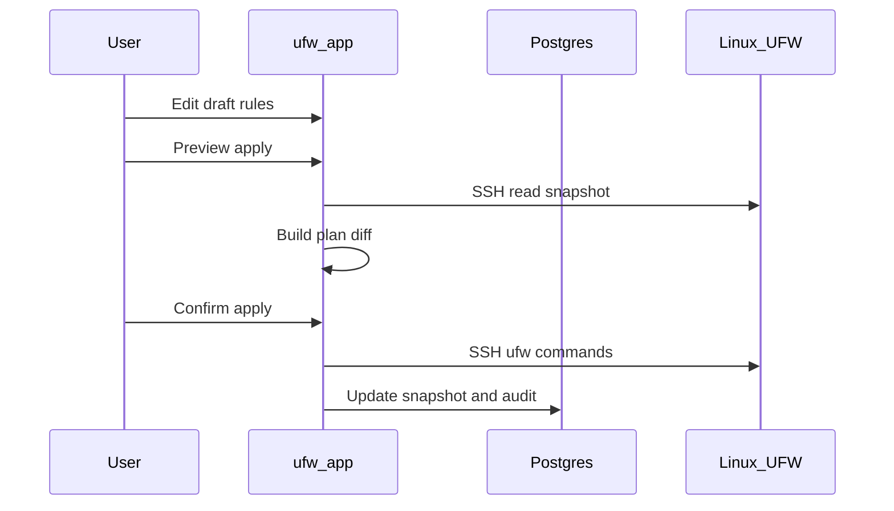

# Workflow brouillon et application

UFW Remote Manager ne pousse jamais de modifications de pare-feu silencieusement. Chaque mutation suit **édition → aperçu → confirmation → application**.

## Étapes

### 1. Éditer le brouillon

Modifiez les règles dans le tableau : ajouter, éditer, supprimer, réordonner, importer. Les modifications restent dans le **brouillon local** jusqu'à l'application.

### 2. Aperçu de l'application

Cliquez sur **Enregistrer les règles**. L'application :

1. Charge l'état UFW actuel depuis le serveur (snapshot SSH)
2. Calcule un **plan** — les commandes qui aligneraient UFW sur votre brouillon
3. Affiche les règles ajoutées, supprimées et réordonnées

Examinez l'aperçu attentivement. Portez attention aux règles pouvant vous verrouiller (ex. bloquer SSH).

### 3. Confirmation

Confirmez dans la boîte de dialogue. Ce n'est qu'alors que les commandes UFW sont exécutées via SSH.

### 4. Exécution de l'application

Les commandes s'exécutent séquentiellement sur le serveur (file par serveur, concurrence 1). La progression apparaît dans la **bannière d'opération** avec le statut étape par étape.

### 5. Synchronisation post-application

Après succès, l'application met à jour le snapshot et synchronise les états d'origine du brouillon pour que les couleurs des lignes reflètent la nouvelle réalité.

## Diagramme de séquence

## Application partielle et dérive

Si l'application échoue en cours de route, UFW distant peut différer à la fois du brouillon et du snapshot. L'interface vous avertit et propose **Resynchronisation forcée depuis le serveur** pour réaligner l'état local sur les règles distantes réelles avant de rééditer.

**N'ignorez jamais les avertissements d'application partielle** — continuer aveuglément peut provoquer des règles en double ou des erreurs d'ordre.

## Protection d'accès SSH

Le planificateur d'application inclut des protections autour des règles d'accès SSH lorsqu'elles sont configurées — voir les tests dans `src/lib/ufw/commands.allow-ssh.test.ts`. Vérifiez tout de même l'aperçu manuellement pour les serveurs de production.

## Documentation associée

- [Règles UFW et états](./ufw-rules-and-states.md)
- [Éditer et appliquer les règles](../user-guide/edit-and-apply-rules.md)
- [Historique des opérations](../user-guide/operations-history.md)
