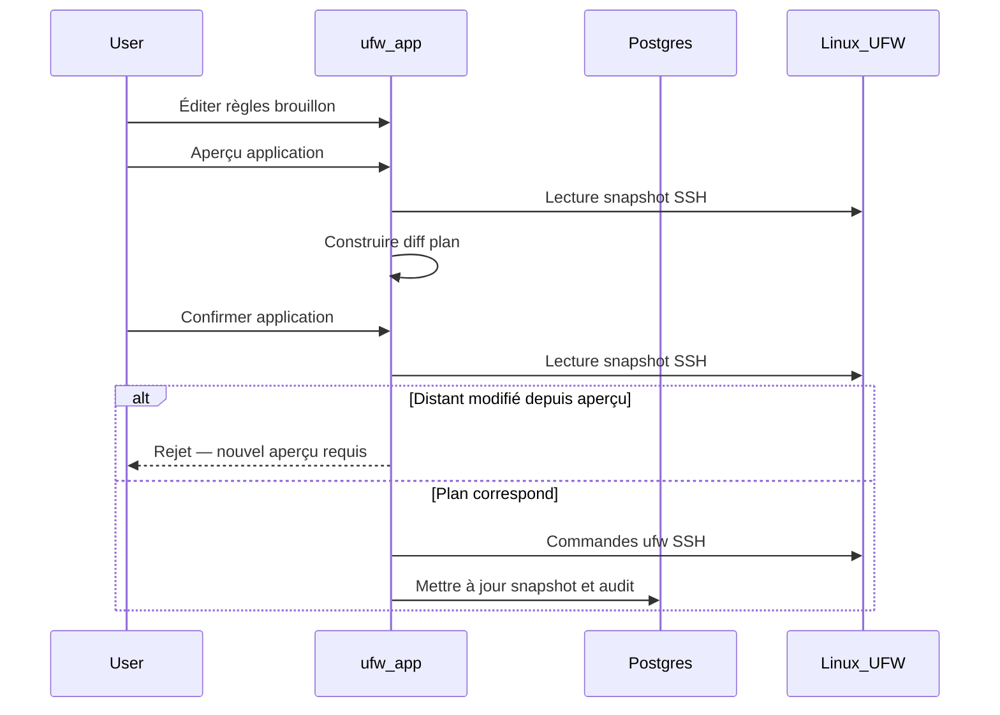

# Workflow brouillon et application

UFW Remote Manager ne pousse jamais les modifications de pare-feu en silence. Chaque mutation suit **édition → aperçu → confirmation → application**.

## Étapes

### 1. Éditer le brouillon

Modifiez les règles dans le tableau : ajouter, éditer, supprimer, réordonner, importer. Les changements restent dans le **brouillon local** jusqu'à application.

### 2. Aperçu d'application

Cliquez sur **Aperçu d'application**. L'application :

1. Charge l'état UFW actuel depuis le serveur (snapshot SSH)
2. Calcule un **plan** — commandes qui aligneraient UFW sur votre brouillon
3. Affiche les règles ajoutées, supprimées et réordonnées

Examinez l'aperçu attentivement. Portez attention aux règles qui pourraient vous exclure (ex. bloquer SSH).

### 3. Confirmer

Confirmez dans la boîte de dialogue. Ce n'est qu'alors que les commandes UFW sont exécutées via SSH.

### 4. Exécution de l'application

Les commandes s'exécutent séquentiellement sur le serveur (file par serveur, concurrence 1). La progression apparaît dans la **bannière d'opération** avec un statut étape par étape.

### 5. Synchronisation post-application

Après succès, l'application met à jour le snapshot et synchronise les états d'origine du brouillon pour que les couleurs des lignes reflètent la nouvelle réalité.

## Diagramme de séquence

## Application partielle et dérive

UFW distant peut changer entre aperçu et confirmation, ou l'application peut échouer en cours de route. L'application gère trois cas distincts :

| Scénario | Statut de session | Action |
|----------|-------------------|--------|
| UFW distant modifié **entre aperçu et confirmation** | Application rejetée (`needsRePreview`) | Relancer **Aperçu d'application** — ne pas forcer la resynchronisation |
| Commandes UFW **interrompues** sur le serveur | `PARTIAL` (`needsResync`) | **Forcer resync depuis serveur**, puis examiner avant édition |
| Commandes UFW réussies mais **sync post-application échouée** | `PARTIAL` (`needsResync`) | **Forcer resync depuis serveur** — UFW distant déjà modifié |

**N'ignorez jamais les avertissements d'application partielle** — continuer aveuglément peut provoquer des règles dupliquées ou des erreurs d'ordre.

## Protection SSH autorisé

Le planificateur d'application inclut des protections autour des règles d'accès SSH lorsque configuré — voir les tests dans `src/lib/ufw/commands.allow-ssh.test.ts`. Vérifiez quand même l'aperçu manuellement pour les serveurs de production.

## Documentation associée

- [Règles UFW et états](./ufw-rules-and-states.md)
- [Éditer et appliquer les règles](../user-guide/edit-and-apply-rules.md)
- [Historique des opérations](../user-guide/operations-history.md)
