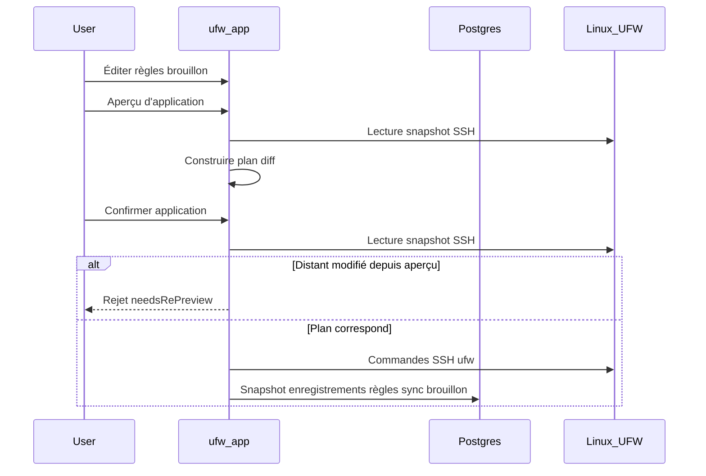

# Workflow brouillon et application

UFW Remote Manager ne pousse jamais les modifications de pare-feu silencieusement. Chaque mutation suit **édition → aperçu → confirmation → application**.

## Étapes

### 1. Éditer le brouillon

Modifiez les règles dans le tableau : ajout, modification, suppression, réordonnancement, import. Les modifications vivent dans le **brouillon local** jusqu'à l'application.

### 2. Aperçu d'application

Cliquez sur **Enregistrer les règles** (flux d'aperçu d'application). L'application :

1. Charge l'état UFW actuel depuis le serveur (SSH)
2. Calcule un **plan** — commandes UFW pour aligner le distant sur votre brouillon
3. Affiche les règles ajoutées, supprimées, mises à jour et réordonnées

Examinez attentivement. Portez attention aux règles pouvant vous verrouiller (ex. bloquer SSH).

### 3. Confirmer

Confirmez dans la boîte de dialogue. Ce n'est qu'alors que les commandes UFW sont exécutées via SSH.

Si UFW distant a changé depuis l'aperçu, l'application est **rejetée** — relancez l'aperçu.

### 4. Exécution de l'application

Les commandes s'exécutent séquentiellement sur le serveur dans la **file d'attente par serveur**. La progression apparaît dans la **bannière d'opérations** avec le statut étape par étape.

### 5. Sync post-application

Après exécution UFW réussie, toujours dans la file :

1. Persister un nouveau snapshot depuis la détection en direct
2. Synchroniser les lignes `ruleRecord` depuis la détection (pas le cache obsolète)
3. Mettre à jour les états d'origine du brouillon pour que les couleurs de ligne correspondent à la réalité

Depuis v0.9.2, les enregistrements de règles post-application sont construits depuis les **données de détection en direct**, empêchant les règles distantes supprimées de réapparaître dans la base de données.

## Diagramme de séquence

## Application partielle et dérive

| Scénario | Statut de session | Action |
|----------|-------------------|--------|
| UFW distant modifié **entre aperçu et confirmation** | Rejeté (`needsRePreview`) | Relancer **Aperçu d'application** — ne pas forcer la resync |
| Commandes UFW **interrompues** sur le serveur | `PARTIAL` (`needsResync`) | **Resynchronisation forcée depuis le serveur**, puis revoir |
| UFW réussi mais **sync post-application échouée** | `PARTIAL` (`needsResync`) | **Resynchronisation forcée depuis le serveur** — UFW distant déjà modifié |

**Ne jamais ignorer les avertissements d'application partielle** — continuer aveuglément peut provoquer des règles en double ou des erreurs d'ordre.

## Application BD uniquement

Si l'aperçu montre des modifications métadonnées uniquement (pas de diff de commandes UFW), la confirmation met à jour les enregistrements locaux sans commandes UFW distantes.

## Garde-fou Allow SSH

Le planificateur d'application inclut des garde-fous autour des règles d'accès SSH lorsque configuré. Vérifiez toujours l'aperçu manuellement sur les serveurs de production.

## Documentation associée

- [Règles UFW et états](./ufw-rules-and-states.md)
- [Éditer et appliquer les règles](../user-guide/edit-and-apply-rules.md)
- [Opérations et concurrence](./operations-and-concurrency.md)
