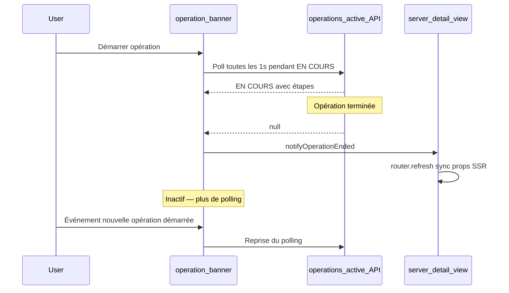
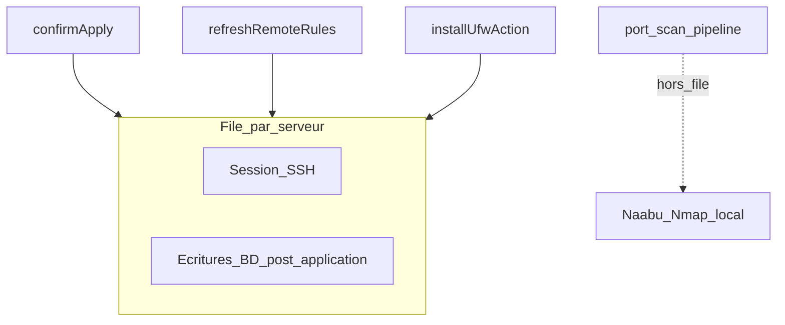

# Opérations et concurrence

UFW Remote Manager exécute les tâches longues (application, sync, actualisation, installation, scan de ports) de manière asynchrone. L'interface suit la progression via les **journaux d'opérations**, la **bannière d'opérations** et le polling côté client. Cette page explique comment ces éléments s'articulent et comment l'application évite les conditions de course sur le même serveur.

## Bannière d'opérations

Pendant l'exécution du travail, une bannière apparaît en haut de l'application (et sur la page de détail serveur lorsqu'elle est limitée à un serveur).

| Élément | Description |
|---------|-------------|
| **Type** | Libellé traduit, ex. application des règles, actualisation du statut, scan de ports |
| **Statut** | `RUNNING`, `PENDING`, `SUCCESS`, `FAILED` ou `PARTIAL` |
| **Étapes** | Liste extensible avec statut par étape et messages d'erreur |
| **Progression** | Compteur courant/total optionnel pour les opérations multi-étapes |

En **SUCCÈS**, la bannière se ferme automatiquement après environ 10 secondes. Vous pouvez la fermer manuellement plus tôt. Les opérations échouées et partielles restent visibles jusqu'à fermeture.

La bannière charge les opérations actives depuis `/api/operations/active`. Ce point de terminaison ne retourne que les opérations en état `RUNNING` ou `PENDING` — pas les opérations terminales.

## Cycle de vie du polling client

### Polling actif

Tant qu'une opération est `RUNNING` ou `PENDING`, la bannière interroge environ toutes les **1 seconde** (avec backoff pour les hooks spécifiques au scan de ports après des exécutions plus longues).

### Comportement inactif (depuis v0.9.2)

Lorsqu'aucune opération active n'existe, la bannière **arrête le polling**. Cela évite des centaines de requêtes API inactives par heure et par onglet navigateur.

Le polling **reprend** lorsque :

- Une nouvelle opération démarre (événement navigateur `OPERATION_STARTED`), ou
- La page se charge et trouve une opération active au premier fetch.

### Événement fin d'opération

Lorsque le polling détecte une transition de `RUNNING`/`PENDING` vers `null`, ou reçoit un statut terminal (`SUCCESS`, `FAILED`, `PARTIAL`), l'application dispatch `OPERATION_ENDED`.

La vue de détail serveur écoute cet événement. Pendant qu'une opération est active, elle bloque la sync des props SSR (règles, comptes de ports) depuis un rafraîchissement de page obsolète. À la fin de l'opération, elle appelle `router.refresh()` pour que l'interface reflète le dernier état de la base de données.

Si la bannière disparaît mais que le tableau de règles semble obsolète après une sync ou application, actualisez la page une fois — cela ne devrait plus se produire après v0.9.2 dans des conditions normales.

## File d'attente SSH par serveur

Le travail distant sur un serveur donné est sérialisé via une **file d'attente par serveur** (`p-queue`, concurrence 1) :

### Ce qui s'exécute dans la file

| Opération | SSH | Écritures BD post-SSH |
|-----------|-----|----------------------|
| **Application des règles** | Commandes UFW + lecture détection finale | Persistance snapshot, enregistrements de règles, états d'origine du brouillon — **dans la même retenue de file** |
| **Actualisation / sync règles** | Lecture statut UFW (si aucune détection passée) | Persistance snapshot, re-seed brouillon — **dans la file** |
| **Installer UFW** | install + enable + détection | Actualisation règles distantes — **dans la file** |

Cela empêche deux flux concurrents (par exemple application et actualisation) d'écrire snapshots ou enregistrements de règles dans un ordre conflictuel.

### Ce qui s'exécute hors file

Le **scan de ports** (Naabu + Nmap) s'exécute **localement dans le conteneur app** et **ne retient pas** la file SSH. Un scan long (~30+ minutes) ne bloque donc pas l'actualisation ou l'application UFW sur le même serveur.

Le chevauchement de scan de ports est empêché séparément : un seul scan `PENDING` ou `RUNNING` par serveur est autorisé. Démarrer un autre scan retourne une erreur *Un scan de ports est déjà en cours pour ce serveur*.

## Limites de débit

Les actions répétées sur le même serveur utilisent un **cooldown de 30 secondes** (fixe dans le code application, non configurable via variables d'environnement) :

| Action | Clé de cooldown |
|--------|-----------------|
| Actualiser le statut / sync règles | `ufw-refresh:{serverId}` |
| Démarrer scan de ports | `port-scan:{serverId}` |

Limites supplémentaires :

| Action | Limite |
|--------|--------|
| Setup (premier admin) | 5 tentatives par minute par IP client |
| Export de configuration | 5 par minute par utilisateur |
| Aperçu import configuration | 10 par minute par utilisateur |
| Installation UFW | 3 par minute par serveur |

Les buckets de limite de débit sont **en mémoire**. L'application est conçue pour une **réplique unique** en production. Exécuter plusieurs instances sans stockage partagé de limite de débit permet de contourner les limites.

Derrière Nginx Proxy Manager, définissez `TRUST_PROXY=1` pour que les limites de débit setup utilisent la vraie IP client depuis `X-Forwarded-For`.

## Nettoyage des opérations obsolètes

Si un navigateur se déconnecte en cours d'opération, la bannière UI peut ne pas se mettre à jour. Un nettoyeur en arrière-plan marque les opérations `RUNNING` très anciennes comme échouées (typiquement dans 30–60 minutes). Actualisez la page pour effacer une bannière bloquée ; consultez **Historique des opérations** pour le statut final.

## Limites d'erreur

Les limites d'erreur côté client empêchent qu'un crash de page unique casse toute la coquille :

| Périmètre | Fichier | Récupération |
|-----------|---------|--------------|
| Coquille app | `src/app/(app)/error.tsx` | **Réessayer** réinitialise la limite d'erreur |
| Détail serveur | `src/app/(app)/servers/[serverAddress]/error.tsx` | **Réessayer** ou **Retour aux serveurs** |

Ces limites capturent les erreurs de rendu dans les composants enfants. Elles ne remplacent pas les messages d'erreur opérationnels des échecs SSH ou d'application — ceux-ci apparaissent dans la bannière d'opérations et l'historique des opérations.

## Documentation associée

- [Historique des opérations](../user-guide/operations-history.md)
- [Workflow brouillon et application](./draft-apply-workflow.md)
- [Architecture](../architecture.md)
- [Scan de ports (guide utilisateur)](../user-guide/port-scan.md)
