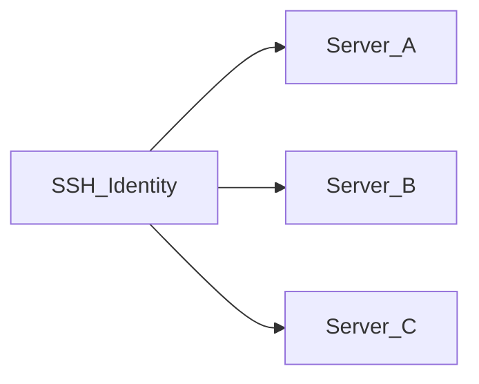

# Identités SSH

Une **identité SSH** est un ensemble réutilisable d'identifiants (nom d'utilisateur + mot de passe ou clé privée) stocké **chiffré** dans la base de données de l'application. Les serveurs référencent des identités au lieu d'intégrer les secrets inline.

## Pourquoi les identités existent

| Sans identités | Avec identités |
|----------------|----------------|
| Identifiants dupliqués sur chaque serveur | Une identité partagée par plusieurs serveurs |
| Rotation d'une clé = modifier chaque serveur | Mettre à jour l'identité une fois ; tous les serveurs liés utilisent les nouveaux identifiants |
| Audit plus difficile | Correspondance claire : identité → serveurs |

## Méthodes d'authentification

- **Mot de passe** — nom d'utilisateur et mot de passe chiffrés au repos
- **Clé privée** — nom d'utilisateur et clé privée PEM chiffrés au repos

Les secrets sont chiffrés avec **AES-256-GCM** via `APP_ENCRYPTION_KEY` depuis `.env`. Si vous perdez cette clé, les identifiants chiffrés ne peuvent pas être récupérés.

## Créer une identité

1. Ouvrir **Identités SSH** dans la barre latérale (`/identities`)
2. Cliquer sur **Ajouter une identité**
3. Saisir le nom, le nom d'utilisateur, la méthode d'authentification et le secret
4. Enregistrer — les identifiants sont chiffrés avant le stockage

## Modification et suppression

- **Modifier** — vous pouvez laisser les champs mot de passe/clé vides pour conserver les secrets existants
- **Supprimer** — bloqué si un serveur utilise encore l'identité ; réassignez ou supprimez d'abord ces serveurs

## Relation avec les serveurs

Chaque enregistrement serveur stocke une référence à une identité. Changer l'identité d'un serveur exécute une **vérification SSH** automatiquement à l'enregistrement.

## Notes de sécurité

- Les secrets d'identité n'apparaissent jamais dans l'interface après l'enregistrement (seulement des placeholders en modification)
- L'**export** de configuration inclut des secrets en clair — voir [Import et export de configuration](./import-export-config.md)
- Sauvegardez `.env` avec `APP_ENCRYPTION_KEY` — voir [Sauvegarde et restauration](../operations/backup-restore.md)

## Documentation associée

- [Serveurs et SSH](./servers-and-ssh.md)
- [Gérer les serveurs](../user-guide/manage-servers.md)
