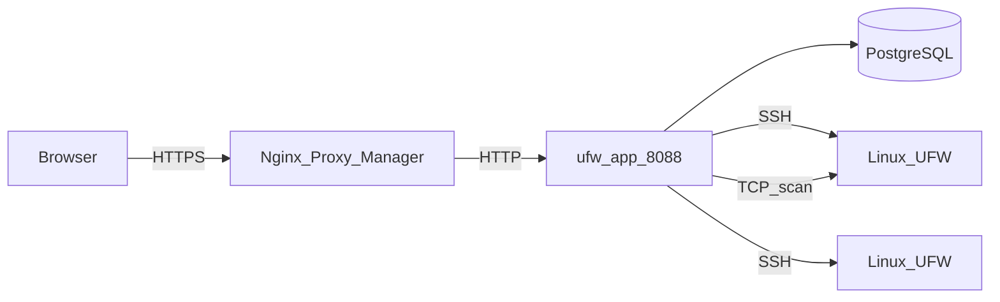
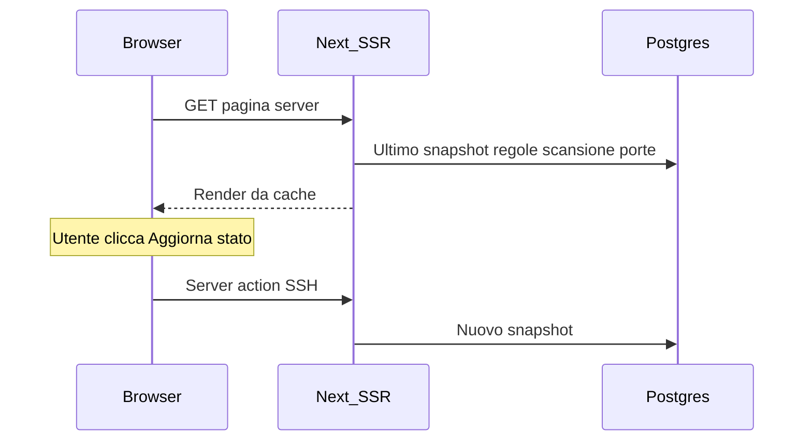

# Architettura

Questa pagina descrive come è costruito UFW Remote Manager, come fluiscono i dati e dove risiedono i segreti. Versione **v0.9.2**.

*Diagramma: Browser → reverse proxy → app → Postgres; app → server target via SSH; scansione porte opzionale dal container app verso gli host target.*

## Componenti

| Componente | Ruolo |
|-----------|------|
| **ufw-app** | Applicazione Next.js (UI, server actions, route API) |
| **ufw-postgres** | PostgreSQL — utenti, credenziali crittografate, regole, snapshot, scansioni, audit |
| **ufw-migrate** | Container one-shot — `prisma migrate deploy` a ogni deploy |
| **Nginx Proxy Manager** | Terminazione HTTPS esterna (non parte di questo stack) |
| **Server Linux target** | Host gestiti con UFW raggiungibili via SSH |

## Flusso richieste (produzione)

1. L'amministratore apre `APP_URL` nel browser (HTTPS via NPM).
2. Better Auth valida il cookie di sessione.
3. Le server action orchestrano lavoro SSH e database.
4. I comandi UFW vengono eseguiti sugli host remoti solo dopo conferma esplicita di applicazione.
5. La scansione porte (se abilitata) esegue Naabu/Nmap dal container app — non via SSH.

## Modello di caricamento dettaglio server (cache-first)

Aprire la dashboard di un server **non** apre SSH al caricamento iniziale della pagina:

| Passaggio | Fonte | SSH? |
|------|--------|------|
| Badge stato UFW | Ultimo `serverSnapshot` | No |
| Tabella regole (prima pagina) | Bozza + snapshot + record regole | No |
| Pannello scansione porte | Ultima scansione di qualsiasi stato (v0.9.2) | No |
| **Aggiorna stato** | Rilevamento live + aggiornamento snapshot | Sì |
| **Conferma applicazione** | Comandi UFW + sync post-applicazione | Sì |
| **Sync iniziale** (nessuno snapshot) | Operazione sync in background | Sì |

## Modello di concorrenza

Vedi [Operazioni e concorrenza](./concepts/operations-and-concurrency.md) per i dettagli completi. Riepilogo:

| Meccanismo | Comportamento |
|-----------|-----------|
| **Coda per server** | SSH + scritture DB post-SSH serializzate (`p-queue`, concorrenza 1) |
| **Scansione porte** | Fuori dalla coda SSH — non blocca le operazioni UFW |
| **Limiti di frequenza** | In memoria; cooldown 30 s per server per refresh/sync/scan |
| **Replica singola** | La produzione assume un'istanza app |

Apply e refresh mantengono la coda fino al persist dello snapshot e alla sync dei record regole — non solo durante la sessione SSH.

## Modello dati (PostgreSQL)

| Entità | Scopo |
|--------|---------|
| **user** | Account amministratore singolo (Better Auth) |
| **identity** | Credenziali SSH crittografate |
| **server** | Host, porta, collegamento all'identità, impronta chiave host |
| **serverSnapshot** | Stato UFW e regole analizzate in un punto nel tempo |
| **ruleRecord** | Metadati locali (gruppo, nome, note) indicizzati per fingerprint |
| **draftSession** / **draftRule** | Copia di lavoro modificabile per utente per server |
| **applySession** / **applySessionItem** | Stato pipeline anteprima e applicazione |
| **operationLog** | Progresso task di lunga durata |
| **auditEvent** | Azioni rilevanti per la sicurezza |
| **portScan** / **portScanFinding** | Esecuzioni e risultati scansione esterna |

Gli snapshot sono conservati (ultimi 10 per server); i vecchi snapshot vengono eliminati alla nuova acquisizione.

## Configurazione di runtime

L'URL pubblico è impostato a **runtime**, non incorporato nell'immagine Docker:

- `APP_URL` in `.env` → `BETTER_AUTH_URL` nel container
- Un'immagine GHCR funziona per qualsiasi dominio — vedi [GHCR + Compose](./deployment/ghcr-compose.md)

**Importante:** `APP_URL` è l'**URL HTTPS pubblico** usato dal browser. NPM inoltra a `http://ufw-app:8088` sulla rete Docker — HTTP interno è intenzionale.

## Archiviazione dati e crittografia

| Dato | Posizione | Crittografato? |
|------|----------|------------|
| Password SSH / chiavi private | Postgres (`identity`) | Sì — AES-256-GCM (`APP_ENCRYPTION_KEY`) |
| Regole UFW, bozze, snapshot | Postgres | Contenuto regole non segreto; le credenziali sì |
| Sessioni | Postgres (Better Auth) | Protette da `BETTER_AUTH_SECRET` |
| Eventi di audit | Postgres | Chi ha fatto cosa e quando |
| Segreti `.env` | Filesystem host | Non devono mai essere in git |

## Confini di sicurezza

- Postgres **non** è pubblicato sull'host in produzione (`docker-compose.prod.yml`)
- Porta app raggiungibile sulla rete Docker (NPM + interna), non su `0.0.0.0` in prod
- La validazione target SSH blocca IP privati/metadata per impostazione predefinita; opzionale `SSH_ALLOWED_CIDRS`
- Le risposte in produzione includono CSP, HSTS e header di sicurezza (`next.config.ts`)

## Documenti correlati

- [Operazioni e concorrenza](./concepts/operations-and-concurrency.md)
- [Modello di sicurezza](./administration/security-model.md)
- [Variabili d'ambiente](./administration/environment-variables.md)
