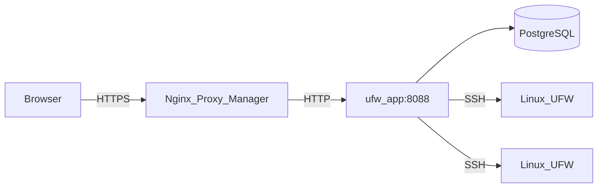

# Architettura

Questa pagina descrive come è costruito UFW Remote Manager, come fluiscono i dati e dove risiedono i segreti.

*Diagramma: Browser → reverse proxy → app → Postgres; app → server di destinazione via SSH.*

## Componenti

| Componente | Ruolo |
|-----------|------|
| **ufw-app** | Applicazione Next.js (UI + API + server actions) |
| **ufw-postgres** | PostgreSQL — utenti, credenziali crittografate, regole, snapshot, audit |
| **ufw-migrate** | Container one-shot — esegue `prisma migrate deploy` a ogni deploy |
| **Nginx Proxy Manager** | Terminazione HTTPS esterna (non fa parte di questo stack) |
| **Server Linux di destinazione** | Host gestiti con UFW raggiungibili via SSH |

## Flusso delle richieste (produzione)

1. L'amministratore apre `APP_URL` nel browser (HTTPS via NPM).
2. Better Auth convalida il cookie di sessione.
3. Server actions e route API orchestrano il lavoro SSH e sul database.
4. I comandi UFW vengono eseguiti sugli host remoti solo dopo conferma esplicita di applicazione.

## Configurazione di runtime

L'URL pubblico è impostato a **runtime**, non incorporato nell'immagine Docker:

- `APP_URL` in `.env` → `BETTER_AUTH_URL` nel container
- Un'immagine GHCR funziona per qualsiasi dominio — vedi [GHCR + Compose](./deployment/ghcr-compose.md)

Implementazione: `getPublicAppUrl()` in `src/lib/app-url.ts`.

**Importante:** `APP_URL` è l'**URL HTTPS pubblico** usato dal browser (via NPM). NPM inoltra a `http://ufw-app:8088` sulla rete Docker — l'HTTP interno è intenzionale. Vedi [Nginx Proxy Manager](./deployment/nginx-proxy-manager.md).

## Modello di caricamento dettaglio server

L'apertura della dashboard di un server è **cache-first** — nessuna connessione SSH al caricamento iniziale della pagina:

1. **SSR** legge l'ultimo **snapshot** UFW da Postgres (`detectionFromSnapshot`) e renderizza stato e regole dal database.
2. Regole, risultati della scansione porte e inventario Docker vengono caricati **in parallelo** da Postgres (`Promise.all`) — ancora senza SSH.
3. **Aggiorna** (dashboard o barra strumenti regole) avvia una lettura SSH live e aggiorna lo snapshot.
4. **Sincronizzazione iniziale** parte automaticamente in background quando UFW è installato e attivo ma **non esiste ancora uno snapshot** (`needsSync`).

Questo mantiene le pagine server veloci mentre il lavoro SSH avviene solo quando aggiorni esplicitamente o quando l'app non ha ancora stato in cache.

## Modello di concorrenza

- **Coda SSH per server** (`p-queue`, concorrenza 1) — le operazioni sullo stesso host sono serializzate
- **Replica singola dell'app** in produzione — i limiti di frequenza sono in memoria
- Non scalare a più repliche dell'app senza aggiungere storage condiviso per i limiti (es. Redis)

## Archiviazione dati

| Dato | Posizione | Crittografato? |
|------|----------|------------|
| Password SSH / chiavi private | Postgres (tabella `identity`) | Sì — AES-256-GCM con `APP_ENCRYPTION_KEY` |
| Regole UFW, bozze, snapshot | Postgres | Solo metadati; il contenuto delle regole non è segreto |
| Sessioni | Postgres (Better Auth) | Token di sessione; protetti da `BETTER_AUTH_SECRET` |
| Eventi di audit | Postgres | Chi ha fatto cosa e quando |
| Segreti `.env` | Solo filesystem dell'host | Non devono mai essere in git |

## Confini di sicurezza

- Postgres **non** è esposto sull'host in produzione (`docker-compose.prod.yml`)
- La porta dell'app è raggiungibile sulla rete Docker (NPM + interna), non su `0.0.0.0` in prod
- La validazione degli host SSH blocca IP privati/metadati per impostazione predefinita; opzionale `SSH_ALLOWED_CIDRS`
- Le risposte in produzione includono CSP, HSTS e header di sicurezza (`next.config.ts`)

## Documentazione correlata

- [Modello di sicurezza](./administration/security-model.md)
- [Workflow bozza e applicazione](./concepts/draft-apply-workflow.md)
- [Variabili d'ambiente](./administration/environment-variables.md)
