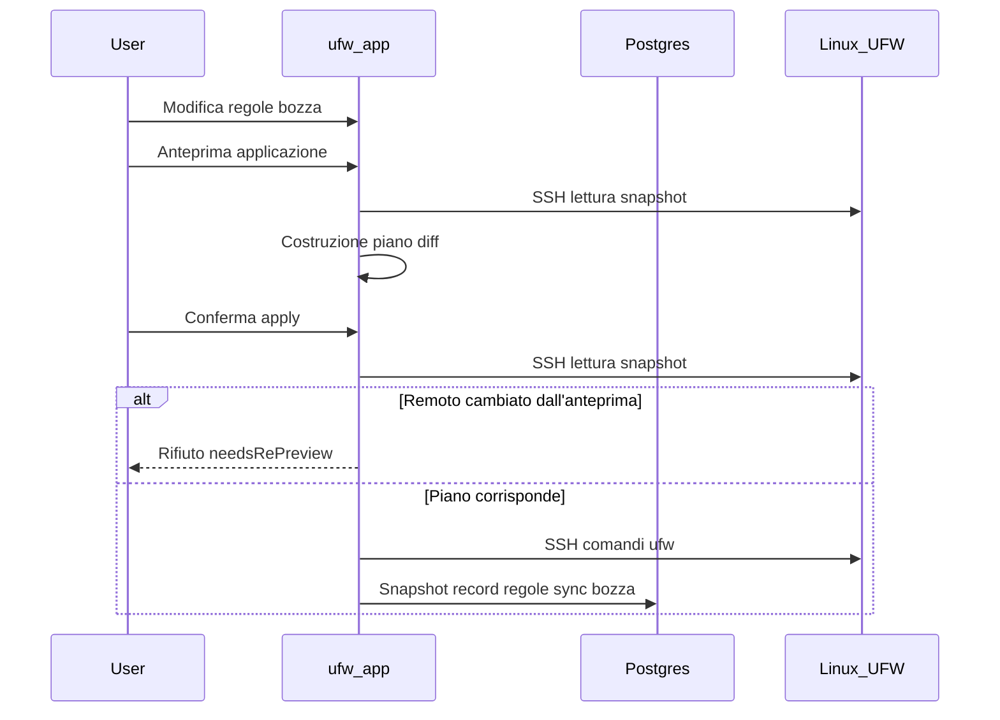

# Workflow bozza e applicazione

UFW Remote Manager non applica mai modifiche firewall in silenzio. Ogni mutazione segue **modifica → anteprima → conferma → applicazione**.

## Passaggi

### 1. Modificare la bozza

Modificate le regole nella tabella: aggiungere, modificare, eliminare, riordinare, importare. Le modifiche restano nella **bozza locale** fino all'applicazione.

### 2. Anteprima applicazione

Fate clic su **Anteprima applicazione** (flusso Salva regole). L'app:

1. Carica lo stato UFW corrente dal server (SSH)
2. Calcola un **piano** — comandi UFW per allineare il remoto alla bozza
3. Mostra regole aggiunte, rimosse, aggiornate e riordinate

Revisionate attentamente. Prestare attenzione alle regole che potrebbero bloccarvi fuori (es. blocco SSH).

### 3. Conferma

Confermate nella finestra di dialogo. Solo allora i comandi UFW vengono eseguiti via SSH.

Se UFW remoto è cambiato dall'anteprima, l'apply è **rifiutato** — eseguite di nuovo l'anteprima.

### 4. Esecuzione apply

I comandi vengono eseguiti sequenzialmente sul server dentro la **coda per server**. Il progresso appare nel **banner operazioni** con stato passo per passo.

### 5. Sync post-applicazione

Dopo esecuzione UFW riuscita, ancora dentro la coda:

1. Persiste un nuovo snapshot dal rilevamento live
2. Sincronizza le righe `ruleRecord` dal rilevamento (non cache obsoleta)
3. Aggiorna gli stati origine bozza così i colori riga corrispondono alla realtà

Da v0.9.2, i record regole post-applicazione sono costruiti dai **dati di rilevamento live**, impedendo alle regole remote eliminate di riapparire nel database.

## Diagramma di sequenza

## Apply parziale e deriva

| Scenario | Stato sessione | Cosa fare |
|----------|----------------|------------|
| UFW remoto cambiato **tra anteprima e conferma** | Rifiutato (`needsRePreview`) | Eseguite **Anteprima applicazione** di nuovo — non forzate risincronizzazione |
| Comandi UFW **interrotti** sul server | `PARTIAL` (`needsResync`) | **Risincronizzazione forzata dal server**, poi revisione |
| UFW riuscito ma **sync post-applicazione fallita** | `PARTIAL` (`needsResync`) | **Risincronizzazione forzata dal server** — UFW remoto già cambiato |

**Non ignorate mai gli avvisi di apply parziale** — continuare alla cieca può causare regole duplicate o errori di ordine.

## Apply solo DB

Se l'anteprima mostra solo modifiche metadati (nessun diff comandi UFW), la conferma aggiorna i record locali senza comandi UFW remoti.

## Salvaguardia SSH consentito

Il planner apply include salvaguardie sulle regole di accesso SSH dove configurato. Verificate comunque l'anteprima manualmente sui server di produzione.

## Documenti correlati

- [Regole UFW e stati](./ufw-rules-and-states.md)
- [Modificare e applicare regole](../user-guide/edit-and-apply-rules.md)
- [Operazioni e concorrenza](./operations-and-concurrency.md)
