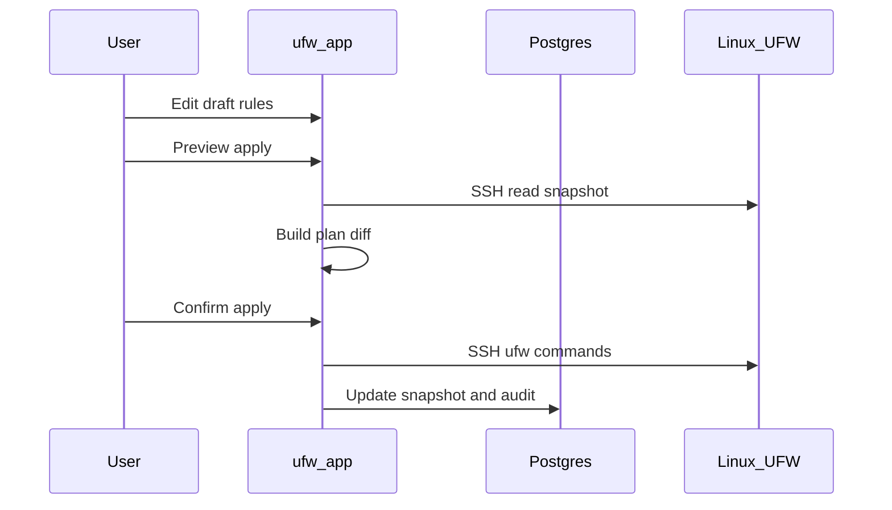

# Workflow bozza e applicazione

UFW Remote Manager non invia mai modifiche al firewall in silenzio. Ogni mutazione segue **modifica → anteprima → conferma → applicazione**.

## Passaggi

### 1. Modifica bozza

Modifica le regole nella tabella: aggiungi, modifica, elimina, riordina, importa. Le modifiche restano nella **bozza locale** finché non vengono applicate.

### 2. Anteprima applicazione

Clicca **Salva regole**. L'app:

1. Carica lo stato UFW corrente dal server (snapshot SSH)
2. Calcola un **piano** — comandi che allineerebbero UFW alla tua bozza
3. Mostra regole aggiunte, rimosse e riordinate

Rivedi l'anteprima con attenzione. Presta attenzione alle regole che potrebbero bloccarti fuori (es. blocco SSH).

### 3. Conferma

Conferma nella finestra di dialogo. Solo allora i comandi UFW vengono eseguiti via SSH.

### 4. Esecuzione applicazione

I comandi vengono eseguiti in sequenza sul server (coda per server, concorrenza 1). Il progresso appare nel **banner operazioni** con stato passo per passo.

### 5. Sincronizzazione post-applicazione

Dopo il successo, l'app aggiorna lo snapshot e sincronizza gli stati di origine della bozza così i colori delle righe riflettono la nuova realtà.

## Diagramma di sequenza

## Applicazione parziale e deriva

Se l'applicazione fallisce a metà, UFW remoto può differire sia dalla bozza che dallo snapshot. L'interfaccia avvisa e offre **Risincronizzazione forzata dal server** per riallineare lo stato locale alle regole remote effettive prima di modificare di nuovo.

**Non ignorare mai gli avvisi di applicazione parziale** — continuare alla cieca può causare regole duplicate o errori di ordine.

## Salvaguardia Allow SSH

Il pianificatore di applicazione include salvaguardie sulle regole di accesso SSH dove configurato — vedi i test in `src/lib/ufw/commands.allow-ssh.test.ts`. Verifica comunque l'anteprima manualmente per i server di produzione.

## Documentazione correlata

- [Regole UFW e stati](./ufw-rules-and-states.md)
- [Modificare e applicare regole](../user-guide/edit-and-apply-rules.md)
- [Cronologia operazioni](../user-guide/operations-history.md)
