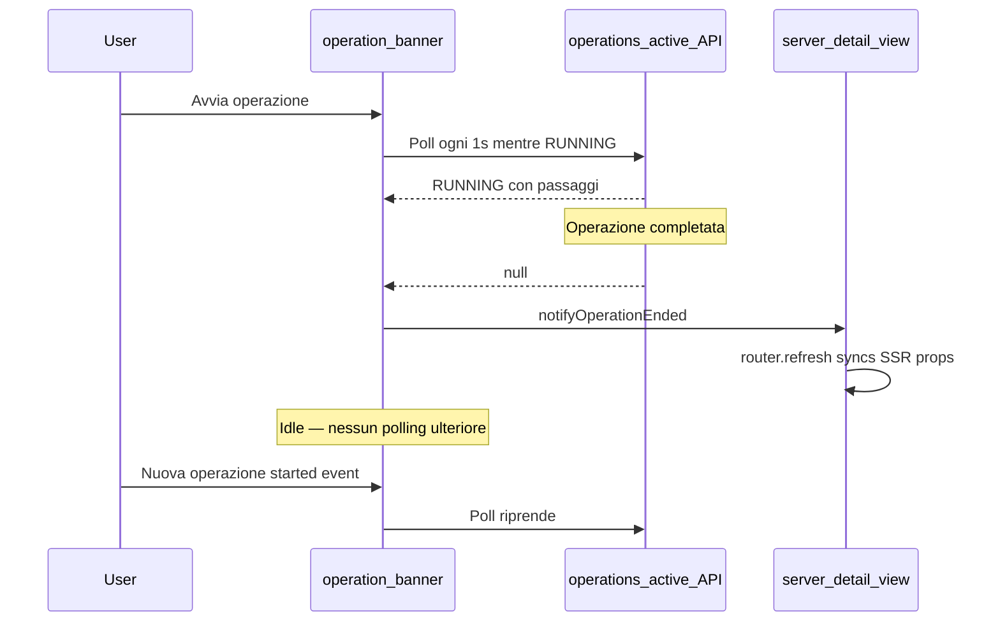
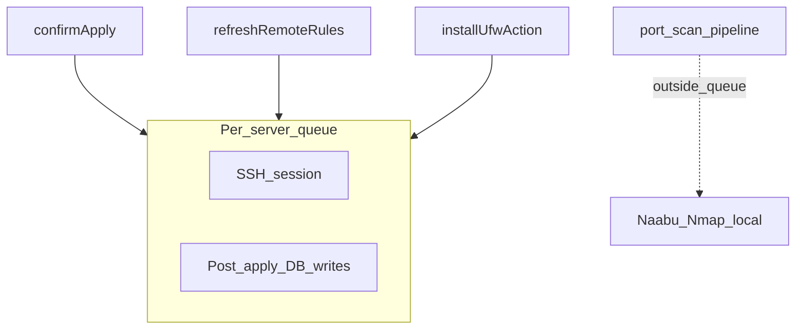

# Operazioni e concorrenza

UFW Remote Manager esegue task di lunga durata (apply, sync, refresh, install, scansione porte) in modo asincrono. L'UI traccia il progresso tramite **log operazioni**, il **banner operazioni** e polling lato client. Questa pagina spiega come questi elementi si integrano e come l'app evita race condition sullo stesso server.

## Banner operazioni

Mentre il lavoro è in corso, un banner appare in cima all'app (e sulla pagina dettaglio server se limitato a un server).

| Elemento | Descrizione |
|---------|-------------|
| **Tipo** | Etichetta tradotta, es. applicazione regole, aggiornamento stato, scansione porte |
| **Stato** | `RUNNING`, `PENDING`, `SUCCESS`, `FAILED` o `PARTIAL` |
| **Passaggi** | Elenco espandibile con stato per passaggio e messaggi di errore |
| **Progresso** | Contatore opzionale corrente/totale per operazioni multi-passo |

Con **SUCCESSO**, il banner si chiude automaticamente dopo circa 10 secondi. Potete chiuderlo manualmente prima. Operazioni fallite e parziali restano visibili fino alla chiusura.

Il banner carica le operazioni attive da `/api/operations/active`. Quel endpoint restituisce solo operazioni in stato `RUNNING` o `PENDING` — non quelle terminali.

## Ciclo di vita polling client

### Polling attivo

Mentre un'operazione è `RUNNING` o `PENDING`, il banner effettua poll circa ogni **1 secondo** (con backoff per hook specifici scansione porte dopo esecuzioni più lunghe).

### Comportamento idle (da v0.9.2)

Quando non esiste operazione attiva, il banner **smette di fare polling**. Evita centinaia di richieste API idle all'ora per scheda browser.

Il polling **riparte** quando:

- Una nuova operazione inizia (evento browser `OPERATION_STARTED`), oppure
- La pagina si carica e trova un'operazione attiva al primo fetch.

### Evento operazione terminata

Quando il polling rileva una transizione da `RUNNING`/`PENDING` a `null`, o riceve uno stato terminale (`SUCCESS`, `FAILED`, `PARTIAL`), l'app invia `OPERATION_ENDED`.

La vista dettaglio server ascolta questo evento. Mentre un'operazione è attiva, blocca la sync delle props SSR (regole, conteggi porte) da un refresh pagina obsoleto. Quando l'operazione termina, chiama `router.refresh()` così l'UI riflette lo stato database più recente.

Se il banner scompare ma la tabella regole sembra obsoleta dopo sync o apply, aggiornate la pagina una volta — non dovrebbe più accadere dopo v0.9.2 in condizioni normali.

## Coda SSH per server

Il lavoro remoto su un dato server è serializzato tramite una **coda per server** (`p-queue`, concorrenza 1):

### Cosa gira dentro la coda

| Operazione | SSH | Scritture database post-SSH |
|-----------|-----|--------------------------|
| **Applicazione regole** | Comandi UFW + lettura rilevamento finale | Persist snapshot, record regole, stati origine bozza — **dentro lo stesso hold coda** |
| **Refresh / sync regole** | Lettura stato UFW (quando nessun rilevamento passato) | Persist snapshot, re-seed bozza — **dentro la coda** |
| **Installa UFW** | install + enable + rilevamento | Refresh regole remote — **dentro la coda** |

Impedisce a due flussi concorrenti (ad esempio apply e refresh) di scrivere snapshot o record regole in ordine conflittuale.

### Cosa gira fuori dalla coda

La **scansione porte** (Naabu + Nmap) gira **localmente nel container app** e **non** mantiene la coda SSH. Una scansione lunga (~30+ minuti) quindi non blocca refresh o apply UFW sullo stesso server.

La sovrapposizione scansione porte è impedita separatamente: è consentita solo una scansione `PENDING` o `RUNNING` per server. Avviarne un'altra restituisce errore *scansione già in corso*.

## Limiti di frequenza

Le azioni ripetute sullo stesso server usano un **cooldown di 30 secondi** (fisso nel codice applicazione, non configurabile via variabili d'ambiente):

| Azione | Chiave cooldown |
|--------|----------------|
| Aggiorna stato / sync regole | `ufw-refresh:{serverId}` |
| Avvia scansione porte | `port-scan:{serverId}` |

Limiti aggiuntivi:

| Azione | Limite |
|--------|-------|
| Setup (primo admin) | 5 tentativi al minuto per IP client |
| Export configurazione | 5 al minuto per utente |
| Anteprima import configurazione | 10 al minuto per utente |
| Installazione UFW | 3 al minuto per server |

I bucket limiti di frequenza sono **in memoria**. L'app è progettata per **replica singola** in produzione. Eseguire più istanze app senza storage condiviso per i limiti permette di aggirarli.

Dietro Nginx Proxy Manager, impostate `TRUST_PROXY=1` così i limiti setup usano l'IP client reale da `X-Forwarded-For`.

## Sweep operazioni obsolete

Se un browser si disconnette a metà operazione, il banner UI potrebbe non aggiornarsi. Uno sweeper in background contrassegna operazioni `RUNNING` molto vecchie come fallite (tipicamente entro 30–60 minuti). Aggiornate la pagina per cancellare un banner bloccato; controllate **Cronologia operazioni** per lo stato finale.

## Error boundary

Gli error boundary lato client impediscono che un crash di pagina singola rompa l'intera shell:

| Ambito | File | Recupero |
|-------|------|----------|
| Shell app | `src/app/(app)/error.tsx` | **Riprova** resetta l'error boundary |
| Dettaglio server | `src/app/(app)/servers/[serverAddress]/error.tsx` | **Riprova** o **Torna ai server** |

Catturano errori di rendering nei componenti figli. Non sostituiscono i messaggi di errore operativi da SSH o apply falliti — quelli appaiono nel banner operazioni e nella cronologia operazioni.

## Documenti correlati

- [Cronologia operazioni](../user-guide/operations-history.md)
- [Workflow bozza e applicazione](./draft-apply-workflow.md)
- [Architettura](../architecture.md)
- [Scansione porte (guida utente)](../user-guide/port-scan.md)
