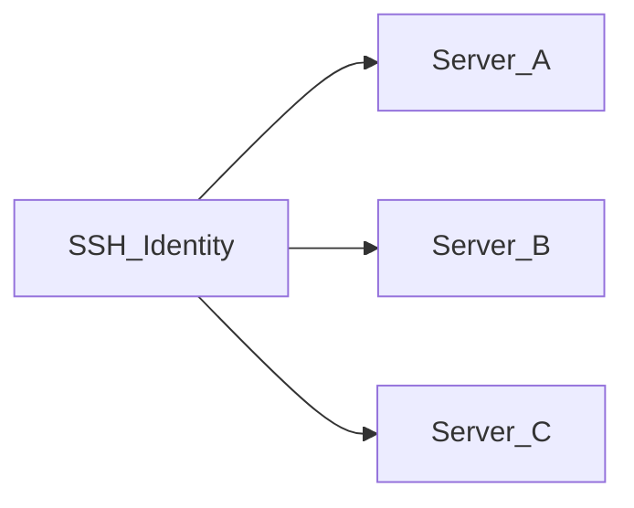

# Identità SSH

Un'**identità SSH** è un insieme riutilizzabile di credenziali (nome utente + password o chiave privata) archiviato **crittografato** nel database dell'applicazione. I server fanno riferimento alle identità invece di incorporare segreti inline.

## Perché esistono le identità

| Senza identità | Con identità |
|--------------------|-----------------|
| Credenziali duplicate su ogni server | Un'identità condivisa da molti server |
| Ruotare una chiave significa modificare ogni server | Aggiorna l'identità una volta; tutti i server collegati usano le nuove credenziali |
| Audit più difficile | Mappatura chiara: identità → server |

## Metodi di autenticazione

- **Password** — nome utente e password crittografati a riposo
- **Chiave privata** — nome utente e chiave privata PEM crittografati a riposo

I segreti sono crittografati con **AES-256-GCM** usando `APP_ENCRYPTION_KEY` da `.env`. Se perdi questa chiave, le credenziali crittografate non possono essere recuperate.

## Creare un'identità

1. Apri **Identità SSH** nella barra laterale (`/identities`)
2. Clicca **Aggiungi identità**
3. Inserisci nome, nome utente, metodo di autenticazione e segreto
4. Salva — le credenziali vengono crittografate prima dell'archiviazione

## Modifica ed eliminazione

- **Modifica** — puoi lasciare vuoti i campi password/chiave per mantenere i segreti esistenti invariati
- **Elimina** — bloccato se un server usa ancora l'identità; riassegna o elimina prima quei server

## Relazione con i server

Ogni record server memorizza un riferimento a un'identità. Cambiare l'identità su un server richiede un **Test SSH** riuscito prima del salvataggio.

## Note di sicurezza

- I segreti dell'identità non compaiono nell'interfaccia dopo il salvataggio (solo segnaposto in modifica)
- L'**esportazione** della configurazione include segreti in testo chiaro — vedi [Importazione ed esportazione configurazione](./import-export-config.md)
- Esegui backup di `.env` con `APP_ENCRYPTION_KEY` — vedi [Backup e ripristino](../operations/backup-restore.md)

## Documentazione correlata

- [Server e SSH](./servers-and-ssh.md)
- [Gestire i server](../user-guide/manage-servers.md)
