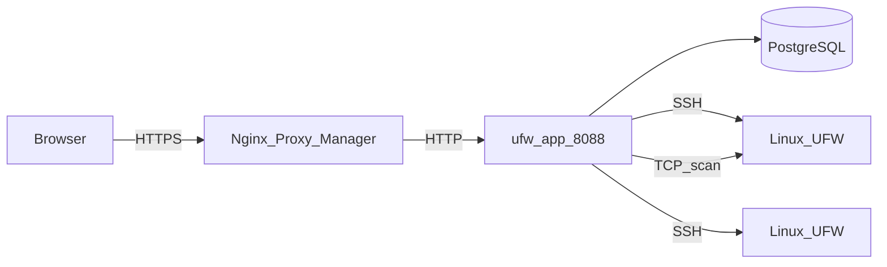
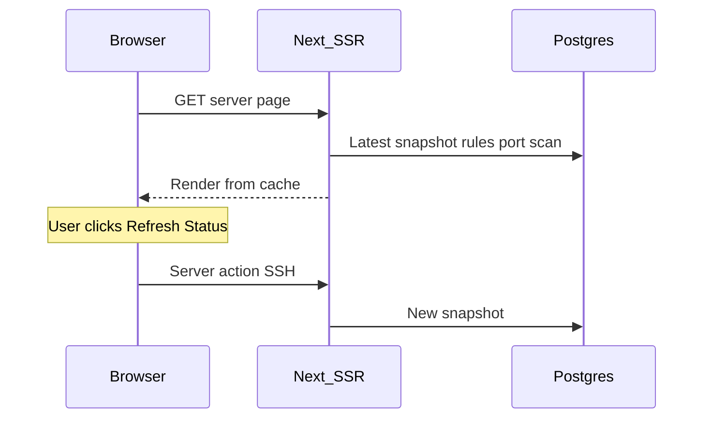

# Arquitetura

Esta página descreve como o UFW Remote Manager é construído, como os dados fluem e onde os segredos residem. Versão **v0.9.2**.

*Diagrama: Navegador → proxy reverso → app → Postgres; app → servidores de destino via SSH; varredura de portas opcional do container do app para hosts de destino.*

## Componentes

| Componente | Função |
|------------|--------|
| **ufw-app** | Aplicação Next.js (UI, server actions, rotas API) |
| **ufw-postgres** | PostgreSQL — usuários, credenciais criptografadas, regras, snapshots, scans, auditoria |
| **ufw-migrate** | Container one-shot — `prisma migrate deploy` a cada deploy |
| **Nginx Proxy Manager** | Terminação HTTPS externa (não faz parte desta stack) |
| **Servidores Linux de destino** | Hosts gerenciados por UFW alcançados via SSH |

## Fluxo de requisições (produção)

1. O administrador abre `APP_URL` no navegador (HTTPS via NPM).
2. Better Auth valida o cookie de sessão.
3. Server actions orquestram trabalho SSH e de banco de dados.
4. Comandos UFW executam em hosts remotos apenas após confirmação explícita de apply.
5. Varredura de portas (quando habilitada) executa Naabu/Nmap do container do app — não via SSH.

## Modelo de carregamento da página de servidor (cache-first)

Abrir o painel de um servidor **não** abre SSH no carregamento inicial da página:

| Etapa | Fonte | SSH? |
|-------|-------|------|
| Badge de status UFW | Último `serverSnapshot` | Não |
| Tabela de regras (primeira página) | Rascunho + snapshot + rule records | Não |
| Painel de varredura de portas | Último scan de qualquer status (v0.9.2) | Não |
| **Atualizar status** | Detecção ao vivo + atualização de snapshot | Sim |
| **Confirmar apply** | Comandos UFW + sync pós-apply | Sim |
| **Sync inicial** (sem snapshot) | Operação de sync em segundo plano | Sim |

## Modelo de concorrência

Veja [Operações e concorrência](./concepts/operations-and-concurrency.md) para detalhes completos. Resumo:

| Mecanismo | Comportamento |
|-----------|---------------|
| **Fila por servidor** | SSH + gravações pós-SSH no BD serializadas (`p-queue`, concorrência 1) |
| **Varredura de portas** | Fora da fila SSH — não bloqueia operações UFW |
| **Limites de taxa** | Em memória; cooldown de 30s por servidor para refresh/sync/scan |
| **Réplica única** | Produção assume uma instância do app |

Apply e refresh mantêm a fila durante persistência de snapshot e sync de rule records — não apenas durante a sessão SSH.

## Modelo de dados (PostgreSQL)

| Entidade | Propósito |
|----------|-----------|
| **user** | Conta de administrador única (Better Auth) |
| **identity** | Credenciais SSH criptografadas |
| **server** | Host, porta, vínculo com identidade, impressão digital da chave host |
| **serverSnapshot** | Status UFW + regras parseadas em um ponto no tempo |
| **ruleRecord** | Metadados locais (grupo, nome, notas) indexados por fingerprint |
| **draftSession** / **draftRule** | Cópia de trabalho editável por usuário por servidor |
| **applySession** / **applySessionItem** | Estado do pipeline de pré-visualização e apply |
| **operationLog** | Progresso de tarefas de longa duração |
| **auditEvent** | Ações relevantes para segurança |
| **portScan** / **portScanFinding** | Execuções e resultados de varredura externa |

Snapshots são retidos (últimos 10 por servidor); snapshots antigos são podados em nova captura.

## Configuração em tempo de execução

A URL pública é definida em **runtime**, não embutida na imagem Docker:

- `APP_URL` no `.env` → `BETTER_AUTH_URL` no container
- Uma imagem GHCR funciona para qualquer domínio — veja [GHCR + Compose](./deployment/ghcr-compose.md)

**Importante:** `APP_URL` é a **URL HTTPS pública** que o navegador usa. O NPM encaminha para `http://ufw-app:8088` na rede Docker — HTTP interno é intencional.

## Armazenamento e criptografia de dados

| Dado | Localização | Criptografado? |
|------|-------------|----------------|
| Senhas / chaves privadas SSH | Postgres (`identity`) | Sim — AES-256-GCM (`APP_ENCRYPTION_KEY`) |
| Regras UFW, rascunhos, snapshots | Postgres | Conteúdo de regras não é segredo; credenciais sim |
| Sessões | Postgres (Better Auth) | Protegidas por `BETTER_AUTH_SECRET` |
| Eventos de auditoria | Postgres | Quem fez o quê e quando |
| Segredos do `.env` | Sistema de arquivos do host | Nunca devem estar no git |

## Limites de segurança

- Postgres **não** é publicado no host em produção (`docker-compose.prod.yml`)
- Porta do app acessível na rede Docker (NPM + interna), não em `0.0.0.0` em prod
- Validação de destino SSH bloqueia IPs privados/metadata por padrão; opcional `SSH_ALLOWED_CIDRS`
- Respostas de produção incluem CSP, HSTS e headers de segurança (`next.config.ts`)

## Documentos relacionados

- [Operações e concorrência](./concepts/operations-and-concurrency.md)
- [Modelo de segurança](./administration/security-model.md)
- [Variáveis de ambiente](./administration/environment-variables.md)
