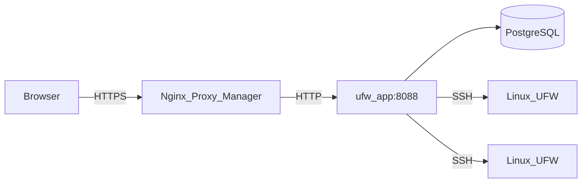

# Arquitetura

Esta página descreve como o UFW Remote Manager é construído, como os dados fluem e onde os segredos ficam armazenados.

*Diagrama: Navegador → proxy reverso → app → Postgres; app → servidores de destino via SSH.*

## Componentes

| Componente | Função |
|-----------|------|
| **ufw-app** | Aplicação Next.js (interface + API + server actions) |
| **ufw-postgres** | PostgreSQL — usuários, credenciais criptografadas, regras, snapshots, auditoria |
| **ufw-migrate** | Container único — executa `prisma migrate deploy` a cada implantação |
| **Nginx Proxy Manager** | Terminação HTTPS externa (não faz parte desta stack) |
| **Servidores Linux de destino** | Hosts gerenciados pelo UFW acessados via SSH |

## Fluxo de requisições (produção)

1. O administrador abre `APP_URL` no navegador (HTTPS via NPM).
2. O Better Auth valida o cookie de sessão.
3. Server actions e rotas de API orquestram trabalho SSH e de banco de dados.
4. A **sincronização inicial** roda automaticamente em segundo plano quando **ainda não existe snapshot UFW no Postgres** (`needsSync`) — por exemplo logo após criar um servidor ou antes do primeiro atualizar status.

Isso mantém as páginas de servidor rápidas enquanto o trabalho SSH ocorre apenas quando você atualiza explicitamente ou quando a aplicação ainda não tem estado em cache.

## Modelo de concorrência

- **Fila SSH por servidor** (`p-queue`, concorrência 1) — operações no mesmo host são serializadas
- **Réplica única da aplicação** em produção — limites de taxa ficam em memória
- Não escale para múltiplas réplicas da aplicação sem adicionar armazenamento compartilhado de limites de taxa (ex.: Redis)

## Armazenamento de dados

| Dado | Localização | Criptografado? |
|------|----------|------------|
| Senhas SSH / chaves privadas | Postgres (tabela `identity`) | Sim — AES-256-GCM com `APP_ENCRYPTION_KEY` |
| Regras UFW, rascunhos, snapshots | Postgres | Apenas metadados; o conteúdo das regras não é secreto |
| Sessões | Postgres (Better Auth) | Tokens de sessão; protegidos por `BETTER_AUTH_SECRET` |
| Eventos de auditoria | Postgres | Quem fez o quê e quando |
| Segredos do `.env` | Apenas no sistema de arquivos do host | Nunca devem estar no git |

## Limites de segurança

- O Postgres **não** é publicado no host em produção (`docker-compose.prod.yml`)
- A porta da aplicação é acessível na rede Docker (NPM + interna), não em `0.0.0.0` em produção
- A validação de destino SSH bloqueia IPs privados/de metadados por padrão; opcional `SSH_ALLOWED_CIDRS`
- Respostas em produção incluem CSP, HSTS e cabeçalhos de segurança (`next.config.ts`)

## Documentação relacionada

- [Modelo de segurança](./administration/security-model.md)
- [Fluxo de rascunho e aplicação](./concepts/draft-apply-workflow.md)
- [Variáveis de ambiente](./administration/environment-variables.md)
