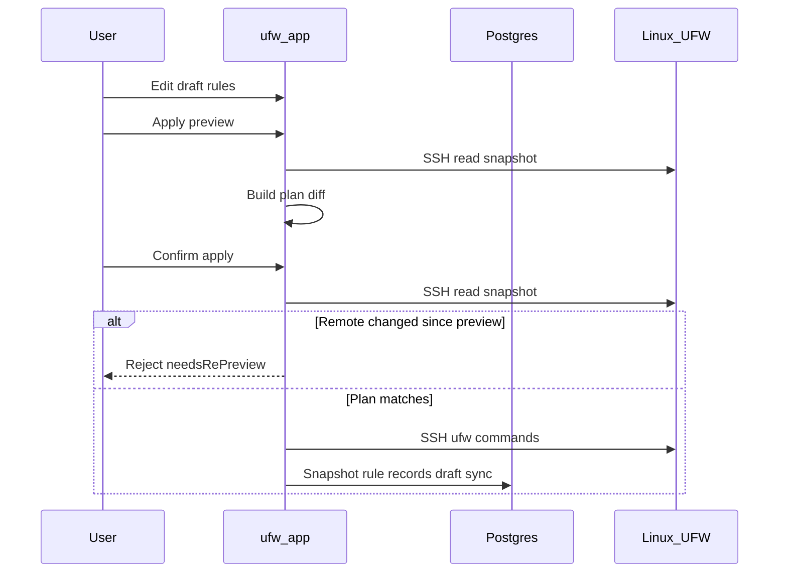

# Fluxo de rascunho e aplicação

O UFW Remote Manager nunca envia alterações de firewall silenciosamente. Toda mutação segue **editar → pré-visualizar → confirmar → aplicar**.

## Etapas

### 1. Editar rascunho

Altere regras na tabela: adicionar, editar, excluir, reordenar, importar. Alterações ficam no **rascunho local** até serem aplicadas.

### 2. Pré-visualizar apply

Clique em **Apply preview** (fluxo Salvar regras). O app:

1. Carrega estado UFW atual do servidor (SSH)
2. Calcula um **plano** — comandos UFW para alinhar remoto ao seu rascunho
3. Mostra regras adicionadas, removidas, atualizadas e reordenadas

Revise com cuidado. Preste atenção a regras que podem bloqueá-lo (ex.: bloquear SSH).

### 3. Confirmar

Confirme no diálogo. Só então os comandos UFW são executados via SSH.

Se o UFW remoto mudou desde a pré-visualização, apply é **rejeitado** — execute a pré-visualização novamente.

### 4. Execução do apply

Comandos executam sequencialmente no servidor dentro da **fila por servidor**. Progresso aparece no **banner de operações** com status passo a passo.

### 5. Sync pós-apply

Após execução UFW bem-sucedida, ainda dentro da fila:

1. Persistir novo snapshot da detecção ao vivo
2. Sincronizar linhas `ruleRecord` da detecção (não cache obsoleto)
3. Atualizar estados de origem do rascunho para cores corresponderem à realidade

Desde v0.9.2, rule records pós-apply são construídos a partir de **dados de detecção ao vivo**, evitando que regras remotas excluídas reapareçam no banco.

## Diagrama de sequência

## Apply parcial e deriva

| Cenário | Status da sessão | O que fazer |
|---------|------------------|-------------|
| UFW remoto mudou **entre pré-visualização e confirmar** | Rejeitado (`needsRePreview`) | Execute **Apply preview** novamente — não force resync |
| Comandos UFW **interrompidos** no servidor | `PARTIAL` (`needsResync`) | **Ressincronização forçada do servidor**, depois revise |
| UFW ok mas **sync pós-apply falhou** | `PARTIAL` (`needsResync`) | **Ressincronização forçada do servidor** — UFW remoto já mudou |

**Nunca ignore avisos de apply parcial** — continuar cegamente pode causar regras duplicadas ou erros de ordem.

## Apply apenas no BD

Se a pré-visualização mostra alterações apenas de metadados (sem diff de comandos UFW), confirmar atualiza registros locais sem comandos UFW remotos.

## Salvaguarda Allow SSH

O planejador de apply inclui salvaguardas em torno de regras de acesso SSH onde configurado. Ainda verifique a pré-visualização manualmente em servidores de produção.

## Documentos relacionados

- [Regras UFW e estados](./ufw-rules-and-states.md)
- [Editar e aplicar regras](../user-guide/edit-and-apply-rules.md)
- [Operações e concorrência](./operations-and-concurrency.md)
