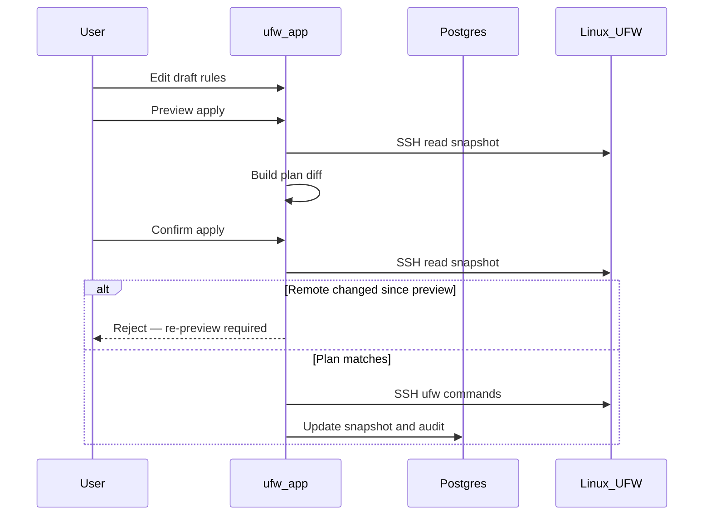

# Fluxo de rascunho e aplicação

O UFW Remote Manager nunca envia alterações de firewall silenciosamente. Toda mutação segue **editar → visualizar → confirmar → aplicar**.

## Etapas

### 1. Editar rascunho

Altere regras na tabela: adicionar, editar, excluir, reordenar, importar. As alterações ficam no **rascunho local** até serem aplicadas.

### 2. Visualizar aplicação

Clique em **Visualizar aplicação**. A aplicação:

1. Carrega o estado UFW atual do servidor (snapshot SSH)
2. Calcula um **plano** — comandos que alinhariam o UFW ao seu rascunho
3. Mostra regras adicionadas, removidas e reordenadas

Revise a visualização com cuidado. Preste atenção a regras que podem bloquear seu acesso (ex.: bloquear SSH).

### 3. Confirmar

Confirme no diálogo. Somente então os comandos UFW são executados via SSH.

### 4. Execução da aplicação

Os comandos rodam sequencialmente no servidor (fila por servidor, concorrência 1). O progresso aparece no **banner de operação** com status passo a passo.

### 5. Sincronização pós-aplicação

Após o sucesso, a aplicação atualiza o snapshot e sincroniza os estados de origem do rascunho para que as cores das linhas reflitam a nova realidade.

## Diagrama de sequência

## Aplicação parcial e deriva

O UFW remoto pode mudar entre visualização e confirmação, ou a aplicação pode falhar no meio do caminho. A aplicação trata três casos distintos:

| Cenário | Status da sessão | O que fazer |
|----------|----------------|------------|
| UFW remoto mudou **entre visualização e confirmação** | Aplicação rejeitada (`needsRePreview`) | Execute **Visualizar aplicação** novamente — não force ressincronização |
| Comandos UFW **interrompidos** no servidor | `PARTIAL` (`needsResync`) | **Ressincronização forçada do servidor**, depois revise antes de editar |
| Comandos UFW bem-sucedidos, mas **sync pós-aplicação falhou** | `PARTIAL` (`needsResync`) | **Ressincronização forçada do servidor** — UFW remoto já alterado |

**Nunca ignore avisos de aplicação parcial** — continuar às cegas pode causar regras duplicadas ou erros de ordem.

## Salvaguarda de acesso SSH

O planejador de aplicação inclui salvaguardas em torno de regras de acesso SSH quando configuradas — veja testes em `src/lib/ufw/commands.allow-ssh.test.ts`. Ainda assim, verifique a visualização manualmente em servidores de produção.

## Documentação relacionada

- [Regras UFW e estados](./ufw-rules-and-states.md)
- [Editar e aplicar regras](../user-guide/edit-and-apply-rules.md)
- [Histórico de operações](../user-guide/operations-history.md)
