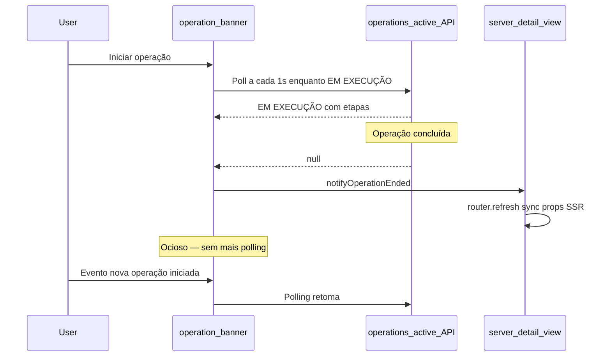
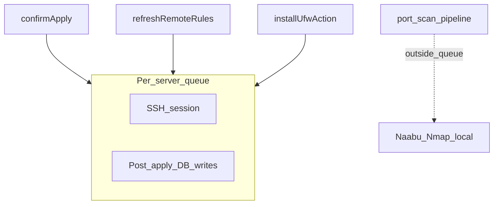

# Operações e concorrência

O UFW Remote Manager executa tarefas longas (apply, sync, refresh, install, varredura de portas) de forma assíncrona. A UI acompanha o progresso via **logs de operação**, **banner de operações** e polling no cliente. Esta página explica como essas peças se encaixam e como o app evita condições de corrida no mesmo servidor.

## Banner de operações

Enquanto o trabalho executa, um banner aparece no topo do app (e na página de detalhe do servidor quando limitado a um servidor).

| Elemento | Descrição |
|----------|-----------|
| **Tipo** | Rótulo traduzido, ex. aplicar regras, atualizar status, varredura de portas |
| **Status** | `RUNNING`, `PENDING`, `SUCCESS`, `FAILED` ou `PARTIAL` |
| **Etapas** | Lista expansível com status por etapa e mensagens de erro |
| **Progresso** | Contador atual/total opcional para operações multi-etapa |

Em **SUCESSO**, o banner fecha automaticamente após cerca de 10 segundos. Você pode fechá-lo manualmente antes. Operações com falha e parciais permanecem visíveis até serem fechadas.

O banner carrega operações ativas de `/api/operations/active`. Esse endpoint retorna apenas operações em estado `RUNNING` ou `PENDING` — não terminais.

## Ciclo de vida do polling no cliente

### Polling ativo

Enquanto uma operação está `RUNNING` ou `PENDING`, o banner faz poll aproximadamente a cada **1 segundo** (com backoff para hooks específicos de varredura de portas após execuções mais longas).

### Comportamento ocioso (desde v0.9.2)

Quando não existe operação ativa, o banner **para o polling**. Isso evita centenas de requisições API ociosas por hora por aba do navegador.

O polling **reinicia** quando:

- Uma nova operação inicia (evento `OPERATION_STARTED` no navegador), ou
- A página carrega e encontra operação ativa na primeira busca.

### Evento de fim de operação

Quando o polling detecta transição de `RUNNING`/`PENDING` para `null`, ou recebe status terminal (`SUCCESS`, `FAILED`, `PARTIAL`), o app dispara `OPERATION_ENDED`.

A view de detalhe do servidor escuta esse evento. Enquanto uma operação está ativa, bloqueia sync de props SSR (regras, contagens de portas) de refresh de página obsoleto. Quando a operação termina, chama `router.refresh()` para a UI refletir o estado mais recente do banco.

Se o banner desaparecer mas a tabela de regras parecer obsoleta após sync ou apply, atualize a página uma vez — isso não deve mais ocorrer após v0.9.2 em condições normais.

## Fila SSH por servidor

Trabalho remoto em um servidor dado é serializado por uma **fila por servidor** (`p-queue`, concorrência 1):

### O que executa dentro da fila

| Operação | SSH | Gravações pós-SSH no banco |
|----------|-----|----------------------------|
| **Aplicar regras** | Comandos UFW + leitura final de detecção | Persist snapshot, rule records, draft origin states — **dentro do mesmo hold da fila** |
| **Refresh / sync rules** | Leitura de status UFW (quando detection não passada) | Persist snapshot, re-seed draft — **dentro da fila** |
| **Instalar UFW** | install + enable + detection | Refresh remote rules — **dentro da fila** |

Isso impede dois fluxos concorrentes (por exemplo apply e refresh) de gravar snapshots ou rule records em ordem conflitante.

### O que executa fora da fila

**Varredura de portas** (Naabu + Nmap) executa **localmente no container do app** e **não** mantém a fila SSH. Uma varredura longa (~30+ minutos) portanto não bloqueia refresh UFW ou apply no mesmo servidor.

Sobreposição de varredura é prevenida separadamente: apenas um scan `PENDING` ou `RUNNING` por servidor é permitido. Iniciar outro retorna erro *scan already running*.

## Limites de taxa

Ações repetidas no mesmo servidor usam **cooldown de 30 segundos** (fixo no código da aplicação, não configurável via variáveis de ambiente):

| Ação | Chave de cooldown |
|------|-------------------|
| Atualizar status / sync rules | `ufw-refresh:{serverId}` |
| Iniciar varredura de portas | `port-scan:{serverId}` |

Limites adicionais:

| Ação | Limite |
|------|--------|
| Setup (primeiro admin) | 5 tentativas por minuto por IP do cliente |
| Exportação de configuração | 5 por minuto por usuário |
| Pré-visualização de importação de configuração | 10 por minuto por usuário |
| Instalação UFW | 3 por minuto por servidor |

Buckets de limite de taxa são **em memória**. O app é projetado para **réplica única** em produção. Executar várias instâncias sem armazenamento compartilhado de rate limit permite contornar limites.

Atrás do Nginx Proxy Manager, defina `TRUST_PROXY=1` para limites de setup usarem IP real do cliente de `X-Forwarded-For`.

## Varredura de operações obsoletas

Se o navegador desconectar no meio de uma operação, o banner da UI pode não atualizar. Um sweeper em segundo plano marca operações `RUNNING` muito antigas como falhas (tipicamente em 30–60 minutos). Atualize a página para limpar banner preso; verifique **Histórico de operações** para status final.

## Error boundaries

Error boundaries no cliente impedem que crash de uma página quebre todo o shell:

| Escopo | Arquivo | Recuperação |
|--------|---------|-------------|
| App shell | `src/app/(app)/error.tsx` | **Try again** reseta o error boundary |
| Detalhe do servidor | `src/app/(app)/servers/[serverAddress]/error.tsx` | **Try again** ou **Back to servers** |

Estes capturam erros de renderização em componentes filhos. Não substituem mensagens operacionais de SSH ou apply falhos — essas aparecem no banner de operações e histórico de operações.

## Documentos relacionados

- [Histórico de operações](../user-guide/operations-history.md)
- [Fluxo de rascunho e aplicação](./draft-apply-workflow.md)
- [Arquitetura](../architecture.md)
- [Varredura de portas (guia do usuário)](../user-guide/port-scan.md)
