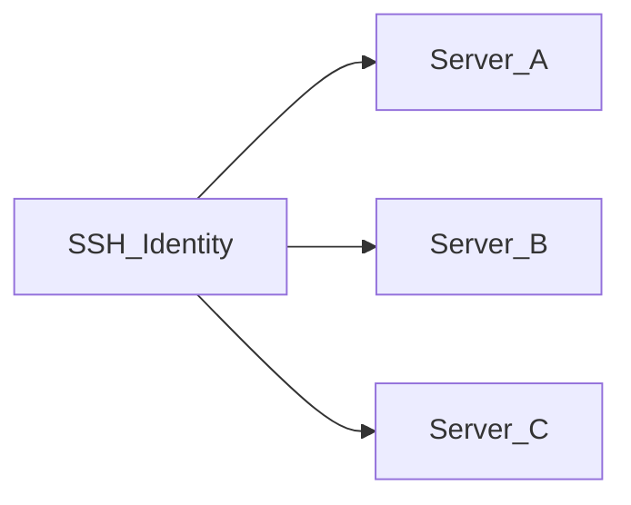

# Identidades SSH

Uma **identidade SSH** é um conjunto reutilizável de credenciais (usuário + senha ou chave privada) armazenado **criptografado** no banco de dados da aplicação. Os servidores referenciam identidades em vez de embutir segredos inline.

## Por que existem identidades

| Sem identidades | Com identidades |
|--------------------|-----------------|
| Credenciais duplicadas em cada servidor | Uma identidade compartilhada por vários servidores |
| Rotacionar uma chave exige editar cada servidor | Atualize a identidade uma vez; todos os servidores vinculados usam as novas credenciais |
| Mais difícil de auditar | Mapeamento claro: identidade → servidores |

## Métodos de autenticação

- **Senha** — usuário e senha criptografados em repouso
- **Chave privada** — usuário e chave privada PEM criptografados em repouso

Os segredos são criptografados com **AES-256-GCM** usando `APP_ENCRYPTION_KEY` do `.env`. Se você perder esta chave, as credenciais criptografadas não poderão ser recuperadas.

## Criar uma identidade

1. Abra **Identidades SSH** na barra lateral (`/identities`)
2. Clique em **Adicionar identidade**
3. Informe nome, usuário, método de autenticação e segredo
4. Salve — as credenciais são criptografadas antes do armazenamento

## Editar e excluir

- **Editar** — você pode deixar os campos de senha/chave vazios para manter os segredos existentes inalterados
- **Excluir** — bloqueado se algum servidor ainda usa a identidade; reatribua ou exclua esses servidores primeiro

## Relação com servidores

Cada registro de servidor armazena uma referência a uma identidade. Alterar a identidade de um servidor exige um **Testar SSH** bem-sucedido antes de salvar.

## Notas de segurança

- Segredos de identidade nunca aparecem na interface após salvar (apenas placeholders na edição)
- A **exportação** de configuração inclui segredos em texto plano — veja [Importar e exportar configuração](./import-export-config.md)
- Faça backup do `.env` com `APP_ENCRYPTION_KEY` — veja [Backup e restauração](../operations/backup-restore.md)

## Documentação relacionada

- [Servidores e SSH](./servers-and-ssh.md)
- [Gerenciar servidores](../user-guide/manage-servers.md)
