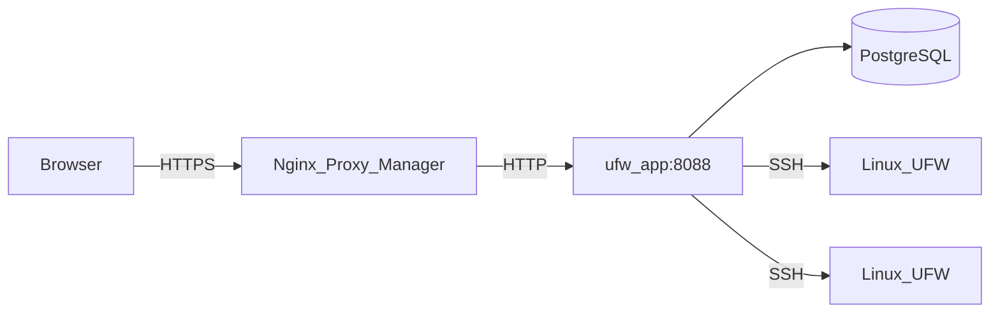

# Архитектура

На этой странице описано, как устроен UFW Remote Manager, как движутся данные и где хранятся секреты.

*Схема: браузер → reverse proxy → приложение → Postgres; приложение → целевые серверы по SSH.*

## Компоненты

| Компонент | Роль |
|-----------|------|
| **ufw-app** | Next.js-приложение (UI + API + server actions) |
| **ufw-postgres** | PostgreSQL — пользователи, зашифрованные учётные данные, правила, snapshots, audit |
| **ufw-migrate** | Одноразовый контейнер — `prisma migrate deploy` при каждом деплое |
| **Nginx Proxy Manager** | Внешнее HTTPS-завершение (не входит в этот stack) |
| **Целевые Linux-серверы** | Хосты с UFW, доступные по SSH |

## Поток запросов (продакшен)

1. Администратор открывает `APP_URL` в браузере (HTTPS через NPM).
2. Better Auth проверяет cookie сессии.
3. Server actions и API-маршруты оркестрируют SSH и работу с БД.
4. **Initial sync** автоматически в фоне, когда **в Postgres ещё нет UFW snapshot** (`needsSync`) — например сразу после создания сервера или до первого обновления статуса.

Страницы серверов остаются быстрыми; SSH выполняется только при явном refresh или когда кэша ещё нет.

## Модель конкурентности

- **Очередь SSH на сервер** (`p-queue`, concurrency 1) — операции на одном хосте сериализуются
- **Одна реплика приложения** в продакшене — rate limits в памяти
- Не масштабируйте на несколько реплик без общего хранилища rate limits (например Redis)

## Хранение данных

| Данные | Где | Шифрование |
|--------|-----|------------|
| SSH-пароли / приватные ключи | Postgres (таблица `identity`) | Да — AES-256-GCM с `APP_ENCRYPTION_KEY` |
| Правила UFW, черновики, snapshots | Postgres | Только метаданные; содержимое правил не секрет |
| Сессии | Postgres (Better Auth) | Токены сессий; защита `BETTER_AUTH_SECRET` |
| События audit | Postgres | Кто, что и когда |
| Секреты `.env` | Только файловая система хоста | Никогда не в git |

## Границы безопасности

- Postgres **не** публикуется на хост в продакшене (`docker-compose.prod.yml`)
- Порт приложения доступен в Docker-сети (NPM + internal), не на `0.0.0.0` в prod
- Валидация SSH-целей блокирует private/metadata IP по умолчанию; опционально `SSH_ALLOWED_CIDRS`
- Production-ответы включают CSP, HSTS и security headers (`next.config.ts`)

## Связанные документы

- [Модель безопасности](./administration/security-model.md)
- [Черновик и apply](./concepts/draft-apply-workflow.md)
- [Переменные окружения](./administration/environment-variables.md)
