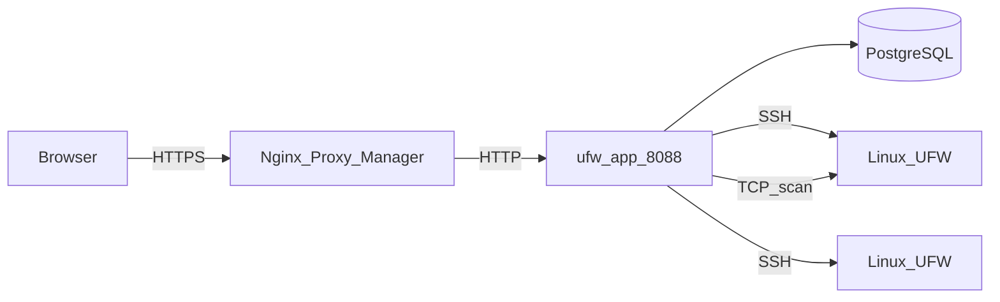
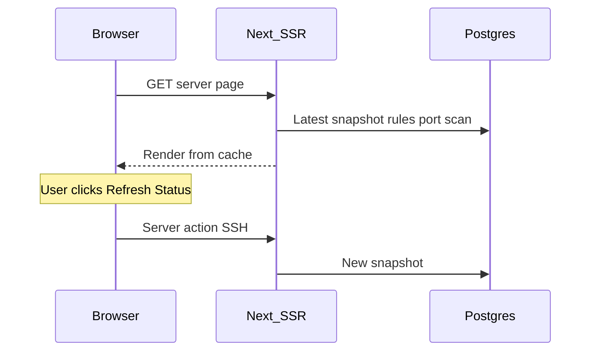

# Архитектура

На этой странице описано, как устроен UFW Remote Manager, как течёт data flow и где хранятся секреты. Версия **v0.9.2**.

*Схема: Browser → reverse proxy → app → Postgres; app → целевые серверы по SSH; опциональный port scan из контейнера app на целевые хосты.*

## Компоненты

| Компонент | Роль |
|-----------|------|
| **ufw-app** | Next.js приложение (UI, server actions, API routes) |
| **ufw-postgres** | PostgreSQL — пользователи, зашифрованные credentials, правила, snapshots, scans, audit |
| **ufw-migrate** | One-shot контейнер — `prisma migrate deploy` при каждом deploy |
| **Nginx Proxy Manager** | Внешнее HTTPS-termination (не часть этого stack) |
| **Целевые Linux-серверы** | UFW-managed хосты, доступные по SSH |

## Поток запросов (продакшен)

1. Администратор открывает `APP_URL` в браузере (HTTPS через NPM).
2. Better Auth проверяет session cookie.
3. Server actions оркестрируют SSH и работу с БД.
4. Команды UFW на удалённых хостах выполняются только после явного подтверждения apply.
5. Port scan (если включён) запускает Naabu/Nmap из контейнера app — не по SSH.

## Модель загрузки страницы сервера (cache-first)

Открытие dashboard сервера **не** открывает SSH при первой загрузке страницы:

| Шаг | Источник | SSH? |
|-----|----------|------|
| Бейдж статуса UFW | Последний `serverSnapshot` | Нет |
| Таблица правил (первая страница) | Draft + snapshot + rule records | Нет |
| Панель port scan | Последний scan любого статуса (v0.9.2) | Нет |
| **Обновить статус** | Live detection + обновление snapshot | Да |
| **Подтвердить apply** | Команды UFW + post-apply sync | Да |
| **Initial sync** (без snapshot) | Фоновая sync-операция | Да |

## Модель конкурентности

Полные детали — в [Операции и конкурентность](./concepts/operations-and-concurrency.md). Кратко:

| Механизм | Поведение |
|----------|-----------|
| **Очередь на сервер** | SSH + post-SSH записи в БД сериализованы (`p-queue`, concurrency 1) |
| **Port scan** | Вне SSH-очереди — не блокирует UFW-операции |
| **Rate limits** | In-memory; cooldown 30 с на сервер для refresh/sync/scan |
| **Одна реплика** | Продакшен предполагает один экземпляр app |

Apply и refresh удерживают очередь через persist snapshot и sync rule records — не только на время SSH-сессии.

## Модель данных (PostgreSQL)

| Сущность | Назначение |
|----------|------------|
| **user** | Единственная учётная запись admin (Better Auth) |
| **identity** | Зашифрованные SSH credentials |
| **server** | Host, port, связь с identity, host key fingerprint |
| **serverSnapshot** | UFW status + parsed rules на момент времени |
| **ruleRecord** | Локальные метаданные (group, name, notes) по fingerprint |
| **draftSession** / **draftRule** | Редактируемая рабочая копия на пользователя и сервер |
| **applySession** / **applySessionItem** | Состояние pipeline preview и apply |
| **operationLog** | Прогресс длительных задач |
| **auditEvent** | Действия, значимые для безопасности |
| **portScan** / **portScanFinding** | Запуски и результаты внешнего scan |

Snapshots хранятся (последние 10 на сервер); старые удаляются при новой capture.

## Runtime-конфигурация

Публичный URL задаётся в **runtime**, не в Docker-образе:

- `APP_URL` в `.env` → `BETTER_AUTH_URL` в контейнере
- Один GHCR-образ подходит для любого домена — см. [GHCR + Compose](./deployment/ghcr-compose.md)

**Важно:** `APP_URL` — **публичный HTTPS URL** для браузера. NPM проксирует на `http://ufw-app:8088` в Docker-сети — внутренний HTTP по задумке.

## Хранение данных и шифрование

| Данные | Где | Шифруется? |
|--------|-----|------------|
| SSH passwords / private keys | Postgres (`identity`) | Да — AES-256-GCM (`APP_ENCRYPTION_KEY`) |
| UFW rules, drafts, snapshots | Postgres | Содержимое правил не секрет; credentials — да |
| Sessions | Postgres (Better Auth) | Защищены `BETTER_AUTH_SECRET` |
| Audit events | Postgres | Кто, что и когда |
| Секреты `.env` | Файловая система хоста | Никогда не в git |

## Границы безопасности

- Postgres **не** публикуется на host в продакшене (`docker-compose.prod.yml`)
- Порт app доступен в Docker-сети (NPM + internal), не на `0.0.0.0` в prod
- SSH target validation блокирует private/metadata IP по умолчанию; опционально `SSH_ALLOWED_CIDRS`
- Production responses включают CSP, HSTS и security headers (`next.config.ts`)

## Связанные документы

- [Операции и конкурентность](./concepts/operations-and-concurrency.md)
- [Модель безопасности](./administration/security-model.md)
- [Переменные окружения](./administration/environment-variables.md)
