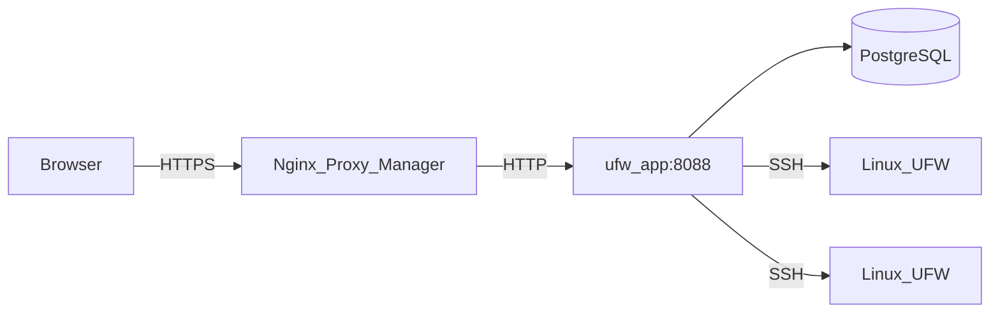

# Архитектура

На этой странице описано, как устроен UFW Remote Manager, как движутся данные и где хранятся секреты.

*Схема: браузер → reverse proxy → приложение → Postgres; приложение → целевые серверы по SSH.*

## Компоненты

| Компонент | Роль |
|-----------|------|
| **ufw-app** | Приложение Next.js (UI + API + server actions) |
| **ufw-postgres** | PostgreSQL — пользователи, зашифрованные учётные данные, правила, снимки, аудит |
| **ufw-migrate** | Одноразовый контейнер — выполняет `prisma migrate deploy` при каждом развёртывании |
| **Nginx Proxy Manager** | Внешнее завершение HTTPS (не входит в этот стек) |
| **Целевые Linux-серверы** | Хосты с UFW, доступные по SSH |

## Поток запросов (продакшен)

1. Администратор открывает `APP_URL` в браузере (HTTPS через NPM).
2. Better Auth проверяет cookie сессии.
3. Server actions и API routes оркестрируют работу SSH и базы данных.
4. Команды UFW на удалённых хостах выполняются только после явного подтверждения применения.

## Конфигурация во время выполнения

Публичный URL задаётся **во время выполнения**, а не вшивается в Docker-образ:

- `APP_URL` в `.env` → `BETTER_AUTH_URL` в контейнере
- Один образ GHCR работает для любого домена — см. [GHCR + Compose](./deployment/ghcr-compose.md)

Реализация: `getPublicAppUrl()` в `src/lib/app-url.ts`.

## Модель параллелизма

- **Очередь SSH на сервер** (`p-queue`, concurrency 1) — операции на одном хосте выполняются последовательно
- **Одна реплика приложения** в продакшене — rate limits хранятся в памяти
- Не масштабируйте до нескольких реплик приложения без общего хранилища rate limits (например, Redis)

## Хранение данных

| Данные | Расположение | Зашифровано? |
|--------|--------------|--------------|
| SSH-пароли / приватные ключи | Postgres (таблица `identity`) | Да — AES-256-GCM с `APP_ENCRYPTION_KEY` |
| Правила UFW, черновики, снимки | Postgres | Только метаданные; содержимое правил не является секретом |
| Сессии | Postgres (Better Auth) | Токены сессий; защищены `BETTER_AUTH_SECRET` |
| События аудита | Postgres | Кто, что и когда сделал |
| Секреты `.env` | Только файловая система хоста | Никогда не должны попадать в git |

## Границы безопасности

- Postgres **не** публикуется на хост в продакшене (`docker-compose.prod.yml`)
- Порт приложения доступен в Docker-сети (NPM + внутренняя), но не на `0.0.0.0` в prod
- Проверка SSH-целей по умолчанию блокирует частные/metadata IP; опционально `SSH_ALLOWED_CIDRS`
- Ответы в продакшене включают CSP, HSTS и security headers (`next.config.ts`)

## Связанные документы

- [Модель безопасности](./administration/security-model.md)
- [Черновик и применение](./concepts/draft-apply-workflow.md)
- [Переменные окружения](./administration/environment-variables.md)
