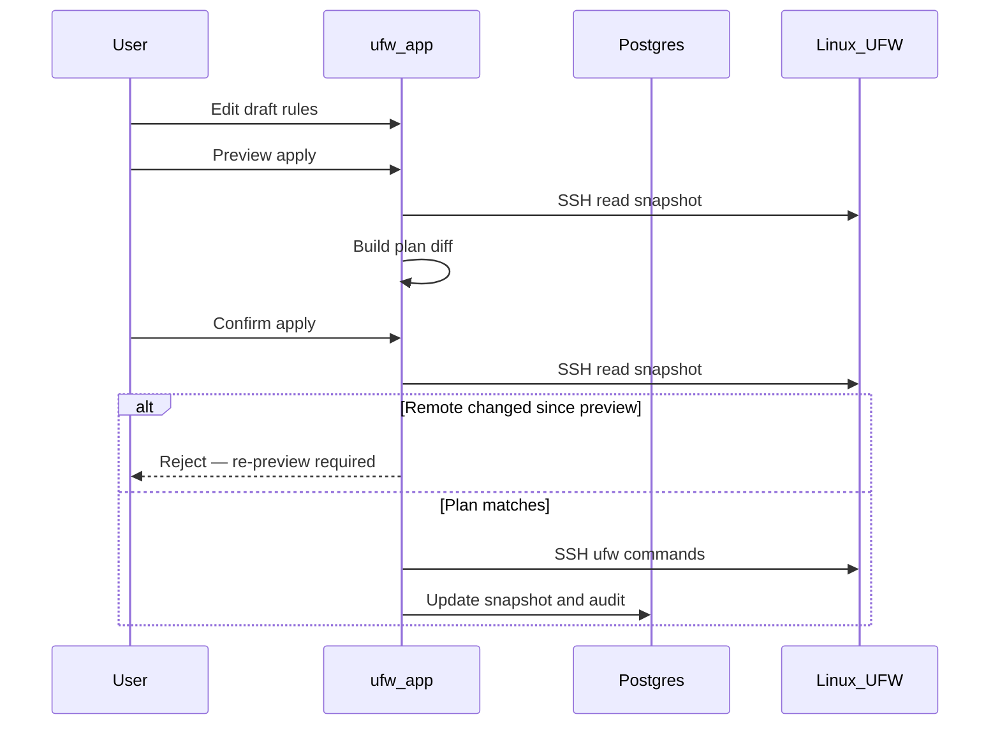

# Черновик и применение

UFW Remote Manager никогда не отправляет изменения межсетевого экрана молча. Каждое изменение следует цепочке **редактирование → предпросмотр → подтверждение → применение**.

## Шаги

### 1. Редактирование черновика

Изменяйте правила в таблице: добавление, правка, удаление, изменение порядка, импорт. Изменения живут в **локальном черновике**, пока не будут применены.

### 2. Предпросмотр применения

Нажмите **Apply preview**. Приложение:

1. Загружает текущее состояние UFW с сервера (SSH-снимок)
2. Вычисляет **план** — команды, которые приведут UFW в соответствие с вашим черновиком
3. Показывает добавленные, удалённые и переупорядоченные правила

Внимательно просмотрите предпросмотр. Обратите внимание на правила, которые могут лишить вас доступа (например, блокировка SSH).

### 3. Подтверждение

Подтвердите в диалоге. Только после этого команды UFW выполняются по SSH.

### 4. Выполнение применения

Команды выполняются на сервере последовательно (очередь на сервер, concurrency 1). Прогресс отображается в **баннере операций** с пошаговым статусом.

### 5. Синхронизация после применения

После успеха приложение обновляет снимок и синхронизирует исходные состояния черновика, чтобы цвета строк отражали новую реальность.

## Диаграмма последовательности

## Частичное применение и расхождение

Удалённый UFW может измениться между предпросмотром и подтверждением, или применение может прерваться на полпути. Приложение обрабатывает три различных случая:

| Сценарий | Статус сессии | Что делать |
|----------|---------------|------------|
| Удалённый UFW **изменился между предпросмотром и подтверждением** | Применение отклонено (`needsRePreview`) | Снова запустите **Apply preview** — не используйте force resync |
| Команды UFW **прерваны** на сервере | `PARTIAL` (`needsResync`) | **Force resync from server**, затем проверьте перед редактированием |
| Команды UFW выполнены, но **post-apply sync не удался** | `PARTIAL` (`needsResync`) | **Force resync from server** — удалённый UFW уже изменён |

**Не игнорируйте предупреждения о частичном применении** — продолжение вслепую может привести к дублированию правил или ошибкам порядка.

## Защита доступа по SSH

Планировщик применения включает меры защиты вокруг правил SSH-доступа там, где это настроено — см. тесты в `src/lib/ufw/commands.allow-ssh.test.ts`. Всё равно проверяйте предпросмотр вручную для продакшен-серверов.

## Связанные документы

- [Правила UFW и состояния](./ufw-rules-and-states.md)
- [Редактирование и применение правил](../user-guide/edit-and-apply-rules.md)
- [История операций](../user-guide/operations-history.md)
