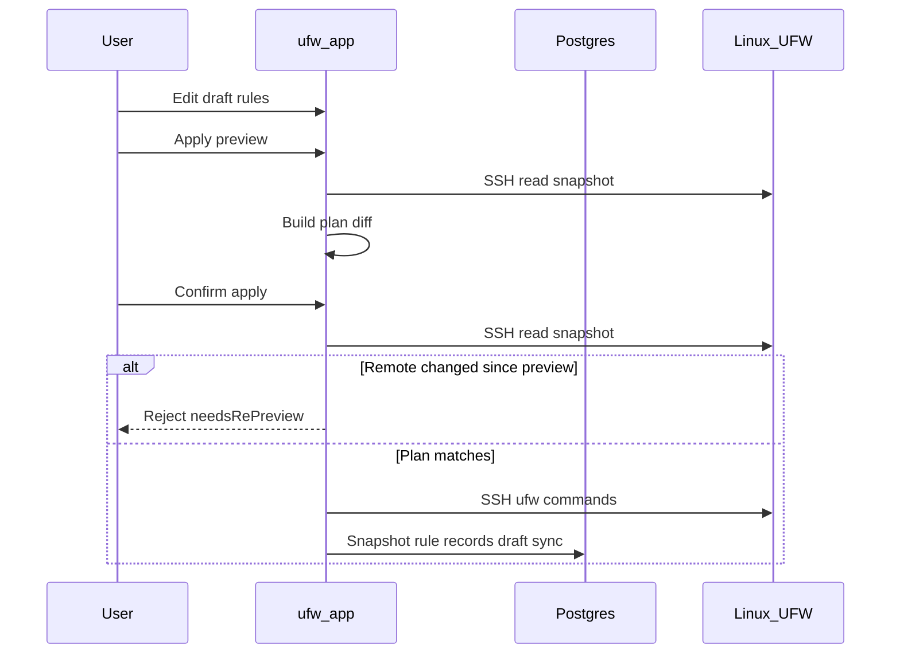

# Черновик и применение

UFW Remote Manager никогда не отправляет изменения межсетевого экрана молча. Каждая мутация следует **edit → preview → confirm → apply**.

## Шаги

### 1. Редактирование черновика

Изменяйте правила в таблице: add, edit, delete, reorder, import. Изменения живут в **локальном черновике** до apply.

### 2. Preview apply

Нажмите **Apply preview** (flow **Сохранить правила**). App:

1. Загружает текущее UFW state с сервера (SSH)
2. Строит **plan** — UFW commands для выравнивания remote с черновиком
3. Показывает added, removed, updated и reordered rules

Проверьте внимательно. Обратите внимание на правила, которые могут заблокировать SSH.

### 3. Confirm

Подтвердите в диалоге. Только тогда UFW commands выполняются по SSH.

Если remote UFW изменился с preview, apply **отклоняется** — выполните preview снова.

### 4. Apply execution

Команды выполняются последовательно на сервере в **per-server queue**. Прогресс — в **баннере операций** со step-by-step status.

### 5. Post-apply sync

После успешного UFW execution, всё ещё в очереди:

1. Persist нового snapshot из live detection
2. Sync `ruleRecord` rows из detection (не stale cache)
3. Обновление draft origin states для соответствия цветов реальности

С v0.9.2 post-apply rule records строятся из **live detection data**, предотвращая возврат удалённых remote rules в БД.

## Sequence diagram

## Partial apply и drift

| Сценарий | Session status | Действие |
|----------|----------------|----------|
| Remote UFW изменился **между preview и confirm** | Rejected (`needsRePreview`) | Снова **Apply preview** — не force resync |
| UFW commands **прерваны** на сервере | `PARTIAL` (`needsResync`) | **Принудительная синхронизация с сервером**, затем review |
| UFW ok, но **post-apply sync failed** | `PARTIAL` (`needsResync`) | **Принудительная синхронизация с сервером** — remote UFW уже изменён |

**Не игнорируйте partial apply warnings** — слепое продолжение может дать duplicate rules или ordering errors.

## DB-only apply

Если preview показывает только metadata changes (без UFW command diff), confirm обновляет локальные records без remote UFW commands.

## Allow SSH safeguard

Apply planner включает safeguards вокруг SSH access rules где настроено. Всё равно проверяйте preview вручную на production servers.

## Связанные документы

- [Правила UFW и состояния](./ufw-rules-and-states.md)
- [Редактирование и применение правил](../user-guide/edit-and-apply-rules.md)
- [Операции и конкурентность](./operations-and-concurrency.md)
