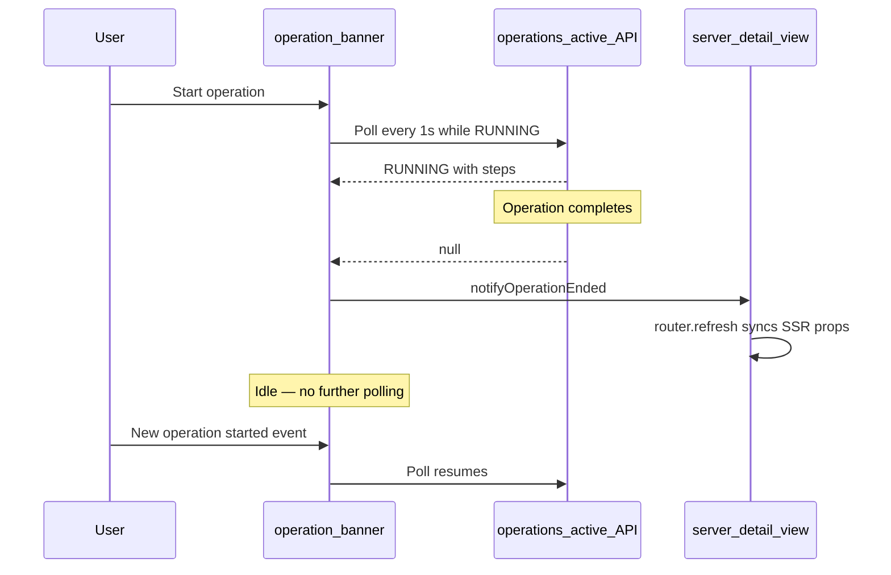
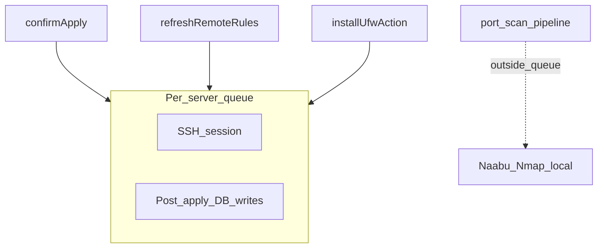

# Операции и конкурентность

UFW Remote Manager выполняет длительные задачи (apply, sync, refresh, install, port scan) асинхронно. UI отслеживает прогресс через **operation logs**, **баннер операций** и client-side polling. На этой странице — как части связаны и как app избегает race conditions на одном сервере.

## Баннер операций

Пока работа выполняется, баннер появляется вверху app (и на странице сервера при scope одного сервера).

| Элемент | Описание |
|---------|----------|
| **Type** | Переведённый label, напр. apply rules, refresh status, port scan |
| **Status** | `RUNNING`, `PENDING`, `SUCCESS`, `FAILED` или `PARTIAL` |
| **Steps** | Раскрываемый список со status по шагам и error messages |
| **Progress** | Опциональный current/total для multi-step operations |

При **УСПЕХ**, баннер auto-dismiss через ~10 секунд. Можно закрыть раньше вручную. Failed и partial остаются до dismiss.

Баннер загружает active operations из `/api/operations/active`. Endpoint возвращает только `RUNNING` или `PENDING` — не terminal.

## Client polling lifecycle

### Active polling

Пока operation `RUNNING` или `PENDING`, баннер poll ~каждую **1 секунду** (с backoff для port-scan hooks после длинных runs).

### Idle behaviour (since v0.9.2)

Когда нет active operation, баннер **останавливает polling**. Это избегает сотен idle API requests в час на browser tab.

Polling **restarts** when:

- Новая operation starts (`OPERATION_STARTED` browser event), или
- Page load находит active operation на first fetch.

### Operation ended event

Когда polling видит transition `RUNNING`/`PENDING` → `null`, или terminal status (`SUCCESS`, `FAILED`, `PARTIAL`), app dispatch `OPERATION_ENDED`.

Server detail view слушает event. Пока operation active, блокирует sync SSR props (rules, port counts) от stale page refresh. При окончании вызывает `router.refresh()` для latest DB state.

Если баннер исчез, но rules table stale после sync или apply — refresh page once; после v0.9.2 при normal conditions не должно повторяться.

## Per-server SSH queue

Remote work на сервере serialized через **per-server queue** (`p-queue`, concurrency 1):

### What runs inside the queue

| Operation | SSH | Post-SSH database writes |
|-----------|-----|--------------------------|
| **Apply rules** | UFW commands + final detection read | Snapshot persist, rule records, draft origin states — **inside same queue hold** |
| **Refresh / sync rules** | UFW status read (when no detection passed in) | Snapshot persist, draft re-seed — **inside queue** |
| **Install UFW** | install + enable + detection | Refresh remote rules — **inside queue** |

Предотвращает concurrent flows (apply и refresh) writing snapshots или rule records в conflicting order.

### What runs outside the queue

**Port scan** (Naabu + Nmap) runs **locally in app container** и **не** holds SSH queue. Long scan (~30+ min) не блокирует UFW refresh или apply на том же сервере.

Port scan overlap prevented separately: only one `PENDING` or `RUNNING` scan per server. Second start returns *scan already running* error.

## Rate limits

Repeat actions на server use **30 second cooldown** (fixed in application code, not env-configurable):

| Action | Cooldown key |
|--------|--------------|
| Refresh status / sync rules | `ufw-refresh:{serverId}` |
| Start port scan | `port-scan:{serverId}` |

Additional limits:

| Action | Limit |
|--------|-------|
| Setup (first admin) | 5 attempts per minute per client IP |
| Config export | 5 per minute per user |
| Config import preview | 10 per minute per user |
| UFW install | 3 per minute per server |

Rate-limit buckets **in-memory**. App designed for **single replica** in production. Multiple app instances без shared rate-limit storage allow bypass.

Behind Nginx Proxy Manager, set `TRUST_PROXY=1` for setup rate limits using real client IP from `X-Forwarded-For`.

## Stale operation sweep

Browser disconnect mid-operation — UI banner may not update. Background sweeper marks very old `RUNNING` as failed (~30–60 min). Refresh page для stuck banner; **История операций** для final status.

## Error boundaries

Client error boundaries prevent single page crash breaking entire shell:

| Scope | File | Recovery |
|-------|------|----------|
| App shell | `src/app/(app)/error.tsx` | **Try again** resets error boundary |
| Server detail | `src/app/(app)/servers/[serverAddress]/error.tsx` | **Try again** or **Back to servers** |

Catch rendering errors in child components. Do not replace operational errors from failed SSH or apply — those in operation banner and operations history.

## Связанные документы

- [История операций](../user-guide/operations-history.md)
- [Черновик и применение](./draft-apply-workflow.md)
- [Архитектура](../architecture.md)
- [Сканирование портов (user guide)](../user-guide/port-scan.md)
