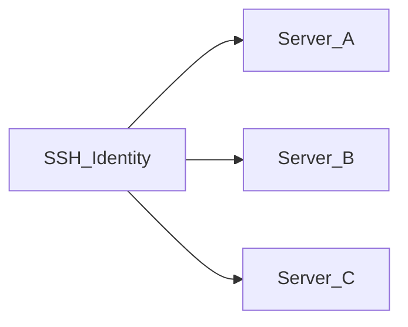

# SSH-идентификации

**SSH-идентификация** — переиспользуемый набор учётных данных (имя пользователя + пароль или приватный ключ), хранящийся **в зашифрованном виде** в базе данных приложения. Серверы ссылаются на идентификации вместо хранения секретов inline.

## Зачем нужны идентификации

| Без идентификаций | С идентификациями |
|-------------------|-------------------|
| Дублирование учётных данных на каждом сервере | Одна идентификация для многих серверов |
| Смена ключа — правка каждого сервера | Обновите идентификацию один раз; все связанные серверы используют новые учётные данные |
| Сложнее аудит | Ясная связь: идентификация → серверы |

## Методы аутентификации

- **Пароль** — имя пользователя и пароль шифруются при хранении
- **Приватный ключ** — имя пользователя и PEM-приватный ключ шифруются при хранении

Секреты шифруются **AES-256-GCM** с использованием `APP_ENCRYPTION_KEY` из `.env`. Если вы потеряете этот ключ, зашифрованные учётные данные восстановить нельзя.

## Создание идентификации

1. Откройте **SSH-идентификации** в боковой панели (`/identities`)
2. Нажмите **Добавить идентификацию**
3. Введите имя, имя пользователя, метод аутентификации и секрет
4. Сохраните — учётные данные шифруются перед записью в хранилище

## Редактирование и удаление

- **Изменить** — поля пароля/ключа можно оставить пустыми, чтобы сохранить существующие секреты без изменений
- **Удалить** — заблокировано, если идентификацию ещё использует хотя бы один сервер; сначала переназначьте или удалите эти серверы

## Связь с серверами

Каждая запись сервера хранит ссылку на одну идентификацию. Смена идентификации на сервере требует успешной **проверки SSH** перед сохранением.

## Заметки по безопасности

- Секреты идентификации не отображаются в интерфейсе после сохранения (при редактировании — только плейсхолдеры)
- **Экспорт** конфигурации включает секреты в открытом виде — см. [Импорт и экспорт конфигурации](./import-export-config.md)
- Резервируйте `.env` с `APP_ENCRYPTION_KEY` — см. [Резервное копирование и восстановление](../operations/backup-restore.md)

## Связанные документы

- [Серверы и SSH](./servers-and-ssh.md)
- [Управление серверами](../user-guide/manage-servers.md)
